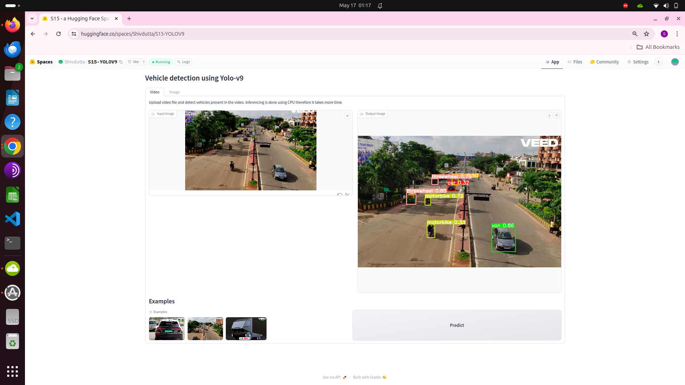

# Inference of Vehicle detection using Yolov9

- This application showcases the inference capabilities of a Yolo v9 trained on the vehicle dataset from kaggle. 
  [Vehicle Dataset Repo Link](https://www.kaggle.com/datasets/nadinpethiyagoda/vehicle-dataset-for-yolo)
- The model is trained on 6 classes:
  - car
  - threewheel
  - bus
  - truck
  - motorbike
  - van
- The architecture is based on Yolo v9 papar https://arxiv.org/abs/2402.13616 and model is 
  trained using  https://github.com/WongKinYiu/yolov9.git
- detect.py file used for inference.
- From gradio applicaiton call is made to detect.py using command line shell with unique folder name passed as argument
- After processing, image/video is picked from same location. 

Mentioned below is the link for Training Repository [Training Repo Link](https://github.com/Shivdutta/ERA2-Session15-Yolov9)

- Post training process, the model is saved locally and then uploaded to Gradio Spaces.
- Attached below is the link to [download model file](https://huggingface.co/spaces/Shivdutta/S15-YOLOV9/blob/main/yolov9/runs/train/exp/weights/best.pt)

-  This app has two features :

  - **Video Prediction:** 
"   - This feature will allow detection of moving vehicles in the the video
  - **Image Prediction:**
    - This feature will allow detection of vehicle in the the image
  
## Usage:

  - **Video Prediction:** 
"   - Upload video file and detect vehicles present in the video.
    - Inferencing is done using CPU therefore it takes more time.
  - **Image Prediction:**
    - Upload image file and detect vehicles present in the image.

 
## Training repo:
https://github.com/Shivdutta/ERA2-Session15-Yolov9

Thank you

