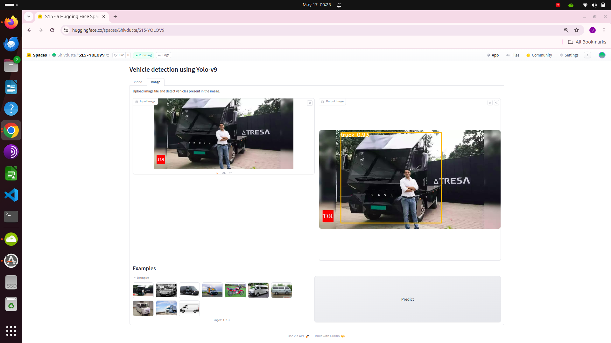

# Yolo v9 model training on AWS

Reference paper - [YOLOv9: Learning What You Want to Learn Using Programmable Gradient Information](https://arxiv.org/abs/2402.13616)


This repository contains following files:

- `detect_dual.py`       : This script is used for detection of image/video by passing arguments.
- `s15.ipynb`            : This script is used for tracking training/validation of dataset.
- `inference.ipynb`      : This script is used for testing of image samples.
- `train_dual.py`        : This script is used for training of dataset by passing arguments.
- `val_dual.py`          : This script is used for validation of dataset by passing arguments.
- `yolov9`               : This code folder is cloned from https://github.com/WongKinYiu/yolov9.git.
- `data\vehicle_dataset` : This dataset folder is cloned from https://www.kaggle.com/datasets/nadinpethiyagoda/vehicle-dataset-for-yolo
- `yolo\weights`         : The base model is downloaded from             
            - https://github.com/WongKinYiu/yolov9/releases/download/v0.1/yolov9-c.pt
            - https://github.com/WongKinYiu/yolov9/releases/download/v0.1/yolov9-e.pt
            - https://github.com/WongKinYiu/yolov9/releases/download/v0.1/yolov9-e.yaml
            - https://github.com/WongKinYiu/yolov9/releases/download/v0.1/yolov9-c.yaml


## From class notes:
- To Do

## Training Steps:
- Download the custom data https://www.kaggle.com/datasets/nadinpethiyagoda/vehicle-dataset-for-yolo
- Place downloaded data inside vehicle_dataset under data folder 
- Place the yolov9-c.pt and yolov9-e.pt weights under weights folder after downloading from above mentioned link
- Place the yolov9-c.yaml and yolov9-e.yaml weights under weights folder after downloading from above mentioned link
- After loging to AWS EC2(refer AWS EC2 snap) and navigate to s15.ipynb
- Training command:
- !python train_dual.py --workers 8 --batch 4  --img 640 --epochs 50 --data /home/ubuntu/s15a/yolov9/data/vehicle_dataset/data.yaml --weights /home/ubuntu/s15a/yolov9/weights/yolov9-e.pt --cfg /home/ubuntu/s15a/yolov9/weights/yolov9-e.yaml --device 0 --hyp /home/ubuntu/s15a/yolov9/data/hyps/hyp.scratch-high.yaml

#### Description Parameters:
        --epochs 50: This argument specifies the number of epochs for training. An epoch is one complete pass through the entire training dataset. Here, training will run for 50 epochs.

        --data /home/ubuntu/s15a/yolov9/data/vehicle_dataset/data.yaml: This argument specifies the path to a YAML file containing information about the dataset being used for training. It likely includes details such as the paths to the training and validation image directories, class names, etc.

        --weights /home/ubuntu/s15a/yolov9/weights/yolov9-e.pt: This argument specifies the path to the weights file to initialize the model with. Here, it's set to yolov9-e.pt.

        --cfg /home/ubuntu/s15a/yolov9/weights/yolov9-e.yaml: This argument specifies the path to the model configuration file in YAML format. It contains details about the network architecture, such as the number of layers, filter sizes, etc.

        --device 0: This argument specifies the device to use for training. Here, it's set to 0, indicating that training will be performed on the first GPU if available. If you don't have a GPU, you can use --device cpu.

        --hyp /home/ubuntu/s15a/yolov9/data/hyps/hyp.scratch-high.yaml: This argument specifies the path to a YAML file containing hyperparameters for training, such as learning rate, momentum, weight decay, etc. Here, it's set to hyp.scratch-high.yaml.

## Classes
  - The model is trained on 6 classes:
    - car
    - threewheel
    - bus
    - truck
    - motorbike
    - van

#### Modify the data.yaml inside data/vehicle_dataset folder
```python
  train: ../data/vehicle_dataset/train
  val: ../data/vehicle_dataset/valid

  nc: 6
  names: [car,threewheel,bus,truck,motorbike,van]
```
#### Modify the yolo9-e.yaml inside weights folder
```python
   nc: 6
```
## Note:
  - If you get this error: AttributeError: 'list' object has no attribute 'device'
  - Then open utils/general.py file and go to line no 903 and write this prediction = prediction[0][1]


## Training Details
```python
train_dual: weights=/home/ubuntu/s15a/yolov9/weights/yolov9-e.pt, cfg=/home/ubuntu/s15a/yolov9/weights/yolov9-e.yaml, data=/home/ubuntu/s15a/yolov9/data/vehicle_dataset/data.yaml, hyp=/home/ubuntu/s15a/yolov9/data/hyps/hyp.scratch-high.yaml, epochs=50, batch_size=4, imgsz=640, rect=False, resume=False, nosave=False, noval=False, noautoanchor=False, noplots=False, evolve=None, bucket=, cache=None, image_weights=False, device=0, multi_scale=False, single_cls=False, optimizer=SGD, sync_bn=False, workers=8, project=runs/train, name=exp, exist_ok=False, quad=False, cos_lr=False, flat_cos_lr=False, fixed_lr=False, label_smoothing=0.0, patience=100, freeze=[0], save_period=-1, seed=0, local_rank=-1, min_items=0, close_mosaic=0, entity=None, upload_dataset=False, bbox_interval=-1, artifact_alias=latest
YOLO 🚀 v0.1-89-g93f1a28 Python-3.10.14 torch-2.2.0 CUDA:0 (Tesla T4, 14931MiB)

hyperparameters: lr0=0.01, lrf=0.01, momentum=0.937, weight_decay=0.0005, warmup_epochs=3.0, warmup_momentum=0.8, warmup_bias_lr=0.1, box=7.5, cls=0.5, cls_pw=1.0, obj=0.7, obj_pw=1.0, dfl=1.5, iou_t=0.2, anchor_t=5.0, fl_gamma=0.0, hsv_h=0.015, hsv_s=0.7, hsv_v=0.4, degrees=0.0, translate=0.1, scale=0.9, shear=0.0, perspective=0.0, flipud=0.0, fliplr=0.5, mosaic=1.0, mixup=0.15, copy_paste=0.3
ClearML: run 'pip install clearml' to automatically track, visualize and remotely train YOLO 🚀 in ClearML
Comet: run 'pip install comet_ml' to automatically track and visualize YOLO 🚀 runs in Comet
TensorBoard: Start with 'tensorboard --logdir runs/train', view at http://localhost:6006/

                 from  n    params  module                                  arguments                     
  0                -1  1         0  models.common.Silence                   []                            
  1                -1  1      1856  models.common.Conv                      [3, 64, 3, 2]                 
  2                -1  1     73984  models.common.Conv                      [64, 128, 3, 2]               
  3                -1  1    252160  models.common.RepNCSPELAN4              [128, 256, 128, 64, 2]        
.
  4                -1  1    164352  models.common.ADown                     [256, 256]                    
  .
  .

  05                -1  1   1004032  models.common.RepNCSPELAN4              [256, 512, 256, 128, 2]       
  6                -1  1    656384  models.common.ADown                     [512, 512]                    
  7                -1  1   4006912  models.common.RepNCSPELAN4              [512, 1024, 512, 256, 2]      
  8                -1  1   2623488  models.common.ADown                     [1024, 1024]                  
  9                -1  1   4269056  models.common.RepNCSPELAN4              [1024, 1024, 512, 256, 2]     
 10                 1  1      4160  models.common.CBLinear                  [64, [64]]                    
 11                 3  1     49344  models.common.CBLinear                  [256, [64, 128]]              
 12                 5  1    229824  models.common.CBLinear                  [512, [64, 128, 256]]         
 13                 7  1    984000  models.common.CBLinear                  [1024, [64, 128, 256, 512]]   
 14                 9  1   2033600  models.common.CBLinear                  [1024, [64, 128, 256, 512, 1024]]
 15                 0  1      1856  models.common.Conv                      [3, 64, 3, 2]                 
 16[10, 11, 12, 13, 14, -1]  1         0  models.common.CBFuse                    [[0, 0, 0, 0, 0]]             
 17                -1  1     73984  models.common.Conv                      [64, 128, 3, 2]               
 18[11, 12, 13, 14, -1]  1         0  models.common.CBFuse                    [[1, 1, 1, 1]]                
 19                -1  1    252160  models.common.RepNCSPELAN4              [128, 256, 128, 64, 2]        
 20                -1  1    164352  models.common.ADown                     [256, 256]                    
 21  [12, 13, 14, -1]  1         0  models.common.CBFuse                    [[2, 2, 2]]                   
 22                -1  1   1004032  models.common.RepNCSPELAN4              [256, 512, 256, 128, 2]       
 23                -1  1    656384  models.common.ADown                     [512, 512]                    
 24      [13, 14, -1]  1         0  models.common.CBFuse                    [[3, 3]]                      
 25                -1  1   4006912  models.common.RepNCSPELAN4              [512, 1024, 512, 256, 2]      
 26                -1  1   2623488  models.common.ADown                     [1024, 1024]                  
 27          [14, -1]  1         0  models.common.CBFuse                    [[4]]                         
 28                -1  1   4269056  models.common.RepNCSPELAN4              [1024, 1024, 512, 256, 2]     
 29                 9  1    787968  models.common.SPPELAN                   [1024, 512, 256]              
 30                -1  1         0  torch.nn.modules.upsampling.Upsample    [None, 2, 'nearest']          
 31           [-1, 7]  1         0  models.common.Concat                    [1]                           
 32                -1  1   4005888  models.common.RepNCSPELAN4              [1536, 512, 512, 256, 2]      
 33                -1  1         0  torch.nn.modules.upsampling.Upsample    [None, 2, 'nearest']          
 34           [-1, 5]  1         0  models.common.Concat                    [1]                           
 35                -1  1   1069056  models.common.RepNCSPELAN4              [1024, 256, 256, 128, 2]      
 36                28  1    787968  models.common.SPPELAN                   [1024, 512, 256]              
 37                -1  1         0  torch.nn.modules.upsampling.Upsample    [None, 2, 'nearest']          
 38          [-1, 25]  1         0  models.common.Concat                    [1]                           
 39                -1  1   4005888  models.common.RepNCSPELAN4              [1536, 512, 512, 256, 2]      
 40                -1  1         0  torch.nn.modules.upsampling.Upsample    [None, 2, 'nearest']          
 41          [-1, 22]  1         0  models.common.Concat                    [1]                           
 42                -1  1   1069056  models.common.RepNCSPELAN4              [1024, 256, 256, 128, 2]      
 43                -1  1    164352  models.common.ADown                     [256, 256]                    
 44          [-1, 39]  1         0  models.common.Concat                    [1]                           
 45                -1  1   3612672  models.common.RepNCSPELAN4              [768, 512, 512, 256, 2]       
 46                -1  1    656384  models.common.ADown                     [512, 512]                    
 47          [-1, 36]  1         0  models.common.Concat                    [1]                           
 48                -1  1  12860416  models.common.RepNCSPELAN4              [1024, 512, 1024, 512, 2]     
 49[35, 32, 29, 42, 45, 48]  1  10990532  models.yolo.DualDDetect                 [6, [256, 512, 512, 256, 512, 512]]
yolov9-e summary: 1475 layers, 69415556 parameters, 69415524 gradients, 244.9 GFLOPs

Transferred 2160/2172 items from /home/ubuntu/s15a/yolov9/weights/yolov9-e.pt
AMP: checks passed ✅
optimizer: SGD(lr=0.01) with parameter groups 356 weight(decay=0.0), 375 weight(decay=0.0005), 373 bias
albumentations: Blur(p=0.01, blur_limit=(3, 7)), MedianBlur(p=0.01, blur_limit=(3, 7)), ToGray(p=0.01), CLAHE(p=0.01, clip_limit=(1, 4.0), tile_grid_size=(8, 8))
train: Scanning /home/ubuntu/s15a/yolov9/data/vehicle_dataset/train/labels... 21
train: New cache created: /home/ubuntu/s15a/yolov9/data/vehicle_dataset/train/labels.cache
val: Scanning /home/ubuntu/s15a/yolov9/data/vehicle_dataset/valid/labels... 900 
val: WARNING ⚠️ /home/ubuntu/s15a/yolov9/data/vehicle_dataset/valid/images/car55.jpg: corrupt JPEG restored and saved
val: New cache created: /home/ubuntu/s15a/yolov9/data/vehicle_dataset/valid/labels.cache
Plotting labels to runs/train/exp/labels.jpg... 
Image sizes 640 train, 640 val
Using 4 dataloader workers
Logging results to runs/train/exp
Starting training for 50 epochs...

      Epoch    GPU_mem   box_loss   cls_loss   dfl_loss  Instances       Size
       0/49      6.78G     0.9832      4.436       1.81         11        640:  WARNING ⚠️ TensorBoard graph visualization failure Only tensors, lists, tuples of tensors, or dictionary of tensors can be output from traced functions
       0/49      6.85G      1.001      4.711      1.547         17        640:  libpng warning: iCCP: known incorrect sRGB profile
       0/49      7.26G     0.8341      3.652      1.538         10        640:  libpng warning: iCCP: known incorrect sRGB profile
       0/49      7.26G     0.7875      2.895      1.505         20        640:  libpng warning: iCCP: known incorrect sRGB profile
       0/49      7.26G     0.7825      2.876      1.504         12        640:  libpng warning: iCCP: known incorrect sRGB profile
       0/49      7.26G     0.7844      2.832      1.508         11        640:  libpng warning: iCCP: known incorrect sRGB profile
       0/49      7.26G     0.7752      2.697      1.499         10        640:  libpng warning: iCCP: known incorrect sRGB profile
       0/49      7.26G     0.7606      2.516      1.493          9        640:  libpng warning: iCCP: known incorrect sRGB profile
       0/49      7.26G     0.7315      2.177      1.474         15        640:  libpng warning: iCCP: known incorrect sRGB profile
       0/49      7.26G     0.7246      2.089      1.467         12        640:  libpng warning: iCCP: known incorrect sRGB profile
       0/49      7.26G     0.7228      2.077      1.466         18        640:  libpng warning: iCCP: known incorrect sRGB profile
       0/49      7.26G     0.7193      2.047      1.462         29        640:  libpng warning: iCCP: known incorrect sRGB profile
       0/49      7.26G     0.7161      2.021      1.459         13        640:  libpng warning: iCCP: known incorrect sRGB profile
       0/49      7.26G      0.704       1.88      1.443         24        640: 1
                 Class     Images  Instances          P          R      mAP50   libpng warning: iCCP: known incorrect sRGB profile
                 Class     Images  Instances          P          R      mAP50   
                   all        900       1150      0.895      0.895      0.963      0.894

      Epoch    GPU_mem   box_loss   cls_loss   dfl_loss  Instances       Size
       1/49      13.4G     0.6539      1.166      1.381         12        640:  libpng warning: iCCP: known incorrect sRGB profile
       1/49      13.4G     0.6889      1.215      1.413         12        640:  libpng warning: iCCP: known incorrect sRGB profile
       1/49      13.4G     0.6834      1.212      1.409         14        640:  libpng warning: iCCP: known incorrect sRGB profile
       1/49      13.4G     0.6872      1.211       1.41         17        640:  libpng warning: iCCP: known incorrect sRGB profile
       1/49      13.4G     0.7018      1.215      1.423         19        640:  libpng warning: iCCP: known incorrect sRGB profile
       1/49      13.4G     0.7189      1.203      1.428         11        640:  libpng warning: iCCP: known incorrect sRGB profile
       1/49      13.4G     0.7278      1.216      1.437          8        640:  libpng warning: iCCP: known incorrect sRGB profile
       1/49      13.4G      0.741      1.226      1.445         10        640: 1
                 Class     Images  Instances          P          R      mAP50   libpng warning: iCCP: known incorrect sRGB profile
                 Class     Images  Instances          P          R      mAP50   
                   all        900       1150      0.916      0.876       0.95      0.862

      Epoch    GPU_mem   box_loss   cls_loss   dfl_loss  Instances       Size
       2/49      13.4G     0.8061       1.22      1.498         16        640:  libpng warning: iCCP: known incorrect sRGB profile
       2/49      13.4G     0.8207      1.295      1.504          6        640:  libpng warning: iCCP: known incorrect sRGB profile
       2/49      13.4G     0.8371      1.322      1.519         18        640:  libpng warning: iCCP: known incorrect sRGB profile
       2/49      13.4G     0.8555      1.335       1.54         16        640:  libpng warning: iCCP: known incorrect sRGB profile
       2/49      13.4G     0.8622      1.356      1.545         12        640:  libpng warning: iCCP: known incorrect sRGB profile
       2/49      13.4G     0.8654      1.358      1.547         19        640:  libpng warning: iCCP: known incorrect sRGB profile
       2/49      13.4G     0.8656      1.356      1.548         12        640:  libpng warning: iCCP: known incorrect sRGB profile
       2/49      13.4G     0.8678      1.359      1.549         12        640: 1
                 Class     Images  Instances          P          R      mAP50   libpng warning: iCCP: known incorrect sRGB profile
                 Class     Images  Instances          P          R      mAP50   
                   all        900       1150      0.856      0.812      0.893      0.767

      Epoch    GPU_mem   box_loss   cls_loss   dfl_loss  Instances       Size
       3/49      13.4G     0.9695      1.451      1.571         14        640:  libpng warning: iCCP: known incorrect sRGB profile
       3/49      13.4G     0.9629      1.439      1.571         17        640:  libpng warning: iCCP: known incorrect sRGB profile
       3/49      13.4G     0.9831      1.484      1.616         14        640:  libpng warning: iCCP: known incorrect sRGB profile
       3/49      13.4G      0.994        1.5      1.616         18        640:  libpng warning: iCCP: known incorrect sRGB profile
       3/49      13.4G     0.9996      1.495      1.617         16        640:  libpng warning: iCCP: known incorrect sRGB profile
       3/49      13.4G      1.006      1.497      1.623         12        640:  libpng warning: iCCP: known incorrect sRGB profile
       3/49      13.4G      1.013      1.505      1.631         18        640:  libpng warning: iCCP: known incorrect sRGB profile
       3/49      13.4G      1.016      1.514      1.635         15        640:  libpng warning: iCCP: known incorrect sRGB profile
       3/49      13.4G      1.017      1.511      1.636         13        640:  libpng warning: iCCP: known incorrect sRGB profile
       3/49      13.4G      1.025      1.508      1.649         17        640: 1
                 Class     Images  Instances          P          R      mAP50   libpng warning: iCCP: known incorrect sRGB profile
                 Class     Images  Instances          P          R      mAP50   
                   all        900       1150      0.809      0.793      0.891      0.762

      Epoch    GPU_mem   box_loss   cls_loss   dfl_loss  Instances       Size
       4/49      13.4G     0.9424      1.149      1.521         11        640:  libpng warning: iCCP: known incorrect sRGB profile
       4/49      13.4G     0.8978      1.316      1.547         12        640:  libpng warning: iCCP: known incorrect sRGB profile
       4/49      13.4G     0.9952      1.476      1.629         12        640:  libpng warning: iCCP: known incorrect sRGB profile
       4/49      13.4G      1.028      1.452      1.659         17        640:  libpng warning: iCCP: known incorrect sRGB profile
       4/49      13.4G       1.03      1.448      1.658         13        640:  libpng warning: iCCP: known incorrect sRGB profile
       4/49      13.4G      1.042      1.452      1.654         14        640:  libpng warning: iCCP: known incorrect sRGB profile
       4/49      13.4G       1.04      1.477      1.656         19        640:  libpng warning: iCCP: known incorrect sRGB profile
       4/49      13.4G       1.04      1.475      1.657         17        640:  libpng warning: iCCP: known incorrect sRGB profile
       4/49      13.4G       1.04      1.474      1.658         15        640:  libpng warning: iCCP: known incorrect sRGB profile
       4/49      13.4G      1.042      1.476       1.66         10        640:  libpng warning: iCCP: known incorrect sRGB profile
       4/49      13.4G      1.043      1.477      1.661         22        640:  libpng warning: iCCP: known incorrect sRGB profile
       4/49      13.4G      1.044      1.472      1.663         13        640:  libpng warning: iCCP: known incorrect sRGB profile
       4/49      13.4G      1.045      1.472      1.662          9        640:  libpng warning: iCCP: known incorrect sRGB profile
       4/49      13.4G       1.05      1.476       1.67         16        640:  libpng warning: iCCP: known incorrect sRGB profile
       4/49      13.4G      1.055      1.482      1.678         17        640: 1
                 Class     Images  Instances          P          R      mAP50   libpng warning: iCCP: known incorrect sRGB profile
                 Class     Images  Instances          P          R      mAP50   
                   all        900       1150      0.845      0.799      0.876       0.75

      Epoch    GPU_mem   box_loss   cls_loss   dfl_loss  Instances       Size
       5/49      13.4G      1.089      1.504      1.674         14        640:  libpng warning: iCCP: known incorrect sRGB profile
       5/49      13.4G      1.055      1.512      1.705         18        640:  libpng warning: iCCP: known incorrect sRGB profile
       5/49      13.4G      1.057       1.51      1.702         19        640:  libpng warning: iCCP: known incorrect sRGB profile
       5/49      13.4G      1.047      1.499      1.691         20        640:  libpng warning: iCCP: known incorrect sRGB profile
       5/49      13.4G      1.052      1.498        1.7         14        640:  libpng warning: iCCP: known incorrect sRGB profile
       5/49      13.4G      1.045      1.489      1.695          8        640:  libpng warning: iCCP: known incorrect sRGB profile
       5/49      13.4G      1.034       1.49      1.688         22        640:  libpng warning: iCCP: known incorrect sRGB profile
       5/49      13.4G      1.041      1.503      1.694         25        640:  libpng warning: iCCP: known incorrect sRGB profile
       5/49      13.4G      1.053      1.513      1.703         15        640:  libpng warning: iCCP: known incorrect sRGB profile
       5/49      13.4G      1.052      1.515        1.7         21        640:  libpng warning: iCCP: known incorrect sRGB profile
       5/49      13.4G      1.054      1.515      1.706         16        640:  libpng warning: iCCP: known incorrect sRGB profile
       5/49      13.4G      1.054      1.514      1.706         17        640:  libpng warning: iCCP: known incorrect sRGB profile
       5/49      13.4G      1.053      1.501      1.702         20        640:  libpng warning: iCCP: known incorrect sRGB profile
       5/49      13.4G      1.053      1.499      1.702         10        640:  libpng warning: iCCP: known incorrect sRGB profile
       5/49      13.4G      1.053      1.497      1.703         15        640:  libpng warning: iCCP: known incorrect sRGB profile
       5/49      13.4G      1.054      1.497      1.703          8        640: 1
                 Class     Images  Instances          P          R      mAP50   libpng warning: iCCP: known incorrect sRGB profile
                 Class     Images  Instances          P          R      mAP50   
                   all        900       1150      0.818      0.861      0.904      0.757

      Epoch    GPU_mem   box_loss   cls_loss   dfl_loss  Instances       Size
       6/49      13.4G       1.02      1.395       1.67         12        640:  libpng warning: iCCP: known incorrect sRGB profile
       6/49      13.4G      1.021      1.392      1.669          8        640:  libpng warning: iCCP: known incorrect sRGB profile
       6/49      13.4G      1.025      1.416       1.67          5        640:  libpng warning: iCCP: known incorrect sRGB profile
       6/49      13.4G      1.027      1.423      1.672         12        640:  libpng warning: iCCP: known incorrect sRGB profile
       6/49      13.4G      1.028      1.431      1.673         13        640:  libpng warning: iCCP: known incorrect sRGB profile
       6/49      13.4G       1.02      1.419      1.668         10        640:  libpng warning: iCCP: known incorrect sRGB profile
       6/49      13.4G      1.009      1.402      1.662         21        640:  libpng warning: iCCP: known incorrect sRGB profile
       6/49      13.4G      1.002      1.394      1.654         18        640:  libpng warning: iCCP: known incorrect sRGB profile
       6/49      13.4G      1.001      1.395      1.654         17        640:  libpng warning: iCCP: known incorrect sRGB profile
       6/49      13.4G     0.9986      1.378      1.644         13        640:  libpng warning: iCCP: known incorrect sRGB profile
       6/49      13.4G     0.9971      1.376      1.643         13        640:  libpng warning: iCCP: known incorrect sRGB profile
       6/49      13.4G      0.997      1.377      1.641         13        640:  libpng warning: iCCP: known incorrect sRGB profile
       6/49      13.4G     0.9956      1.374      1.639         14        640: 1
                 Class     Images  Instances          P          R      mAP50   libpng warning: iCCP: known incorrect sRGB profile
                 Class     Images  Instances          P          R      mAP50   
                   all        900       1150       0.88      0.847      0.917      0.802

      Epoch    GPU_mem   box_loss   cls_loss   dfl_loss  Instances       Size
       7/49      13.4G     0.9995       1.33       1.63         16        640:  libpng warning: iCCP: known incorrect sRGB profile
       7/49      13.4G      1.001      1.339      1.638         17        640:  libpng warning: iCCP: known incorrect sRGB profile
       7/49      13.4G      1.003      1.347      1.645         14        640:  libpng warning: iCCP: known incorrect sRGB profile
       7/49      13.4G      1.002      1.349      1.645         11        640:  libpng warning: iCCP: known incorrect sRGB profile
       7/49      13.4G      1.006      1.354      1.648         22        640:  libpng warning: iCCP: known incorrect sRGB profile
       7/49      13.4G     0.9992      1.338      1.646         21        640:  libpng warning: iCCP: known incorrect sRGB profile
       7/49      13.4G      1.005      1.337      1.654         11        640:  libpng warning: iCCP: known incorrect sRGB profile
       7/49      13.4G      1.004       1.34      1.655         14        640:  libpng warning: iCCP: known incorrect sRGB profile
       7/49      13.4G      1.009      1.354      1.659         22        640: 1
                 Class     Images  Instances          P          R      mAP50   libpng warning: iCCP: known incorrect sRGB profile
                 Class     Images  Instances          P          R      mAP50   
                   all        900       1150      0.887      0.856      0.932      0.798

      Epoch    GPU_mem   box_loss   cls_loss   dfl_loss  Instances       Size
       8/49      13.4G       1.31      1.735      1.886         19        640:  libpng warning: iCCP: known incorrect sRGB profile
       8/49      13.4G      1.077      1.599      1.687         22        640:  libpng warning: iCCP: known incorrect sRGB profile
       8/49      13.4G      1.007      1.362      1.643         11        640:  libpng warning: iCCP: known incorrect sRGB profile
       8/49      13.4G      1.007      1.376      1.646         11        640:  libpng warning: iCCP: known incorrect sRGB profile
       8/49      13.4G     0.9827      1.311      1.627         13        640:  libpng warning: iCCP: known incorrect sRGB profile
       8/49      13.4G     0.9735       1.28      1.621         15        640:  libpng warning: iCCP: known incorrect sRGB profile
       8/49      13.4G     0.9722      1.278       1.62         25        640:  libpng warning: iCCP: known incorrect sRGB profile
       8/49      13.4G     0.9724      1.279       1.62         23        640:  libpng warning: iCCP: known incorrect sRGB profile
       8/49      13.4G     0.9717       1.28       1.62         14        640: 1
                 Class     Images  Instances          P          R      mAP50   libpng warning: iCCP: known incorrect sRGB profile
                 Class     Images  Instances          P          R      mAP50   
                   all        900       1150      0.898       0.87       0.94      0.813

      Epoch    GPU_mem   box_loss   cls_loss   dfl_loss  Instances       Size
       9/49      13.4G     0.9532      1.232      1.598         16        640:  libpng warning: iCCP: known incorrect sRGB profile
       9/49      13.4G     0.9613      1.227      1.604         14        640:  libpng warning: iCCP: known incorrect sRGB profile
       9/49      13.4G     0.9585      1.237      1.599         17        640:  libpng warning: iCCP: known incorrect sRGB profile
       9/49      13.4G     0.9607      1.243      1.603          9        640:  libpng warning: iCCP: known incorrect sRGB profile
       9/49      13.4G     0.9519      1.241      1.598         11        640:  libpng warning: iCCP: known incorrect sRGB profile
       9/49      13.4G     0.9524      1.236      1.594         23        640:  libpng warning: iCCP: known incorrect sRGB profile
       9/49      13.4G      0.952      1.237      1.597         19        640:  libpng warning: iCCP: known incorrect sRGB profile
       9/49      13.4G     0.9441      1.228      1.591         26        640:  libpng warning: iCCP: known incorrect sRGB profile
       9/49      13.4G     0.9439      1.228       1.59         14        640:  libpng warning: iCCP: known incorrect sRGB profile
       9/49      13.4G     0.9458      1.232      1.592         14        640:  libpng warning: iCCP: known incorrect sRGB profile
       9/49      13.4G     0.9422      1.223       1.59         12        640:  libpng warning: iCCP: known incorrect sRGB profile
       9/49      13.4G     0.9442      1.224      1.591         17        640: 1
                 Class     Images  Instances          P          R      mAP50   libpng warning: iCCP: known incorrect sRGB profile
                 Class     Images  Instances          P          R      mAP50   
                   all        900       1150      0.913       0.88      0.941      0.839

      Epoch    GPU_mem   box_loss   cls_loss   dfl_loss  Instances       Size
      10/49      13.4G     0.7477     0.9397      1.435         20        640:  libpng warning: iCCP: known incorrect sRGB profile
      10/49      13.4G     0.9324      1.116      1.554         13        640:  libpng warning: iCCP: known incorrect sRGB profile
      10/49      13.4G     0.9276      1.138      1.589         27        640:  libpng warning: iCCP: known incorrect sRGB profile
      10/49      13.4G     0.9576      1.187      1.614         22        640:  libpng warning: iCCP: known incorrect sRGB profile
      10/49      13.4G      0.958      1.194      1.613          7        640:  libpng warning: iCCP: known incorrect sRGB profile
      10/49      13.4G     0.9346       1.18      1.601         14        640:  libpng warning: iCCP: known incorrect sRGB profile
      10/49      13.4G     0.9281      1.167      1.594          9        640:  libpng warning: iCCP: known incorrect sRGB profile
      10/49      13.4G     0.9253      1.159       1.59         13        640: 1
                 Class     Images  Instances          P          R      mAP50   libpng warning: iCCP: known incorrect sRGB profile
                 Class     Images  Instances          P          R      mAP50   
                   all        900       1150      0.942      0.874      0.947      0.838

      Epoch    GPU_mem   box_loss   cls_loss   dfl_loss  Instances       Size
      11/49      13.4G     0.7862     0.9687      1.444         28        640:  libpng warning: iCCP: known incorrect sRGB profile
      11/49      13.4G     0.9145      1.135      1.572         22        640:  libpng warning: iCCP: known incorrect sRGB profile
      11/49      13.4G     0.9168      1.143      1.578         18        640:  libpng warning: iCCP: known incorrect sRGB profile
      11/49      13.4G     0.9029      1.137      1.558          7        640:  libpng warning: iCCP: known incorrect sRGB profile
      11/49      13.4G     0.9027      1.135      1.569         12        640:  libpng warning: iCCP: known incorrect sRGB profile
      11/49      13.4G     0.9005      1.121      1.563         20        640:  libpng warning: iCCP: known incorrect sRGB profile
      11/49      13.4G      0.891      1.116      1.556         11        640:  libpng warning: iCCP: known incorrect sRGB profile
      11/49      13.4G     0.8884      1.105      1.555         11        640:  libpng warning: iCCP: known incorrect sRGB profile
      11/49      13.4G     0.8897      1.107      1.556         18        640:  libpng warning: iCCP: known incorrect sRGB profile
      11/49      13.4G      0.897      1.109      1.562         14        640: 1
                 Class     Images  Instances          P          R      mAP50   libpng warning: iCCP: known incorrect sRGB profile
                 Class     Images  Instances          P          R      mAP50   
                   all        900       1150      0.936      0.867      0.951      0.841

      Epoch    GPU_mem   box_loss   cls_loss   dfl_loss  Instances       Size
      12/49      13.4G     0.8371     0.9716      1.532         10        640:  libpng warning: iCCP: known incorrect sRGB profile
      12/49      13.4G     0.8533      1.053      1.544         22        640:  libpng warning: iCCP: known incorrect sRGB profile
      12/49      13.4G     0.8519       1.05      1.544         15        640:  libpng warning: iCCP: known incorrect sRGB profile
      12/49      13.4G     0.8707      1.057      1.553          5        640:  libpng warning: iCCP: known incorrect sRGB profile
      12/49      13.4G     0.8673      1.067      1.556         15        640:  libpng warning: iCCP: known incorrect sRGB profile
      12/49      13.4G     0.8693      1.075      1.557         22        640:  libpng warning: iCCP: known incorrect sRGB profile
      12/49      13.4G     0.8704      1.076      1.555         16        640:  libpng warning: iCCP: known incorrect sRGB profile
      12/49      13.4G     0.8766      1.082      1.563         18        640:  libpng warning: iCCP: known incorrect sRGB profile
      12/49      13.4G     0.8785      1.086      1.564          9        640:  libpng warning: iCCP: known incorrect sRGB profile
      12/49      13.4G     0.8784      1.093      1.556         15        640:  libpng warning: iCCP: known incorrect sRGB profile
      12/49      13.4G     0.8918      1.105      1.572         18        640:  libpng warning: iCCP: known incorrect sRGB profile
      12/49      13.4G     0.8896      1.107       1.57         12        640:  libpng warning: iCCP: known incorrect sRGB profile
      12/49      13.4G     0.8878      1.106      1.566          8        640: 1
                 Class     Images  Instances          P          R      mAP50   libpng warning: iCCP: known incorrect sRGB profile
                 Class     Images  Instances          P          R      mAP50   
                   all        900       1150      0.943      0.894      0.955      0.844

      Epoch    GPU_mem   box_loss   cls_loss   dfl_loss  Instances       Size
      13/49      13.4G     0.9256      1.229      1.549         12        640:  libpng warning: iCCP: known incorrect sRGB profile
      13/49      13.4G     0.9327      1.154      1.567         11        640:  libpng warning: iCCP: known incorrect sRGB profile
      13/49      13.4G      0.897      1.131      1.551         16        640:  libpng warning: iCCP: known incorrect sRGB profile
      13/49      13.4G     0.8909       1.13      1.546         15        640:  libpng warning: iCCP: known incorrect sRGB profile
      13/49      13.4G     0.8974      1.132      1.556         11        640:  libpng warning: iCCP: known incorrect sRGB profile
      13/49      13.4G     0.8976      1.128      1.557         13        640:  libpng warning: iCCP: known incorrect sRGB profile
      13/49      13.4G     0.8907      1.111      1.546         15        640:  libpng warning: iCCP: known incorrect sRGB profile
      13/49      13.4G      0.873      1.084      1.544         14        640:  libpng warning: iCCP: known incorrect sRGB profile
      13/49      13.4G     0.8678      1.079      1.539         17        640: 1
                 Class     Images  Instances          P          R      mAP50   libpng warning: iCCP: known incorrect sRGB profile
                 Class     Images  Instances          P          R      mAP50   
                   all        900       1150      0.942      0.899      0.963      0.863

      Epoch    GPU_mem   box_loss   cls_loss   dfl_loss  Instances       Size
  0%|          | 0/525 00:00libpng warning: iCCP: known incorrect sRGB profile
      14/49      13.4G     0.8672      1.055      1.553         12        640:  libpng warning: iCCP: known incorrect sRGB profile
      14/49      13.4G     0.8643      1.048      1.548         10        640:  libpng warning: iCCP: known incorrect sRGB profile
      14/49      13.4G     0.8651      1.056      1.552         10        640:  libpng warning: iCCP: known incorrect sRGB profile
      14/49      13.4G     0.8466      1.043      1.538         17        640:  libpng warning: iCCP: known incorrect sRGB profile
      14/49      13.4G     0.8475      1.056      1.543         13        640:  libpng warning: iCCP: known incorrect sRGB profile
      14/49      13.4G     0.8477      1.053      1.541         15        640:  libpng warning: iCCP: known incorrect sRGB profile
      14/49      13.4G     0.8504      1.056      1.542          9        640:  libpng warning: iCCP: known incorrect sRGB profile
      14/49      13.4G     0.8475      1.051       1.54         20        640:  libpng warning: iCCP: known incorrect sRGB profile
      14/49      13.4G     0.8483      1.052      1.541         22        640:  libpng warning: iCCP: known incorrect sRGB profile
      14/49      13.4G     0.8519      1.055      1.546         15        640:  libpng warning: iCCP: known incorrect sRGB profile
      14/49      13.4G     0.8572      1.054      1.547         18        640: 1
                 Class     Images  Instances          P          R      mAP50   libpng warning: iCCP: known incorrect sRGB profile
                 Class     Images  Instances          P          R      mAP50   
                   all        900       1150      0.937       0.91      0.965      0.864

      Epoch    GPU_mem   box_loss   cls_loss   dfl_loss  Instances       Size
      15/49      13.4G     0.8013     0.9748       1.52         10        640:  libpng warning: iCCP: known incorrect sRGB profile
      15/49      13.4G     0.8151     0.9897      1.512         13        640:  libpng warning: iCCP: known incorrect sRGB profile
      15/49      13.4G     0.8178     0.9876      1.521         11        640:  libpng warning: iCCP: known incorrect sRGB profile
      15/49      13.4G     0.8217     0.9889      1.518         14        640:  libpng warning: iCCP: known incorrect sRGB profile
      15/49      13.4G      0.824     0.9824       1.52         25        640:  libpng warning: iCCP: known incorrect sRGB profile
      15/49      13.4G     0.8236     0.9887      1.523         14        640:  libpng warning: iCCP: known incorrect sRGB profile
      15/49      13.4G     0.8251     0.9904      1.523         14        640:  libpng warning: iCCP: known incorrect sRGB profile
      15/49      13.4G     0.8252     0.9935      1.524         14        640:  libpng warning: iCCP: known incorrect sRGB profile
      15/49      13.4G     0.8282      0.994      1.525         20        640: 1
                 Class     Images  Instances          P          R      mAP50   libpng warning: iCCP: known incorrect sRGB profile
                 Class     Images  Instances          P          R      mAP50   
                   all        900       1150      0.929      0.902      0.956      0.854

      Epoch    GPU_mem   box_loss   cls_loss   dfl_loss  Instances       Size
      16/49      13.4G     0.8231      1.018      1.532         10        640:  libpng warning: iCCP: known incorrect sRGB profile
libpng warning: iCCP: known incorrect sRGB profile
libpng warning: iCCP: known incorrect sRGB profile
      16/49      13.4G     0.8344       1.01      1.515         19        640:  libpng warning: iCCP: known incorrect sRGB profile
      16/49      13.4G     0.8226     0.9888      1.503          6        640:  libpng warning: iCCP: known incorrect sRGB profile
      16/49      13.4G     0.8495     0.9988       1.53         10        640:  libpng warning: iCCP: known incorrect sRGB profile
      16/49      13.4G     0.8253     0.9879      1.514         13        640:  libpng warning: iCCP: known incorrect sRGB profile
      16/49      13.4G     0.8274     0.9857      1.515         14        640:  libpng warning: iCCP: known incorrect sRGB profile
      16/49      13.4G     0.8321     0.9864      1.517          5        640:  libpng warning: iCCP: known incorrect sRGB profile
      16/49      13.4G     0.8175     0.9735      1.505         15        640:  libpng warning: iCCP: known incorrect sRGB profile
      16/49      13.4G     0.8188     0.9749      1.504         12        640:  libpng warning: iCCP: known incorrect sRGB profile
      16/49      13.4G     0.8174     0.9744      1.502         13        640:  libpng warning: iCCP: known incorrect sRGB profile
      16/49      13.4G     0.8186      0.967      1.512          5        640:  libpng warning: iCCP: known incorrect sRGB profile
      16/49      13.4G     0.8201     0.9771      1.514          8        640:  libpng warning: iCCP: known incorrect sRGB profile
      16/49      13.4G     0.8194      0.977      1.514         13        640: 1
                 Class     Images  Instances          P          R      mAP50   libpng warning: iCCP: known incorrect sRGB profile
                 Class     Images  Instances          P          R      mAP50   
                   all        900       1150      0.962      0.896      0.968       0.88

      Epoch    GPU_mem   box_loss   cls_loss   dfl_loss  Instances       Size
      17/49      13.4G     0.7874      1.076      1.502         10        640:  libpng warning: iCCP: known incorrect sRGB profile
      17/49      13.4G     0.8256      1.031      1.527         18        640:  libpng warning: iCCP: known incorrect sRGB profile
      17/49      13.4G     0.8122     0.9723      1.508         16        640:  libpng warning: iCCP: known incorrect sRGB profile
      17/49      13.4G     0.8147     0.9713      1.515         12        640:  libpng warning: iCCP: known incorrect sRGB profile
      17/49      13.4G     0.8107     0.9671      1.515         17        640:  libpng warning: iCCP: known incorrect sRGB profile
      17/49      13.4G     0.8108     0.9667      1.515          8        640:  libpng warning: iCCP: known incorrect sRGB profile
      17/49      13.4G     0.8113     0.9679      1.515         27        640:  libpng warning: iCCP: known incorrect sRGB profile
      17/49      13.4G     0.8095     0.9642      1.513         15        640:  libpng warning: iCCP: known incorrect sRGB profile
      17/49      13.4G     0.8092      0.957      1.508         10        640:  libpng warning: iCCP: known incorrect sRGB profile
      17/49      13.4G     0.8088     0.9517      1.507         11        640: 1
                 Class     Images  Instances          P          R      mAP50   libpng warning: iCCP: known incorrect sRGB profile
                 Class     Images  Instances          P          R      mAP50   
                   all        900       1150      0.942      0.926      0.969      0.876

      Epoch    GPU_mem   box_loss   cls_loss   dfl_loss  Instances       Size
      18/49      13.4G      0.802     0.9124      1.449         17        640:  libpng warning: iCCP: known incorrect sRGB profile
      18/49      13.4G     0.8017     0.9116      1.447         15        640:  libpng warning: iCCP: known incorrect sRGB profile
      18/49      13.4G     0.8236     0.9824      1.502         22        640:  libpng warning: iCCP: known incorrect sRGB profile
      18/49      13.4G     0.8236     0.9794      1.504         17        640:  libpng warning: iCCP: known incorrect sRGB profile
      18/49      13.4G     0.8256     0.9816      1.502         15        640:  libpng warning: iCCP: known incorrect sRGB profile
      18/49      13.4G     0.8142     0.9583      1.489         11        640:  libpng warning: iCCP: known incorrect sRGB profile
libpng warning: iCCP: known incorrect sRGB profile
      18/49      13.4G     0.8157      0.951      1.489         14        640:  libpng warning: iCCP: known incorrect sRGB profile
      18/49      13.4G     0.8124     0.9383      1.486          9        640:  libpng warning: iCCP: known incorrect sRGB profile
      18/49      13.4G     0.8013     0.9209      1.482         20        640:  libpng warning: iCCP: known incorrect sRGB profile
      18/49      13.4G     0.8001     0.9194      1.482         12        640:  libpng warning: iCCP: known incorrect sRGB profile
      18/49      13.4G     0.7964     0.9118       1.48         14        640:  libpng warning: iCCP: known incorrect sRGB profile
      18/49      13.4G     0.7937     0.9065      1.478         16        640:  libpng warning: iCCP: known incorrect sRGB profile
      18/49      13.4G     0.7921     0.9043      1.479         13        640: 1
                 Class     Images  Instances          P          R      mAP50   libpng warning: iCCP: known incorrect sRGB profile
                 Class     Images  Instances          P          R      mAP50   
                   all        900       1150      0.953      0.925      0.969      0.877

      Epoch    GPU_mem   box_loss   cls_loss   dfl_loss  Instances       Size
      19/49      13.4G     0.8013      0.916      1.469          7        640:  libpng warning: iCCP: known incorrect sRGB profile
      19/49      13.4G     0.8204     0.9362      1.516          8        640:  libpng warning: iCCP: known incorrect sRGB profile
      19/49      13.4G      0.819       0.94       1.52          8        640:  libpng warning: iCCP: known incorrect sRGB profile
      19/49      13.4G       0.81     0.9299      1.515         18        640:  libpng warning: iCCP: known incorrect sRGB profile
      19/49      13.4G      0.796     0.9085      1.497         14        640:  libpng warning: iCCP: known incorrect sRGB profile
      19/49      13.4G     0.7989     0.9133      1.498         15        640:  libpng warning: iCCP: known incorrect sRGB profile
      19/49      13.4G     0.7876     0.8918      1.487         11        640:  libpng warning: iCCP: known incorrect sRGB profile
      19/49      13.4G     0.7892     0.8941      1.489         13        640: 1
                 Class     Images  Instances          P          R      mAP50   libpng warning: iCCP: known incorrect sRGB profile
                 Class     Images  Instances          P          R      mAP50   
                   all        900       1150      0.957      0.927      0.972      0.884

      Epoch    GPU_mem   box_loss   cls_loss   dfl_loss  Instances       Size
      20/49      13.4G     0.7722     0.9191      1.497          8        640:  libpng warning: iCCP: known incorrect sRGB profile
      20/49      13.4G     0.7551     0.8695      1.478         10        640:  libpng warning: iCCP: known incorrect sRGB profile
      20/49      13.4G     0.7724     0.9102      1.491         14        640:  libpng warning: iCCP: known incorrect sRGB profile
      20/49      13.4G     0.7654     0.8744      1.473          9        640:  libpng warning: iCCP: known incorrect sRGB profile
      20/49      13.4G     0.7634     0.8657      1.464         17        640:  libpng warning: iCCP: known incorrect sRGB profile
      20/49      13.4G     0.7678     0.8728      1.464         21        640:  libpng warning: iCCP: known incorrect sRGB profile
      20/49      13.4G     0.7634     0.8638       1.46          8        640:  libpng warning: iCCP: known incorrect sRGB profile
      20/49      13.4G     0.7632     0.8659      1.457          9        640: 1
                 Class     Images  Instances          P          R      mAP50   libpng warning: iCCP: known incorrect sRGB profile
                 Class     Images  Instances          P          R      mAP50   
                   all        900       1150       0.95      0.925      0.974      0.888

      Epoch    GPU_mem   box_loss   cls_loss   dfl_loss  Instances       Size
      21/49      13.4G     0.7746     0.8674      1.457         10        640:  libpng warning: iCCP: known incorrect sRGB profile
      21/49      13.4G      0.776     0.8753      1.461         17        640:  libpng warning: iCCP: known incorrect sRGB profile
      21/49      13.4G     0.7508     0.8371      1.434          5        640:  libpng warning: iCCP: known incorrect sRGB profile
      21/49      13.4G     0.7463     0.8287      1.439         13        640:  libpng warning: iCCP: known incorrect sRGB profile
      21/49      13.4G      0.745     0.8262      1.439         12        640:  libpng warning: iCCP: known incorrect sRGB profile
      21/49      13.4G     0.7432     0.8282      1.436          7        640:  libpng warning: iCCP: known incorrect sRGB profile
      21/49      13.4G     0.7473     0.8397      1.443         19        640:  libpng warning: iCCP: known incorrect sRGB profile
      21/49      13.4G     0.7463     0.8383      1.443         14        640:  libpng warning: iCCP: known incorrect sRGB profile
      21/49      13.4G     0.7415     0.8358      1.439         14        640: 1
                 Class     Images  Instances          P          R      mAP50   libpng warning: iCCP: known incorrect sRGB profile
                 Class     Images  Instances          P          R      mAP50   
                   all        900       1150      0.965      0.919      0.969      0.889

      Epoch    GPU_mem   box_loss   cls_loss   dfl_loss  Instances       Size
      22/49      13.4G     0.7547      0.843      1.455         18        640:  libpng warning: iCCP: known incorrect sRGB profile
      22/49      13.4G     0.7418     0.8185      1.441         17        640:  libpng warning: iCCP: known incorrect sRGB profile
      22/49      13.4G     0.7392     0.8201      1.438         10        640:  libpng warning: iCCP: known incorrect sRGB profile
      22/49      13.4G     0.7352     0.8052      1.431         11        640:  libpng warning: iCCP: known incorrect sRGB profile
      22/49      13.4G     0.7446     0.8158      1.437         18        640:  libpng warning: iCCP: known incorrect sRGB profile
      22/49      13.4G     0.7525       0.82      1.442         14        640:  libpng warning: iCCP: known incorrect sRGB profile
      22/49      13.4G     0.7517     0.8217      1.442          9        640:  libpng warning: iCCP: known incorrect sRGB profile
      22/49      13.4G     0.7532       0.83      1.446         14        640:  libpng warning: iCCP: known incorrect sRGB profile
      22/49      13.4G     0.7441     0.8265      1.445         15        640:  libpng warning: iCCP: known incorrect sRGB profile
      22/49      13.4G     0.7404     0.8242      1.446         13        640:  libpng warning: iCCP: known incorrect sRGB profile
      22/49      13.4G     0.7405     0.8245      1.447         13        640:  libpng warning: iCCP: known incorrect sRGB profile
      22/49      13.4G     0.7387     0.8249      1.447          8        640:  libpng warning: iCCP: known incorrect sRGB profile
      22/49      13.4G     0.7401     0.8279      1.448         25        640: 1
                 Class     Images  Instances          P          R      mAP50   libpng warning: iCCP: known incorrect sRGB profile
                 Class     Images  Instances          P          R      mAP50   
                   all        900       1150      0.963      0.923      0.975      0.891

      Epoch    GPU_mem   box_loss   cls_loss   dfl_loss  Instances       Size
      23/49      13.4G     0.7268     0.7828      1.458         13        640:  libpng warning: iCCP: known incorrect sRGB profile
      23/49      13.4G     0.7502     0.8124       1.48         16        640:  libpng warning: iCCP: known incorrect sRGB profile
      23/49      13.4G     0.7521     0.8215       1.48         10        640:  libpng warning: iCCP: known incorrect sRGB profile
      23/49      13.4G      0.744     0.8352      1.456         17        640:  libpng warning: iCCP: known incorrect sRGB profile
      23/49      13.4G     0.7439     0.8318      1.457         11        640:  libpng warning: iCCP: known incorrect sRGB profile
      23/49      13.4G     0.7454     0.8295      1.457         15        640:  libpng warning: iCCP: known incorrect sRGB profile
      23/49      13.4G     0.7474     0.8319      1.453         18        640:  libpng warning: iCCP: known incorrect sRGB profile
      23/49      13.4G     0.7454     0.8377      1.451          7        640:  libpng warning: iCCP: known incorrect sRGB profile
      23/49      13.4G     0.7442     0.8347      1.451         12        640:  libpng warning: iCCP: known incorrect sRGB profile
      23/49      13.4G     0.7429     0.8339      1.455         11        640:  libpng warning: iCCP: known incorrect sRGB profile
      23/49      13.4G     0.7407     0.8312      1.451         16        640:  libpng warning: iCCP: known incorrect sRGB profile
      23/49      13.4G     0.7416     0.8297      1.453          6        640: 1
                 Class     Images  Instances          P          R      mAP50   libpng warning: iCCP: known incorrect sRGB profile
                 Class     Images  Instances          P          R      mAP50   
                   all        900       1150      0.956      0.924      0.971      0.892

      Epoch    GPU_mem   box_loss   cls_loss   dfl_loss  Instances       Size
      24/49      13.4G     0.7487     0.8524      1.448         10        640:  libpng warning: iCCP: known incorrect sRGB profile
      24/49      13.4G     0.7456     0.8407      1.435         24        640:  libpng warning: iCCP: known incorrect sRGB profile
      24/49      13.4G     0.7367     0.8266      1.431         23        640:  libpng warning: iCCP: known incorrect sRGB profile
      24/49      13.4G     0.7332     0.8219      1.436         17        640:  libpng warning: iCCP: known incorrect sRGB profile
      24/49      13.4G     0.7289     0.8108      1.433         17        640:  libpng warning: iCCP: known incorrect sRGB profile
      24/49      13.4G     0.7202     0.7917      1.429          7        640:  libpng warning: iCCP: known incorrect sRGB profile
      24/49      13.4G     0.7218     0.7948      1.432         15        640:  libpng warning: iCCP: known incorrect sRGB profile
      24/49      13.4G     0.7145     0.7762      1.424         21        640: 1
                 Class     Images  Instances          P          R      mAP50   libpng warning: iCCP: known incorrect sRGB profile
                 Class     Images  Instances          P          R      mAP50   
                   all        900       1150      0.961      0.929      0.977      0.899

      Epoch    GPU_mem   box_loss   cls_loss   dfl_loss  Instances       Size
      25/49      13.4G     0.8826     0.7355      1.551         14        640:  libpng warning: iCCP: known incorrect sRGB profile
      25/49      13.4G     0.7242     0.7877      1.419         18        640:  libpng warning: iCCP: known incorrect sRGB profile
      25/49      13.4G     0.7034     0.7462      1.405         14        640:  libpng warning: iCCP: known incorrect sRGB profile
      25/49      13.4G     0.7028     0.7416      1.404         17        640:  libpng warning: iCCP: known incorrect sRGB profile
      25/49      13.4G     0.7004     0.7364      1.402          9        640:  libpng warning: iCCP: known incorrect sRGB profile
      25/49      13.4G     0.6992     0.7492      1.407         20        640:  libpng warning: iCCP: known incorrect sRGB profile
      25/49      13.4G      0.709      0.766       1.42         14        640:  libpng warning: iCCP: known incorrect sRGB profile
      25/49      13.4G     0.7091     0.7654       1.42         16        640:  libpng warning: iCCP: known incorrect sRGB profile
      25/49      13.4G     0.7097     0.7675      1.421         26        640:  libpng warning: iCCP: known incorrect sRGB profile
      25/49      13.4G      0.709     0.7655      1.421         17        640:  libpng warning: iCCP: known incorrect sRGB profile
      25/49      13.4G     0.7035     0.7565      1.416         10        640: 1
                 Class     Images  Instances          P          R      mAP50   libpng warning: iCCP: known incorrect sRGB profile
                 Class     Images  Instances          P          R      mAP50   
                   all        900       1150       0.97      0.934      0.979      0.898

      Epoch    GPU_mem   box_loss   cls_loss   dfl_loss  Instances       Size
      26/49      13.4G     0.6614     0.7113       1.36         15        640:  libpng warning: iCCP: known incorrect sRGB profile
      26/49      13.4G      0.696     0.7483      1.404         18        640:  libpng warning: iCCP: known incorrect sRGB profile
      26/49      13.4G     0.6929      0.733      1.398         12        640:  libpng warning: iCCP: known incorrect sRGB profile
      26/49      13.4G     0.6954     0.7341      1.397         14        640:  libpng warning: iCCP: known incorrect sRGB profile
      26/49      13.4G     0.6954     0.7263       1.41         23        640:  libpng warning: iCCP: known incorrect sRGB profile
      26/49      13.4G     0.6953     0.7254       1.41          5        640:  libpng warning: iCCP: known incorrect sRGB profile
      26/49      13.4G     0.6902     0.7264      1.407         18        640:  libpng warning: iCCP: known incorrect sRGB profile
      26/49      13.4G     0.6903     0.7246      1.408         12        640:  libpng warning: iCCP: known incorrect sRGB profile
      26/49      13.4G     0.6905     0.7272      1.407         19        640: 1
                 Class     Images  Instances          P          R      mAP50   libpng warning: iCCP: known incorrect sRGB profile
                 Class     Images  Instances          P          R      mAP50   
                   all        900       1150      0.956      0.933      0.975      0.901

      Epoch    GPU_mem   box_loss   cls_loss   dfl_loss  Instances       Size
      27/49      13.4G     0.6962     0.7351      1.422          8        640:  libpng warning: iCCP: known incorrect sRGB profile
      27/49      13.4G        0.7     0.7311      1.424         13        640:  libpng warning: iCCP: known incorrect sRGB profile
      27/49      13.4G     0.7066     0.7353      1.425         18        640:  libpng warning: iCCP: known incorrect sRGB profile
      27/49      13.4G     0.6984     0.7298      1.419         11        640:  libpng warning: iCCP: known incorrect sRGB profile
      27/49      13.4G     0.6968     0.7276      1.417         21        640:  libpng warning: iCCP: known incorrect sRGB profile
      27/49      13.4G     0.7011     0.7327      1.413         17        640:  libpng warning: iCCP: known incorrect sRGB profile
      27/49      13.4G     0.7023      0.725      1.411         10        640:  libpng warning: iCCP: known incorrect sRGB profile
      27/49      13.4G     0.7027     0.7241      1.411         13        640:  libpng warning: iCCP: known incorrect sRGB profile
      27/49      13.4G     0.6847      0.705      1.402          9        640: 1
                 Class     Images  Instances          P          R      mAP50   libpng warning: iCCP: known incorrect sRGB profile
                 Class     Images  Instances          P          R      mAP50   
                   all        900       1150      0.961      0.942      0.977      0.901

      Epoch    GPU_mem   box_loss   cls_loss   dfl_loss  Instances       Size
      28/49      13.4G      0.711     0.7297       1.43         18        640:  libpng warning: iCCP: known incorrect sRGB profile
      28/49      13.4G     0.7016     0.7322      1.417         14        640:  libpng warning: iCCP: known incorrect sRGB profile
      28/49      13.4G     0.6998     0.7327      1.417         10        640:  libpng warning: iCCP: known incorrect sRGB profile
      28/49      13.4G      0.697     0.7357      1.422         16        640:  libpng warning: iCCP: known incorrect sRGB profile
      28/49      13.4G     0.6959     0.7335       1.42         13        640:  libpng warning: iCCP: known incorrect sRGB profile
      28/49      13.4G     0.6961     0.7346      1.422         15        640:  libpng warning: iCCP: known incorrect sRGB profile
      28/49      13.4G      0.691     0.7227      1.416         16        640:  libpng warning: iCCP: known incorrect sRGB profile
      28/49      13.4G     0.6905     0.7208      1.415         15        640:  libpng warning: iCCP: known incorrect sRGB profile
      28/49      13.4G     0.6876     0.7198      1.416         11        640:  libpng warning: iCCP: known incorrect sRGB profile
      28/49      13.4G     0.6899     0.7235      1.418         24        640:  libpng warning: iCCP: known incorrect sRGB profile
      28/49      13.4G     0.6882     0.7225      1.417         13        640: 1
                 Class     Images  Instances          P          R      mAP50   libpng warning: iCCP: known incorrect sRGB profile
                 Class     Images  Instances          P          R      mAP50   
                   all        900       1150      0.968       0.93      0.977      0.905

      Epoch    GPU_mem   box_loss   cls_loss   dfl_loss  Instances       Size
      29/49      13.4G     0.6707     0.8398      1.423         16        640:  libpng warning: iCCP: known incorrect sRGB profile
      29/49      13.4G     0.6899     0.7954      1.399         12        640:  libpng warning: iCCP: known incorrect sRGB profile
      29/49      13.4G     0.6799     0.7412       1.39         12        640:  libpng warning: iCCP: known incorrect sRGB profile
      29/49      13.4G     0.6817     0.7418      1.392         14        640:  libpng warning: iCCP: known incorrect sRGB profile
      29/49      13.4G     0.6788     0.7383      1.389          8        640:  libpng warning: iCCP: known incorrect sRGB profile
      29/49      13.4G     0.6741     0.7205       1.39         13        640:  libpng warning: iCCP: known incorrect sRGB profile
      29/49      13.4G     0.6716     0.7129      1.387         16        640:  libpng warning: iCCP: known incorrect sRGB profile
      29/49      13.4G     0.6756     0.7086      1.393         11        640:  libpng warning: iCCP: known incorrect sRGB profile
      29/49      13.4G     0.6766     0.7077      1.396         14        640:  libpng warning: iCCP: known incorrect sRGB profile
      29/49      13.4G     0.6724     0.6993      1.394         10        640:  libpng warning: iCCP: known incorrect sRGB profile
      29/49      13.4G     0.6712     0.6972      1.394         18        640:  libpng warning: iCCP: known incorrect sRGB profile
      29/49      13.4G     0.6715     0.6967      1.392         10        640: 1
                 Class     Images  Instances          P          R      mAP50   libpng warning: iCCP: known incorrect sRGB profile
                 Class     Images  Instances          P          R      mAP50   
                   all        900       1150      0.966      0.947       0.98      0.913

      Epoch    GPU_mem   box_loss   cls_loss   dfl_loss  Instances       Size
      30/49      13.4G      0.632     0.5939      1.405         15        640:  libpng warning: iCCP: known incorrect sRGB profile
      30/49      13.4G     0.6343     0.5812       1.38         17        640:  libpng warning: iCCP: known incorrect sRGB profile
      30/49      13.4G     0.6865     0.7023      1.404         17        640:  libpng warning: iCCP: known incorrect sRGB profile
      30/49      13.4G     0.6688     0.7093      1.405         15        640:  libpng warning: iCCP: known incorrect sRGB profile
      30/49      13.4G      0.671     0.7059      1.401         13        640:  libpng warning: iCCP: known incorrect sRGB profile
      30/49      13.4G     0.6728     0.7002      1.401          9        640:  libpng warning: iCCP: known incorrect sRGB profile
      30/49      13.4G     0.6734     0.6982      1.399         18        640:  libpng warning: iCCP: known incorrect sRGB profile
      30/49      13.4G     0.6734     0.6964      1.398         16        640:  libpng warning: iCCP: known incorrect sRGB profile
      30/49      13.4G     0.6779        0.7        1.4         28        640:  libpng warning: iCCP: known incorrect sRGB profile
      30/49      13.4G     0.6773      0.698      1.401         22        640: 1
                 Class     Images  Instances          P          R      mAP50   libpng warning: iCCP: known incorrect sRGB profile
                 Class     Images  Instances          P          R      mAP50   
                   all        900       1150      0.953       0.95      0.978      0.911

      Epoch    GPU_mem   box_loss   cls_loss   dfl_loss  Instances       Size
      31/49      13.4G     0.6617     0.6562      1.345         12        640:  libpng warning: iCCP: known incorrect sRGB profile
      31/49      13.4G     0.6587     0.6559      1.345         11        640:  libpng warning: iCCP: known incorrect sRGB profile
      31/49      13.4G     0.6592     0.6455      1.368         15        640:  libpng warning: iCCP: known incorrect sRGB profile
      31/49      13.4G     0.6841     0.6715      1.384         12        640:  libpng warning: iCCP: known incorrect sRGB profile
      31/49      13.4G     0.6812     0.6681      1.384         10        640:  libpng warning: iCCP: known incorrect sRGB profile
      31/49      13.4G     0.6462     0.6752      1.371         10        640:  libpng warning: iCCP: known incorrect sRGB profile
      31/49      13.4G     0.6497     0.6793      1.377         16        640:  libpng warning: iCCP: known incorrect sRGB profile
      31/49      13.4G     0.6489     0.6765      1.376         10        640:  libpng warning: iCCP: known incorrect sRGB profile
      31/49      13.4G     0.6505     0.6788      1.377         13        640:  libpng warning: iCCP: known incorrect sRGB profile
      31/49      13.4G     0.6532     0.6844      1.379         13        640: 1
                 Class     Images  Instances          P          R      mAP50   libpng warning: iCCP: known incorrect sRGB profile
                 Class     Images  Instances          P          R      mAP50   
                   all        900       1150       0.97      0.953      0.984      0.913

      Epoch    GPU_mem   box_loss   cls_loss   dfl_loss  Instances       Size
      32/49      13.4G     0.6409     0.6591      1.369         22        640:  libpng warning: iCCP: known incorrect sRGB profile
      32/49      13.4G     0.6428     0.6587      1.376         14        640:  libpng warning: iCCP: known incorrect sRGB profile
      32/49      13.4G     0.6463     0.6633      1.374         16        640:  libpng warning: iCCP: known incorrect sRGB profile
      32/49      13.4G     0.6447     0.6617      1.368         18        640:  libpng warning: iCCP: known incorrect sRGB profile
      32/49      13.4G     0.6442      0.661      1.368         16        640:  libpng warning: iCCP: known incorrect sRGB profile
      32/49      13.4G     0.6448     0.6577      1.369         17        640:  libpng warning: iCCP: known incorrect sRGB profile
      32/49      13.4G     0.6449     0.6576      1.369         14        640: 1
                 Class     Images  Instances          P          R      mAP50   libpng warning: iCCP: known incorrect sRGB profile
                 Class     Images  Instances          P          R      mAP50   
                   all        900       1150      0.969      0.956      0.983      0.921

      Epoch    GPU_mem   box_loss   cls_loss   dfl_loss  Instances       Size
  0%|          | 0/525 00:00libpng warning: iCCP: known incorrect sRGB profile
      33/49      13.4G     0.8717     0.8048      1.474         21        640:  libpng warning: iCCP: known incorrect sRGB profile
      33/49      13.4G     0.6446     0.6184      1.376         17        640:  libpng warning: iCCP: known incorrect sRGB profile
      33/49      13.4G     0.6419     0.6182      1.373         17        640:  libpng warning: iCCP: known incorrect sRGB profile
      33/49      13.4G     0.6359     0.6187      1.371         10        640:  libpng warning: iCCP: known incorrect sRGB profile
      33/49      13.4G     0.6321     0.6121      1.362         12        640:  libpng warning: iCCP: known incorrect sRGB profile
      33/49      13.4G     0.6376     0.6265       1.36         10        640:  libpng warning: iCCP: known incorrect sRGB profile
      33/49      13.4G     0.6328     0.6222      1.356         22        640:  libpng warning: iCCP: known incorrect sRGB profile
      33/49      13.4G     0.6321     0.6225      1.355         18        640:  libpng warning: iCCP: known incorrect sRGB profile
      33/49      13.4G     0.6314     0.6226      1.355         20        640: 1
                 Class     Images  Instances          P          R      mAP50   libpng warning: iCCP: known incorrect sRGB profile
                 Class     Images  Instances          P          R      mAP50   
                   all        900       1150      0.968       0.96      0.983      0.919

      Epoch    GPU_mem   box_loss   cls_loss   dfl_loss  Instances       Size
      34/49      13.4G     0.5898     0.5997      1.334          9        640:  libpng warning: iCCP: known incorrect sRGB profile
      34/49      13.4G     0.6026     0.5879      1.333         17        640:  libpng warning: iCCP: known incorrect sRGB profile
      34/49      13.4G     0.6165     0.6031      1.336         22        640:  libpng warning: iCCP: known incorrect sRGB profile
      34/49      13.4G     0.6178     0.6036      1.338         14        640:  libpng warning: iCCP: known incorrect sRGB profile
      34/49      13.4G     0.6261     0.6082      1.346         12        640:  libpng warning: iCCP: known incorrect sRGB profile
      34/49      13.4G      0.628     0.6116      1.351         12        640:  libpng warning: iCCP: known incorrect sRGB profile
      34/49      13.4G     0.6312     0.6114      1.353         13        640:  libpng warning: iCCP: known incorrect sRGB profile
      34/49      13.4G     0.6245     0.6062      1.348         13        640:  libpng warning: iCCP: known incorrect sRGB profile
      34/49      13.4G     0.6216     0.6103      1.345          8        640:  libpng warning: iCCP: known incorrect sRGB profile
      34/49      13.4G     0.6254     0.6167      1.351         16        640:  libpng warning: iCCP: known incorrect sRGB profile
libpng warning: iCCP: known incorrect sRGB profile
      34/49      13.4G     0.6256     0.6168       1.35         10        640: 1
                 Class     Images  Instances          P          R      mAP50   libpng warning: iCCP: known incorrect sRGB profile
                 Class     Images  Instances          P          R      mAP50   
                   all        900       1150      0.966      0.963      0.982      0.919

      Epoch    GPU_mem   box_loss   cls_loss   dfl_loss  Instances       Size
      35/49      13.4G     0.5905     0.6063      1.335         14        640:  libpng warning: iCCP: known incorrect sRGB profile
      35/49      13.4G     0.5773     0.5841      1.331         20        640:  libpng warning: iCCP: known incorrect sRGB profile
      35/49      13.4G     0.5743     0.5792      1.323         13        640:  libpng warning: iCCP: known incorrect sRGB profile
      35/49      13.4G      0.593     0.6024      1.338         12        640:  libpng warning: iCCP: known incorrect sRGB profile
      35/49      13.4G     0.5965     0.6031      1.343         13        640:  libpng warning: iCCP: known incorrect sRGB profile
      35/49      13.4G     0.5959     0.6032      1.342         18        640:  libpng warning: iCCP: known incorrect sRGB profile
      35/49      13.4G     0.5983     0.5992      1.338         18        640:  libpng warning: iCCP: known incorrect sRGB profile
      35/49      13.4G     0.5984     0.5956      1.338         22        640: 1
                 Class     Images  Instances          P          R      mAP50   libpng warning: iCCP: known incorrect sRGB profile
                 Class     Images  Instances          P          R      mAP50   
                   all        900       1150      0.977      0.951      0.986       0.92

      Epoch    GPU_mem   box_loss   cls_loss   dfl_loss  Instances       Size
      36/49      13.4G     0.5922     0.6313       1.29         22        640:  libpng warning: iCCP: known incorrect sRGB profile
      36/49      13.4G     0.6638     0.6727      1.414          8        640:  libpng warning: iCCP: known incorrect sRGB profile
      36/49      13.4G     0.6233     0.5934      1.343         12        640:  libpng warning: iCCP: known incorrect sRGB profile
      36/49      13.4G     0.6227     0.5967      1.343         12        640:  libpng warning: iCCP: known incorrect sRGB profile
      36/49      13.4G     0.6438     0.6149      1.361         14        640:  libpng warning: iCCP: known incorrect sRGB profile
      36/49      13.4G     0.6423     0.6034      1.349         10        640:  libpng warning: iCCP: known incorrect sRGB profile
      36/49      13.4G     0.6367     0.6133      1.349         17        640:  libpng warning: iCCP: known incorrect sRGB profile
      36/49      13.4G     0.6326     0.6096      1.347         19        640:  libpng warning: iCCP: known incorrect sRGB profile
      36/49      13.4G     0.6256     0.6048      1.347         10        640:  libpng warning: iCCP: known incorrect sRGB profile
      36/49      13.4G     0.6281     0.6071      1.349         19        640:  libpng warning: iCCP: known incorrect sRGB profile
      36/49      13.4G     0.6285     0.6077       1.35         11        640: 1
                 Class     Images  Instances          P          R      mAP50   libpng warning: iCCP: known incorrect sRGB profile
                 Class     Images  Instances          P          R      mAP50   
                   all        900       1150      0.975      0.951      0.984      0.921

      Epoch    GPU_mem   box_loss   cls_loss   dfl_loss  Instances       Size
      37/49      13.4G     0.6054     0.5806      1.345         25        640:  libpng warning: iCCP: known incorrect sRGB profile
      37/49      13.4G      0.624     0.6144       1.37         16        640:  libpng warning: iCCP: known incorrect sRGB profile
      37/49      13.4G     0.6198     0.6082      1.364         11        640:  libpng warning: iCCP: known incorrect sRGB profile
      37/49      13.4G     0.6191     0.6105      1.365         17        640:  libpng warning: iCCP: known incorrect sRGB profile
      37/49      13.4G     0.6123     0.6123      1.358         17        640:  libpng warning: iCCP: known incorrect sRGB profile
      37/49      13.4G     0.6137     0.6138      1.359          6        640:  libpng warning: iCCP: known incorrect sRGB profile
      37/49      13.4G     0.6165     0.6172      1.359         17        640:  libpng warning: iCCP: known incorrect sRGB profile
      37/49      13.4G     0.6144     0.6137      1.357         13        640:  libpng warning: iCCP: known incorrect sRGB profile
      37/49      13.4G      0.611     0.6081      1.352         19        640:  libpng warning: iCCP: known incorrect sRGB profile
      37/49      13.4G     0.6132     0.6048       1.35         16        640:  libpng warning: iCCP: known incorrect sRGB profile
      37/49      13.4G     0.6162     0.6102      1.347         12        640:  libpng warning: iCCP: known incorrect sRGB profile
      37/49      13.4G     0.6172     0.6095      1.346         16        640:  libpng warning: iCCP: known incorrect sRGB profile
      37/49      13.4G     0.6172     0.6084      1.345         16        640:  libpng warning: iCCP: known incorrect sRGB profile
      37/49      13.4G     0.6168     0.6086      1.344         14        640:  libpng warning: iCCP: known incorrect sRGB profile
      37/49      13.4G     0.6149      0.605      1.343         18        640: 1
                 Class     Images  Instances          P          R      mAP50   libpng warning: iCCP: known incorrect sRGB profile
                 Class     Images  Instances          P          R      mAP50   
                   all        900       1150       0.98      0.958      0.985      0.927

      Epoch    GPU_mem   box_loss   cls_loss   dfl_loss  Instances       Size
  0%|          | 0/525 00:00libpng warning: iCCP: known incorrect sRGB profile
      38/49      13.4G     0.5341     0.4689      1.285         12        640:  libpng warning: iCCP: known incorrect sRGB profile
      38/49      13.4G     0.5569     0.5176      1.305         18        640:  libpng warning: iCCP: known incorrect sRGB profile
      38/49      13.4G     0.5519     0.5088      1.303          8        640:  libpng warning: iCCP: known incorrect sRGB profile
      38/49      13.4G     0.5772     0.5335      1.319         14        640:  libpng warning: iCCP: known incorrect sRGB profile
libpng warning: iCCP: known incorrect sRGB profile
      38/49      13.4G     0.5799     0.5429      1.323         17        640:  libpng warning: iCCP: known incorrect sRGB profile
      38/49      13.4G     0.5857     0.5571      1.334         18        640:  libpng warning: iCCP: known incorrect sRGB profile
      38/49      13.4G     0.5883     0.5564      1.337         13        640:  libpng warning: iCCP: known incorrect sRGB profile
      38/49      13.4G     0.5892     0.5587      1.336         20        640:  libpng warning: iCCP: known incorrect sRGB profile
      38/49      13.4G     0.5885      0.561      1.335         14        640:  libpng warning: iCCP: known incorrect sRGB profile
      38/49      13.4G     0.5861     0.5544      1.328         19        640:  libpng warning: iCCP: known incorrect sRGB profile
      38/49      13.4G     0.5864     0.5548      1.329         11        640:  libpng warning: iCCP: known incorrect sRGB profile
      38/49      13.4G     0.5853     0.5557       1.33         20        640:  libpng warning: iCCP: known incorrect sRGB profile
      38/49      13.4G     0.5849     0.5585      1.331         12        640: 1libpng warning: iCCP: known incorrect sRGB profile
      38/49      13.4G     0.5848     0.5583       1.33          7        640: 1
                 Class     Images  Instances          P          R      mAP50   libpng warning: iCCP: known incorrect sRGB profile
                 Class     Images  Instances          P          R      mAP50   
                   all        900       1150      0.979      0.953      0.986      0.928

      Epoch    GPU_mem   box_loss   cls_loss   dfl_loss  Instances       Size
      39/49      13.4G     0.5572     0.5185      1.318         10        640:  libpng warning: iCCP: known incorrect sRGB profile
      39/49      13.4G     0.5799     0.5412      1.332         16        640:  libpng warning: iCCP: known incorrect sRGB profile
      39/49      13.4G     0.5808     0.5423      1.334         13        640:  libpng warning: iCCP: known incorrect sRGB profile
      39/49      13.4G     0.5856      0.548      1.333         12        640:  libpng warning: iCCP: known incorrect sRGB profile
      39/49      13.4G     0.5907     0.5635      1.333         15        640:  libpng warning: iCCP: known incorrect sRGB profile
      39/49      13.4G     0.5882     0.5607      1.328         20        640:  libpng warning: iCCP: known incorrect sRGB profile
      39/49      13.4G     0.5913     0.5613      1.332         16        640:  libpng warning: iCCP: known incorrect sRGB profile
      39/49      13.4G     0.5866     0.5599      1.328         20        640: 1libpng warning: iCCP: known incorrect sRGB profile
      39/49      13.4G     0.5861      0.559      1.328         10        640: 1
                 Class     Images  Instances          P          R      mAP50   libpng warning: iCCP: known incorrect sRGB profile
                 Class     Images  Instances          P          R      mAP50   
                   all        900       1150      0.969      0.962      0.984      0.927

      Epoch    GPU_mem   box_loss   cls_loss   dfl_loss  Instances       Size
      40/49      13.4G     0.4055     0.3117      1.242          8        640:  libpng warning: iCCP: known incorrect sRGB profile
      40/49      13.4G     0.5394     0.4824      1.293         21        640:  libpng warning: iCCP: known incorrect sRGB profile
      40/49      13.4G     0.5761     0.5206      1.311          9        640:  libpng warning: iCCP: known incorrect sRGB profile
      40/49      13.4G     0.5679     0.5234       1.31         14        640:  libpng warning: iCCP: known incorrect sRGB profile
      40/49      13.4G      0.563     0.5235      1.306         14        640:  libpng warning: iCCP: known incorrect sRGB profile
      40/49      13.4G     0.5747     0.5369      1.313         17        640:  libpng warning: iCCP: known incorrect sRGB profile
      40/49      13.4G     0.5685     0.5318       1.31         12        640:  libpng warning: iCCP: known incorrect sRGB profile
      40/49      13.4G     0.5726     0.5449      1.315         13        640:  libpng warning: iCCP: known incorrect sRGB profile
      40/49      13.4G      0.568     0.5454      1.313         18        640:  libpng warning: iCCP: known incorrect sRGB profile
      40/49      13.4G     0.5609     0.5454      1.306          9        640:  libpng warning: iCCP: known incorrect sRGB profile
      40/49      13.4G     0.5658     0.5443      1.308         19        640:  libpng warning: iCCP: known incorrect sRGB profile
      40/49      13.4G     0.5658     0.5442      1.308         16        640: 1
                 Class     Images  Instances          P          R      mAP50   libpng warning: iCCP: known incorrect sRGB profile
                 Class     Images  Instances          P          R      mAP50   
                   all        900       1150      0.972      0.951      0.985      0.926

      Epoch    GPU_mem   box_loss   cls_loss   dfl_loss  Instances       Size
      41/49      13.4G     0.5035      0.452      1.248          9        640:  libpng warning: iCCP: known incorrect sRGB profile
      41/49      13.4G     0.5684     0.5096      1.309         16        640:  libpng warning: iCCP: known incorrect sRGB profile
      41/49      13.4G      0.569     0.5211      1.307         10        640:  libpng warning: iCCP: known incorrect sRGB profile
      41/49      13.4G     0.5684     0.5214      1.307         21        640:  libpng warning: iCCP: known incorrect sRGB profile
      41/49      13.4G     0.5668     0.5239      1.306         14        640:  libpng warning: iCCP: known incorrect sRGB profile
      41/49      13.4G     0.5627     0.5232      1.304         10        640: 1
                 Class     Images  Instances          P          R      mAP50   libpng warning: iCCP: known incorrect sRGB profile
                 Class     Images  Instances          P          R      mAP50   
                   all        900       1150       0.98      0.958      0.988      0.932

      Epoch    GPU_mem   box_loss   cls_loss   dfl_loss  Instances       Size
      42/49      13.4G     0.4997     0.4228      1.245         11        640:  libpng warning: iCCP: known incorrect sRGB profile
      42/49      13.4G     0.5655     0.5252      1.306         22        640:  libpng warning: iCCP: known incorrect sRGB profile
      42/49      13.4G     0.5582     0.5153      1.301          7        640:  libpng warning: iCCP: known incorrect sRGB profile
      42/49      13.4G     0.5546     0.5113      1.296         13        640:  libpng warning: iCCP: known incorrect sRGB profile
      42/49      13.4G     0.5539     0.5115      1.297         16        640:  libpng warning: iCCP: known incorrect sRGB profile
      42/49      13.4G      0.554     0.5131      1.297         26        640:  libpng warning: iCCP: known incorrect sRGB profile
      42/49      13.4G     0.5458     0.5043      1.291          8        640:  libpng warning: iCCP: known incorrect sRGB profile
      42/49      13.4G     0.5477     0.5061      1.293         18        640:  libpng warning: iCCP: known incorrect sRGB profile
      42/49      13.4G     0.5498     0.5062      1.295         14        640: 1
                 Class     Images  Instances          P          R      mAP50   libpng warning: iCCP: known incorrect sRGB profile
                 Class     Images  Instances          P          R      mAP50   
                   all        900       1150      0.972      0.967      0.986      0.933

      Epoch    GPU_mem   box_loss   cls_loss   dfl_loss  Instances       Size
      43/49      13.4G      0.456     0.3314      1.186         16        640:  libpng warning: iCCP: known incorrect sRGB profile
      43/49      13.4G     0.5781     0.5551      1.296         13        640:  libpng warning: iCCP: known incorrect sRGB profile
      43/49      13.4G     0.5712     0.5226       1.31         22        640:  libpng warning: iCCP: known incorrect sRGB profile
      43/49      13.4G     0.5796      0.524      1.319          8        640:  libpng warning: iCCP: known incorrect sRGB profile
      43/49      13.4G     0.5789     0.5231      1.317         18        640:  libpng warning: iCCP: known incorrect sRGB profile
      43/49      13.4G     0.5638     0.5152      1.307         13        640:  libpng warning: iCCP: known incorrect sRGB profile
      43/49      13.4G     0.5659     0.5162      1.311          8        640:  libpng warning: iCCP: known incorrect sRGB profile
      43/49      13.4G      0.562     0.5133      1.311         10        640:  libpng warning: iCCP: known incorrect sRGB profile
      43/49      13.4G     0.5616     0.5115      1.308         15        640: 1
                 Class     Images  Instances          P          R      mAP50   libpng warning: iCCP: known incorrect sRGB profile
                 Class     Images  Instances          P          R      mAP50   
                   all        900       1150      0.973      0.962      0.986      0.934

      Epoch    GPU_mem   box_loss   cls_loss   dfl_loss  Instances       Size
      44/49      13.4G     0.5397     0.5101      1.312         19        640:  libpng warning: iCCP: known incorrect sRGB profile
      44/49      13.4G     0.5364     0.5074      1.305          9        640:  libpng warning: iCCP: known incorrect sRGB profile
      44/49      13.4G     0.5406     0.5085      1.303         24        640:  libpng warning: iCCP: known incorrect sRGB profile
      44/49      13.4G     0.5371     0.4958      1.301         16        640:  libpng warning: iCCP: known incorrect sRGB profile
      44/49      13.4G     0.5419        0.5      1.305         21        640:  libpng warning: iCCP: known incorrect sRGB profile
      44/49      13.4G     0.5403     0.5026      1.301         15        640:  libpng warning: iCCP: known incorrect sRGB profile
      44/49      13.4G     0.5409     0.4972      1.299         15        640: 1
                 Class     Images  Instances          P          R      mAP50   libpng warning: iCCP: known incorrect sRGB profile
                 Class     Images  Instances          P          R      mAP50   
                   all        900       1150      0.977       0.96      0.988      0.936

      Epoch    GPU_mem   box_loss   cls_loss   dfl_loss  Instances       Size
      45/49      13.4G     0.5736     0.5012       1.39          8        640:  libpng warning: iCCP: known incorrect sRGB profile
      45/49      13.4G     0.5326     0.4835      1.303         18        640:  libpng warning: iCCP: known incorrect sRGB profile
      45/49      13.4G     0.5334     0.4786      1.298         17        640:  libpng warning: iCCP: known incorrect sRGB profile
      45/49      13.4G     0.5361      0.484      1.301         13        640:  libpng warning: iCCP: known incorrect sRGB profile
      45/49      13.4G     0.5417     0.4868      1.301         14        640:  libpng warning: iCCP: known incorrect sRGB profile
      45/49      13.4G     0.5459     0.4878        1.3         13        640:  libpng warning: iCCP: known incorrect sRGB profile
      45/49      13.4G     0.5505      0.492      1.302         15        640:  libpng warning: iCCP: known incorrect sRGB profile
      45/49      13.4G     0.5472     0.4859        1.3         12        640:  libpng warning: iCCP: known incorrect sRGB profile
      45/49      13.4G     0.5489     0.4932      1.303         11        640:  libpng warning: iCCP: known incorrect sRGB profile
      45/49      13.4G     0.5501     0.4948      1.302         13        640:  libpng warning: iCCP: known incorrect sRGB profile
      45/49      13.4G     0.5451     0.4882      1.299         14        640:  libpng warning: iCCP: known incorrect sRGB profile
      45/49      13.4G     0.5453     0.4876      1.298         11        640:  libpng warning: iCCP: known incorrect sRGB profile
      45/49      13.4G     0.5457     0.4901        1.3         13        640:  libpng warning: iCCP: known incorrect sRGB profile
      45/49      13.4G      0.539     0.4837      1.294         10        640: 1
                 Class     Images  Instances          P          R      mAP50   libpng warning: iCCP: known incorrect sRGB profile
                 Class     Images  Instances          P          R      mAP50   
                   all        900       1150      0.978      0.958      0.988      0.935

      Epoch    GPU_mem   box_loss   cls_loss   dfl_loss  Instances       Size
      46/49      13.4G     0.5517     0.4926      1.301          6        640:  libpng warning: iCCP: known incorrect sRGB profile
      46/49      13.4G     0.5699     0.5334      1.321         10        640:  libpng warning: iCCP: known incorrect sRGB profile
      46/49      13.4G     0.5709     0.5261      1.328          8        640:  libpng warning: iCCP: known incorrect sRGB profile
      46/49      13.4G     0.5513     0.5054      1.304         11        640:  libpng warning: iCCP: known incorrect sRGB profile
      46/49      13.4G      0.549     0.4999      1.298         12        640:  libpng warning: iCCP: known incorrect sRGB profile
      46/49      13.4G     0.5423     0.4945      1.298         23        640:  libpng warning: iCCP: known incorrect sRGB profile
      46/49      13.4G      0.541     0.4917      1.296         19        640:  libpng warning: iCCP: known incorrect sRGB profile
      46/49      13.4G     0.5371     0.4854      1.295         10        640:  libpng warning: iCCP: known incorrect sRGB profile
      46/49      13.4G     0.5371     0.4815      1.294         14        640:  libpng warning: iCCP: known incorrect sRGB profile
      46/49      13.4G     0.5335     0.4798      1.292          9        640:  libpng warning: iCCP: known incorrect sRGB profile
      46/49      13.4G     0.5324     0.4791      1.292         18        640: 1
                 Class     Images  Instances          P          R      mAP50   libpng warning: iCCP: known incorrect sRGB profile
                 Class     Images  Instances          P          R      mAP50   
                   all        900       1150      0.977      0.961      0.987      0.935

      Epoch    GPU_mem   box_loss   cls_loss   dfl_loss  Instances       Size
      47/49      13.4G     0.4214     0.4378      1.188         15        640:  libpng warning: iCCP: known incorrect sRGB profile
      47/49      13.4G     0.5108     0.4852       1.27         10        640:  libpng warning: iCCP: known incorrect sRGB profile
      47/49      13.4G     0.5131      0.466      1.279         12        640:  libpng warning: iCCP: known incorrect sRGB profile
      47/49      13.4G     0.5223     0.4654      1.278         27        640:  libpng warning: iCCP: known incorrect sRGB profile
      47/49      13.4G     0.5344     0.4713      1.284          9        640:  libpng warning: iCCP: known incorrect sRGB profile
      47/49      13.4G     0.5312     0.4612      1.281         18        640:  libpng warning: iCCP: known incorrect sRGB profile
      47/49      13.4G     0.5272      0.457      1.276         16        640:  libpng warning: iCCP: known incorrect sRGB profile
      47/49      13.4G     0.5284     0.4546       1.28         11        640:  libpng warning: iCCP: known incorrect sRGB profile
      47/49      13.4G     0.5304      0.459      1.283         17        640:  libpng warning: iCCP: known incorrect sRGB profile
      47/49      13.4G      0.529     0.4601      1.282         22        640: 1
                 Class     Images  Instances          P          R      mAP50   libpng warning: iCCP: known incorrect sRGB profile
                 Class     Images  Instances          P          R      mAP50   
                   all        900       1150      0.978      0.965      0.987      0.939

      Epoch    GPU_mem   box_loss   cls_loss   dfl_loss  Instances       Size
      48/49      13.4G     0.4925     0.4329      1.268         13        640:  libpng warning: iCCP: known incorrect sRGB profile
      48/49      13.4G     0.5024     0.4398      1.272         11        640:  libpng warning: iCCP: known incorrect sRGB profile
      48/49      13.4G      0.504     0.4459      1.275         17        640:  libpng warning: iCCP: known incorrect sRGB profile
      48/49      13.4G     0.5158     0.4457      1.282         16        640:  libpng warning: iCCP: known incorrect sRGB profile
      48/49      13.4G     0.5149     0.4507      1.279         18        640:  libpng warning: iCCP: known incorrect sRGB profile
      48/49      13.4G     0.5165     0.4511      1.279         26        640: 1
                 Class     Images  Instances          P          R      mAP50   libpng warning: iCCP: known incorrect sRGB profile
                 Class     Images  Instances          P          R      mAP50   
                   all        900       1150      0.975      0.966      0.988       0.94

      Epoch    GPU_mem   box_loss   cls_loss   dfl_loss  Instances       Size
  0%|          | 0/525 00:00libpng warning: iCCP: known incorrect sRGB profile
      49/49      13.4G     0.5283     0.4689      1.291         13        640:  libpng warning: iCCP: known incorrect sRGB profile
      49/49      13.4G     0.5271     0.4681       1.29         13        640:  libpng warning: iCCP: known incorrect sRGB profile
      49/49      13.4G     0.5257     0.4648      1.288         20        640:  libpng warning: iCCP: known incorrect sRGB profile
      49/49      13.4G      0.528     0.4644       1.29         20        640:  libpng warning: iCCP: known incorrect sRGB profile
      49/49      13.4G     0.5283      0.474      1.292         19        640:  libpng warning: iCCP: known incorrect sRGB profile
      49/49      13.4G     0.5248     0.4691      1.292         19        640:  libpng warning: iCCP: known incorrect sRGB profile
      49/49      13.4G      0.524     0.4692      1.292         15        640:  libpng warning: iCCP: known incorrect sRGB profile
      49/49      13.4G     0.5242     0.4691      1.292         20        640:  libpng warning: iCCP: known incorrect sRGB profile
      49/49      13.4G      0.516     0.4596      1.283         12        640:  libpng warning: iCCP: known incorrect sRGB profile
      49/49      13.4G     0.5151     0.4586      1.284         16        640: 1
                 Class     Images  Instances          P          R      mAP50   libpng warning: iCCP: known incorrect sRGB profile
                 Class     Images  Instances          P          R      mAP50   
                   all        900       1150      0.979      0.967      0.988      0.938

50 epochs completed in 3.895 hours.
Optimizer stripped from runs/train/exp/weights/last.pt, 140.0MB
Optimizer stripped from runs/train/exp/weights/best.pt, 140.0MB

Validating runs/train/exp/weights/best.pt...
Fusing layers... 
yolov9-e summary: 839 layers, 68555524 parameters, 0 gradients, 240.7 GFLOPs
                 Class     Images  Instances          P          R      mAP50   libpng warning: iCCP: known incorrect sRGB profile
                 Class     Images  Instances          P          R      mAP50   
                   all        900       1150      0.975      0.966      0.988      0.939
                   car        900        201      0.954      0.933      0.972      0.946
            threewheel        900        227      0.996       0.98      0.995      0.957
                   bus        900        185      0.974      0.989      0.995      0.971
                 truck        900        151      0.968      0.987      0.994      0.948
             motorbike        900        216      0.981      0.933      0.984      0.843
                   van        900        170      0.976      0.971      0.991      0.972
Results saved to runs/train/exptrain_dual: weights=/home/ubuntu/s15a/yolov9/weights/yolov9-e.pt, cfg=/home/ubuntu/s15a/yolov9/weights/yolov9-e.yaml, data=/home/ubuntu/s15a/yolov9/data/vehicle_dataset/data.yaml, hyp=/home/ubuntu/s15a/yolov9/data/hyps/hyp.scratch-high.yaml, epochs=50, batch_size=4, imgsz=640, rect=False, resume=False, nosave=False, noval=False, noautoanchor=False, noplots=False, evolve=None, bucket=, cache=None, image_weights=False, device=0, multi_scale=False, single_cls=False, optimizer=SGD, sync_bn=False, workers=8, project=runs/train, name=exp, exist_ok=False, quad=False, cos_lr=False, flat_cos_lr=False, fixed_lr=False, label_smoothing=0.0, patience=100, freeze=[0], save_period=-1, seed=0, local_rank=-1, min_items=0, close_mosaic=0, entity=None, upload_dataset=False, bbox_interval=-1, artifact_alias=latest
YOLO 🚀 v0.1-89-g93f1a28 Python-3.10.14 torch-2.2.0 CUDA:0 (Tesla T4, 14931MiB)

hyperparameters: lr0=0.01, lrf=0.01, momentum=0.937, weight_decay=0.0005, warmup_epochs=3.0, warmup_momentum=0.8, warmup_bias_lr=0.1, box=7.5, cls=0.5, cls_pw=1.0, obj=0.7, obj_pw=1.0, dfl=1.5, iou_t=0.2, anchor_t=5.0, fl_gamma=0.0, hsv_h=0.015, hsv_s=0.7, hsv_v=0.4, degrees=0.0, translate=0.1, scale=0.9, shear=0.0, perspective=0.0, flipud=0.0, fliplr=0.5, mosaic=1.0, mixup=0.15, copy_paste=0.3
ClearML: run 'pip install clearml' to automatically track, visualize and remotely train YOLO 🚀 in ClearML
Comet: run 'pip install comet_ml' to automatically track and visualize YOLO 🚀 runs in Comet
TensorBoard: Start with 'tensorboard --logdir runs/train', view at http://localhost:6006/

                 from  n    params  module                                  arguments                     
  0                -1  1         0  models.common.Silence                   []                            
  1                -1  1      1856  models.common.Conv                      [3, 64, 3, 2]                 
  2                -1  1     73984  models.common.Conv                      [64, 128, 3, 2]               
  3                -1  1    252160  models.common.RepNCSPELAN4              [128, 256, 128, 64, 2]        
  4                -1  1    164352  models.common.ADown                     [256, 256]                    
  5                -1  1   1004032  models.common.RepNCSPELAN4              [256, 512, 256, 128, 2]       
  6                -1  1    656384  models.common.ADown                     [512, 512]                    
  7                -1  1   4006912  models.common.RepNCSPELAN4              [512, 1024, 512, 256, 2]      
  8                -1  1   2623488  models.common.ADown                     [1024, 1024]                  
  9                -1  1   4269056  models.common.RepNCSPELAN4              [1024, 1024, 512, 256, 2]     
 10                 1  1      4160  models.common.CBLinear                  [64, [64]]                    
 11                 3  1     49344  models.common.CBLinear                  [256, [64, 128]]              
 12                 5  1    229824  models.common.CBLinear                  [512, [64, 128, 256]]         
 13                 7  1    984000  models.common.CBLinear                  [1024, [64, 128, 256, 512]]   
 14                 9  1   2033600  models.common.CBLinear                  [1024, [64, 128, 256, 512, 1024]]
 15                 0  1      1856  models.common.Conv                      [3, 64, 3, 2]                 
 16[10, 11, 12, 13, 14, -1]  1         0  models.common.CBFuse                    [[0, 0, 0, 0, 0]]             
 17                -1  1     73984  models.common.Conv                      [64, 128, 3, 2]               
 18[11, 12, 13, 14, -1]  1         0  models.common.CBFuse                    [[1, 1, 1, 1]]                
 19                -1  1    252160  models.common.RepNCSPELAN4              [128, 256, 128, 64, 2]        
 20                -1  1    164352  models.common.ADown                     [256, 256]                    
 21  [12, 13, 14, -1]  1         0  models.common.CBFuse                    [[2, 2, 2]]                   
 22                -1  1   1004032  models.common.RepNCSPELAN4              [256, 512, 256, 128, 2]       
 23                -1  1    656384  models.common.ADown                     [512, 512]                    
 24      [13, 14, -1]  1         0  models.common.CBFuse                    [[3, 3]]                      
 25                -1  1   4006912  models.common.RepNCSPELAN4              [512, 1024, 512, 256, 2]      
 26                -1  1   2623488  models.common.ADown                     [1024, 1024]                  
 27          [14, -1]  1         0  models.common.CBFuse                    [[4]]                         
 28                -1  1   4269056  models.common.RepNCSPELAN4              [1024, 1024, 512, 256, 2]     
 29                 9  1    787968  models.common.SPPELAN                   [1024, 512, 256]              
 30                -1  1         0  torch.nn.modules.upsampling.Upsample    [None, 2, 'nearest']          
 31           [-1, 7]  1         0  models.common.Concat                    [1]                           
 32                -1  1   4005888  models.common.RepNCSPELAN4              [1536, 512, 512, 256, 2]      
 33                -1  1         0  torch.nn.modules.upsampling.Upsample    [None, 2, 'nearest']          
 34           [-1, 5]  1         0  models.common.Concat                    [1]                           
 35                -1  1   1069056  models.common.RepNCSPELAN4              [1024, 256, 256, 128, 2]      
 36                28  1    787968  models.common.SPPELAN                   [1024, 512, 256]              
 37                -1  1         0  torch.nn.modules.upsampling.Upsample    [None, 2, 'nearest']          
 38          [-1, 25]  1         0  models.common.Concat                    [1]                           
 39                -1  1   4005888  models.common.RepNCSPELAN4              [1536, 512, 512, 256, 2]      
 40                -1  1         0  torch.nn.modules.upsampling.Upsample    [None, 2, 'nearest']          
 41          [-1, 22]  1         0  models.common.Concat                    [1]                           
 42                -1  1   1069056  models.common.RepNCSPELAN4              [1024, 256, 256, 128, 2]      
 43                -1  1    164352  models.common.ADown                     [256, 256]                    
 44          [-1, 39]  1         0  models.common.Concat                    [1]                           
 45                -1  1   3612672  models.common.RepNCSPELAN4              [768, 512, 512, 256, 2]       
 46                -1  1    656384  models.common.ADown                     [512, 512]                    
 47          [-1, 36]  1         0  models.common.Concat                    [1]                           
 48                -1  1  12860416  models.common.RepNCSPELAN4              [1024, 512, 1024, 512, 2]     
 49[35, 32, 29, 42, 45, 48]  1  10990532  models.yolo.DualDDetect                 [6, [256, 512, 512, 256, 512, 512]]
yolov9-e summary: 1475 layers, 69415556 parameters, 69415524 gradients, 244.9 GFLOPs

Transferred 2160/2172 items from /home/ubuntu/s15a/yolov9/weights/yolov9-e.pt
AMP: checks passed ✅
optimizer: SGD(lr=0.01) with parameter groups 356 weight(decay=0.0), 375 weight(decay=0.0005), 373 bias
albumentations: Blur(p=0.01, blur_limit=(3, 7)), MedianBlur(p=0.01, blur_limit=(3, 7)), ToGray(p=0.01), CLAHE(p=0.01, clip_limit=(1, 4.0), tile_grid_size=(8, 8))
train: Scanning /home/ubuntu/s15a/yolov9/data/vehicle_dataset/train/labels... 21
train: New cache created: /home/ubuntu/s15a/yolov9/data/vehicle_dataset/train/labels.cache
val: Scanning /home/ubuntu/s15a/yolov9/data/vehicle_dataset/valid/labels... 900 
val: WARNING ⚠️ /home/ubuntu/s15a/yolov9/data/vehicle_dataset/valid/images/car55.jpg: corrupt JPEG restored and saved
val: New cache created: /home/ubuntu/s15a/yolov9/data/vehicle_dataset/valid/labels.cache
Plotting labels to runs/train/exp/labels.jpg... 
Image sizes 640 train, 640 val
Using 4 dataloader workers
Logging results to runs/train/exp
Starting training for 50 epochs...

      Epoch    GPU_mem   box_loss   cls_loss   dfl_loss  Instances       Size
       0/49      6.78G     0.9832      4.436       1.81         11        640:  WARNING ⚠️ TensorBoard graph visualization failure Only tensors, lists, tuples of tensors, or dictionary of tensors can be output from traced functions
       0/49      6.85G      1.001      4.711      1.547         17        640:  libpng warning: iCCP: known incorrect sRGB profile
       0/49      7.26G     0.8341      3.652      1.538         10        640:  libpng warning: iCCP: known incorrect sRGB profile
       0/49      7.26G     0.7875      2.895      1.505         20        640:  libpng warning: iCCP: known incorrect sRGB profile
       0/49      7.26G     0.7825      2.876      1.504         12        640:  libpng warning: iCCP: known incorrect sRGB profile
       0/49      7.26G     0.7844      2.832      1.508         11        640:  libpng warning: iCCP: known incorrect sRGB profile
       0/49      7.26G     0.7752      2.697      1.499         10        640:  libpng warning: iCCP: known incorrect sRGB profile
       0/49      7.26G     0.7606      2.516      1.493          9        640:  libpng warning: iCCP: known incorrect sRGB profile
       0/49      7.26G     0.7315      2.177      1.474         15        640:  libpng warning: iCCP: known incorrect sRGB profile
       0/49      7.26G     0.7246      2.089      1.467         12        640:  libpng warning: iCCP: known incorrect sRGB profile
       0/49      7.26G     0.7228      2.077      1.466         18        640:  libpng warning: iCCP: known incorrect sRGB profile
       0/49      7.26G     0.7193      2.047      1.462         29        640:  libpng warning: iCCP: known incorrect sRGB profile
       0/49      7.26G     0.7161      2.021      1.459         13        640:  libpng warning: iCCP: known incorrect sRGB profile
       0/49      7.26G      0.704       1.88      1.443         24        640: 1
                 Class     Images  Instances          P          R      mAP50   libpng warning: iCCP: known incorrect sRGB profile
                 Class     Images  Instances          P          R      mAP50   
                   all        900       1150      0.895      0.895      0.963      0.894

      Epoch    GPU_mem   box_loss   cls_loss   dfl_loss  Instances       Size
       1/49      13.4G     0.6539      1.166      1.381         12        640:  libpng warning: iCCP: known incorrect sRGB profile
       1/49      13.4G     0.6889      1.215      1.413         12        640:  libpng warning: iCCP: known incorrect sRGB profile
       1/49      13.4G     0.6834      1.212      1.409         14        640:  libpng warning: iCCP: known incorrect sRGB profile
       1/49      13.4G     0.6872      1.211       1.41         17        640:  libpng warning: iCCP: known incorrect sRGB profile
       1/49      13.4G     0.7018      1.215      1.423         19        640:  libpng warning: iCCP: known incorrect sRGB profile
       1/49      13.4G     0.7189      1.203      1.428         11        640:  libpng warning: iCCP: known incorrect sRGB profile
       1/49      13.4G     0.7278      1.216      1.437          8        640:  libpng warning: iCCP: known incorrect sRGB profile
       1/49      13.4G      0.741      1.226      1.445         10        640: 1
                 Class     Images  Instances          P          R      mAP50   libpng warning: iCCP: known incorrect sRGB profile
                 Class     Images  Instances          P          R      mAP50   
                   all        900       1150      0.916      0.876       0.95      0.862

      Epoch    GPU_mem   box_loss   cls_loss   dfl_loss  Instances       Size
       2/49      13.4G     0.8061       1.22      1.498         16        640:  libpng warning: iCCP: known incorrect sRGB profile
       2/49      13.4G     0.8207      1.295      1.504          6        640:  libpng warning: iCCP: known incorrect sRGB profile
       2/49      13.4G     0.8371      1.322      1.519         18        640:  libpng warning: iCCP: known incorrect sRGB profile
       2/49      13.4G     0.8555      1.335       1.54         16        640:  libpng warning: iCCP: known incorrect sRGB profile
       2/49      13.4G     0.8622      1.356      1.545         12        640:  libpng warning: iCCP: known incorrect sRGB profile
       2/49      13.4G     0.8654      1.358      1.547         19        640:  libpng warning: iCCP: known incorrect sRGB profile
       2/49      13.4G     0.8656      1.356      1.548         12        640:  libpng warning: iCCP: known incorrect sRGB profile
       2/49      13.4G     0.8678      1.359      1.549         12        640: 1
                 Class     Images  Instances          P          R      mAP50   libpng warning: iCCP: known incorrect sRGB profile
                 Class     Images  Instances          P          R      mAP50   
                   all        900       1150      0.856      0.812      0.893      0.767

      Epoch    GPU_mem   box_loss   cls_loss   dfl_loss  Instances       Size
       3/49      13.4G     0.9695      1.451      1.571         14        640:  libpng warning: iCCP: known incorrect sRGB profile
       3/49      13.4G     0.9629      1.439      1.571         17        640:  libpng warning: iCCP: known incorrect sRGB profile
       3/49      13.4G     0.9831      1.484      1.616         14        640:  libpng warning: iCCP: known incorrect sRGB profile
       3/49      13.4G      0.994        1.5      1.616         18        640:  libpng warning: iCCP: known incorrect sRGB profile
       3/49      13.4G     0.9996      1.495      1.617         16        640:  libpng warning: iCCP: known incorrect sRGB profile
       3/49      13.4G      1.006      1.497      1.623         12        640:  libpng warning: iCCP: known incorrect sRGB profile
       3/49      13.4G      1.013      1.505      1.631         18        640:  libpng warning: iCCP: known incorrect sRGB profile
       3/49      13.4G      1.016      1.514      1.635         15        640:  libpng warning: iCCP: known incorrect sRGB profile
       3/49      13.4G      1.017      1.511      1.636         13        640:  libpng warning: iCCP: known incorrect sRGB profile
       3/49      13.4G      1.025      1.508      1.649         17        640: 1
                 Class     Images  Instances          P          R      mAP50   libpng warning: iCCP: known incorrect sRGB profile
                 Class     Images  Instances          P          R      mAP50   
                   all        900       1150      0.809      0.793      0.891      0.762

      Epoch    GPU_mem   box_loss   cls_loss   dfl_loss  Instances       Size
       4/49      13.4G     0.9424      1.149      1.521         11        640:  libpng warning: iCCP: known incorrect sRGB profile
       4/49      13.4G     0.8978      1.316      1.547         12        640:  libpng warning: iCCP: known incorrect sRGB profile
       4/49      13.4G     0.9952      1.476      1.629         12        640:  libpng warning: iCCP: known incorrect sRGB profile
       4/49      13.4G      1.028      1.452      1.659         17        640:  libpng warning: iCCP: known incorrect sRGB profile
       4/49      13.4G       1.03      1.448      1.658         13        640:  libpng warning: iCCP: known incorrect sRGB profile
       4/49      13.4G      1.042      1.452      1.654         14        640:  libpng warning: iCCP: known incorrect sRGB profile
       4/49      13.4G       1.04      1.477      1.656         19        640:  libpng warning: iCCP: known incorrect sRGB profile
       4/49      13.4G       1.04      1.475      1.657         17        640:  libpng warning: iCCP: known incorrect sRGB profile
       4/49      13.4G       1.04      1.474      1.658         15        640:  libpng warning: iCCP: known incorrect sRGB profile
       4/49      13.4G      1.042      1.476       1.66         10        640:  libpng warning: iCCP: known incorrect sRGB profile
       4/49      13.4G      1.043      1.477      1.661         22        640:  libpng warning: iCCP: known incorrect sRGB profile
       4/49      13.4G      1.044      1.472      1.663         13        640:  libpng warning: iCCP: known incorrect sRGB profile
       4/49      13.4G      1.045      1.472      1.662          9        640:  libpng warning: iCCP: known incorrect sRGB profile
       4/49      13.4G       1.05      1.476       1.67         16        640:  libpng warning: iCCP: known incorrect sRGB profile
       4/49      13.4G      1.055      1.482      1.678         17        640: 1
                 Class     Images  Instances          P          R      mAP50   libpng warning: iCCP: known incorrect sRGB profile
                 Class     Images  Instances          P          R      mAP50   
                   all        900       1150      0.845      0.799      0.876       0.75

      Epoch    GPU_mem   box_loss   cls_loss   dfl_loss  Instances       Size
       5/49      13.4G      1.089      1.504      1.674         14        640:  libpng warning: iCCP: known incorrect sRGB profile
       5/49      13.4G      1.055      1.512      1.705         18        640:  libpng warning: iCCP: known incorrect sRGB profile
       5/49      13.4G      1.057       1.51      1.702         19        640:  libpng warning: iCCP: known incorrect sRGB profile
       5/49      13.4G      1.047      1.499      1.691         20        640:  libpng warning: iCCP: known incorrect sRGB profile
       5/49      13.4G      1.052      1.498        1.7         14        640:  libpng warning: iCCP: known incorrect sRGB profile
       5/49      13.4G      1.045      1.489      1.695          8        640:  libpng warning: iCCP: known incorrect sRGB profile
       5/49      13.4G      1.034       1.49      1.688         22        640:  libpng warning: iCCP: known incorrect sRGB profile
       5/49      13.4G      1.041      1.503      1.694         25        640:  libpng warning: iCCP: known incorrect sRGB profile
       5/49      13.4G      1.053      1.513      1.703         15        640:  libpng warning: iCCP: known incorrect sRGB profile
       5/49      13.4G      1.052      1.515        1.7         21        640:  libpng warning: iCCP: known incorrect sRGB profile
       5/49      13.4G      1.054      1.515      1.706         16        640:  libpng warning: iCCP: known incorrect sRGB profile
       5/49      13.4G      1.054      1.514      1.706         17        640:  libpng warning: iCCP: known incorrect sRGB profile
       5/49      13.4G      1.053      1.501      1.702         20        640:  libpng warning: iCCP: known incorrect sRGB profile
       5/49      13.4G      1.053      1.499      1.702         10        640:  libpng warning: iCCP: known incorrect sRGB profile
       5/49      13.4G      1.053      1.497      1.703         15        640:  libpng warning: iCCP: known incorrect sRGB profile
       5/49      13.4G      1.054      1.497      1.703          8        640: 1
                 Class     Images  Instances          P          R      mAP50   libpng warning: iCCP: known incorrect sRGB profile
                 Class     Images  Instances          P          R      mAP50   
                   all        900       1150      0.818      0.861      0.904      0.757

      Epoch    GPU_mem   box_loss   cls_loss   dfl_loss  Instances       Size
       6/49      13.4G       1.02      1.395       1.67         12        640:  libpng warning: iCCP: known incorrect sRGB profile
       6/49      13.4G      1.021      1.392      1.669          8        640:  libpng warning: iCCP: known incorrect sRGB profile
       6/49      13.4G      1.025      1.416       1.67          5        640:  libpng warning: iCCP: known incorrect sRGB profile
       6/49      13.4G      1.027      1.423      1.672         12        640:  libpng warning: iCCP: known incorrect sRGB profile
       6/49      13.4G      1.028      1.431      1.673         13        640:  libpng warning: iCCP: known incorrect sRGB profile
       6/49      13.4G       1.02      1.419      1.668         10        640:  libpng warning: iCCP: known incorrect sRGB profile
       6/49      13.4G      1.009      1.402      1.662         21        640:  libpng warning: iCCP: known incorrect sRGB profile
       6/49      13.4G      1.002      1.394      1.654         18        640:  libpng warning: iCCP: known incorrect sRGB profile
       6/49      13.4G      1.001      1.395      1.654         17        640:  libpng warning: iCCP: known incorrect sRGB profile
       6/49      13.4G     0.9986      1.378      1.644         13        640:  libpng warning: iCCP: known incorrect sRGB profile
       6/49      13.4G     0.9971      1.376      1.643         13        640:  libpng warning: iCCP: known incorrect sRGB profile
       6/49      13.4G      0.997      1.377      1.641         13        640:  libpng warning: iCCP: known incorrect sRGB profile
       6/49      13.4G     0.9956      1.374      1.639         14        640: 1
                 Class     Images  Instances          P          R      mAP50   libpng warning: iCCP: known incorrect sRGB profile
                 Class     Images  Instances          P          R      mAP50   
                   all        900       1150       0.88      0.847      0.917      0.802

      Epoch    GPU_mem   box_loss   cls_loss   dfl_loss  Instances       Size
       7/49      13.4G     0.9995       1.33       1.63         16        640:  libpng warning: iCCP: known incorrect sRGB profile
       7/49      13.4G      1.001      1.339      1.638         17        640:  libpng warning: iCCP: known incorrect sRGB profile
       7/49      13.4G      1.003      1.347      1.645         14        640:  libpng warning: iCCP: known incorrect sRGB profile
       7/49      13.4G      1.002      1.349      1.645         11        640:  libpng warning: iCCP: known incorrect sRGB profile
       7/49      13.4G      1.006      1.354      1.648         22        640:  libpng warning: iCCP: known incorrect sRGB profile
       7/49      13.4G     0.9992      1.338      1.646         21        640:  libpng warning: iCCP: known incorrect sRGB profile
       7/49      13.4G      1.005      1.337      1.654         11        640:  libpng warning: iCCP: known incorrect sRGB profile
       7/49      13.4G      1.004       1.34      1.655         14        640:  libpng warning: iCCP: known incorrect sRGB profile
       7/49      13.4G      1.009      1.354      1.659         22        640: 1
                 Class     Images  Instances          P          R      mAP50   libpng warning: iCCP: known incorrect sRGB profile
                 Class     Images  Instances          P          R      mAP50   
                   all        900       1150      0.887      0.856      0.932      0.798

      Epoch    GPU_mem   box_loss   cls_loss   dfl_loss  Instances       Size
       8/49      13.4G       1.31      1.735      1.886         19        640:  libpng warning: iCCP: known incorrect sRGB profile
       8/49      13.4G      1.077      1.599      1.687         22        640:  libpng warning: iCCP: known incorrect sRGB profile
       8/49      13.4G      1.007      1.362      1.643         11        640:  libpng warning: iCCP: known incorrect sRGB profile
       8/49      13.4G      1.007      1.376      1.646         11        640:  libpng warning: iCCP: known incorrect sRGB profile
       8/49      13.4G     0.9827      1.311      1.627         13        640:  libpng warning: iCCP: known incorrect sRGB profile
       8/49      13.4G     0.9735       1.28      1.621         15        640:  libpng warning: iCCP: known incorrect sRGB profile
       8/49      13.4G     0.9722      1.278       1.62         25        640:  libpng warning: iCCP: known incorrect sRGB profile
       8/49      13.4G     0.9724      1.279       1.62         23        640:  libpng warning: iCCP: known incorrect sRGB profile
       8/49      13.4G     0.9717       1.28       1.62         14        640: 1
                 Class     Images  Instances          P          R      mAP50   libpng warning: iCCP: known incorrect sRGB profile
                 Class     Images  Instances          P          R      mAP50   
                   all        900       1150      0.898       0.87       0.94      0.813

      Epoch    GPU_mem   box_loss   cls_loss   dfl_loss  Instances       Size
       9/49      13.4G     0.9532      1.232      1.598         16        640:  libpng warning: iCCP: known incorrect sRGB profile
       9/49      13.4G     0.9613      1.227      1.604         14        640:  libpng warning: iCCP: known incorrect sRGB profile
       9/49      13.4G     0.9585      1.237      1.599         17        640:  libpng warning: iCCP: known incorrect sRGB profile
       9/49      13.4G     0.9607      1.243      1.603          9        640:  libpng warning: iCCP: known incorrect sRGB profile
       9/49      13.4G     0.9519      1.241      1.598         11        640:  libpng warning: iCCP: known incorrect sRGB profile
       9/49      13.4G     0.9524      1.236      1.594         23        640:  libpng warning: iCCP: known incorrect sRGB profile
       9/49      13.4G      0.952      1.237      1.597         19        640:  libpng warning: iCCP: known incorrect sRGB profile
       9/49      13.4G     0.9441      1.228      1.591         26        640:  libpng warning: iCCP: known incorrect sRGB profile
       9/49      13.4G     0.9439      1.228       1.59         14        640:  libpng warning: iCCP: known incorrect sRGB profile
       9/49      13.4G     0.9458      1.232      1.592         14        640:  libpng warning: iCCP: known incorrect sRGB profile
       9/49      13.4G     0.9422      1.223       1.59         12        640:  libpng warning: iCCP: known incorrect sRGB profile
       9/49      13.4G     0.9442      1.224      1.591         17        640: 1
                 Class     Images  Instances          P          R      mAP50   libpng warning: iCCP: known incorrect sRGB profile
                 Class     Images  Instances          P          R      mAP50   
                   all        900       1150      0.913       0.88      0.941      0.839

      Epoch    GPU_mem   box_loss   cls_loss   dfl_loss  Instances       Size
      10/49      13.4G     0.7477     0.9397      1.435         20        640:  libpng warning: iCCP: known incorrect sRGB profile
      10/49      13.4G     0.9324      1.116      1.554         13        640:  libpng warning: iCCP: known incorrect sRGB profile
      10/49      13.4G     0.9276      1.138      1.589         27        640:  libpng warning: iCCP: known incorrect sRGB profile
      10/49      13.4G     0.9576      1.187      1.614         22        640:  libpng warning: iCCP: known incorrect sRGB profile
      10/49      13.4G      0.958      1.194      1.613          7        640:  libpng warning: iCCP: known incorrect sRGB profile
      10/49      13.4G     0.9346       1.18      1.601         14        640:  libpng warning: iCCP: known incorrect sRGB profile
      10/49      13.4G     0.9281      1.167      1.594          9        640:  libpng warning: iCCP: known incorrect sRGB profile
      10/49      13.4G     0.9253      1.159       1.59         13        640: 1
                 Class     Images  Instances          P          R      mAP50   libpng warning: iCCP: known incorrect sRGB profile
                 Class     Images  Instances          P          R      mAP50   
                   all        900       1150      0.942      0.874      0.947      0.838

      Epoch    GPU_mem   box_loss   cls_loss   dfl_loss  Instances       Size
      11/49      13.4G     0.7862     0.9687      1.444         28        640:  libpng warning: iCCP: known incorrect sRGB profile
      11/49      13.4G     0.9145      1.135      1.572         22        640:  libpng warning: iCCP: known incorrect sRGB profile
      11/49      13.4G     0.9168      1.143      1.578         18        640:  libpng warning: iCCP: known incorrect sRGB profile
      11/49      13.4G     0.9029      1.137      1.558          7        640:  libpng warning: iCCP: known incorrect sRGB profile
      11/49      13.4G     0.9027      1.135      1.569         12        640:  libpng warning: iCCP: known incorrect sRGB profile
      11/49      13.4G     0.9005      1.121      1.563         20        640:  libpng warning: iCCP: known incorrect sRGB profile
      11/49      13.4G      0.891      1.116      1.556         11        640:  libpng warning: iCCP: known incorrect sRGB profile
      11/49      13.4G     0.8884      1.105      1.555         11        640:  libpng warning: iCCP: known incorrect sRGB profile
      11/49      13.4G     0.8897      1.107      1.556         18        640:  libpng warning: iCCP: known incorrect sRGB profile
      11/49      13.4G      0.897      1.109      1.562         14        640: 1
                 Class     Images  Instances          P          R      mAP50   libpng warning: iCCP: known incorrect sRGB profile
                 Class     Images  Instances          P          R      mAP50   
                   all        900       1150      0.936      0.867      0.951      0.841

      Epoch    GPU_mem   box_loss   cls_loss   dfl_loss  Instances       Size
      12/49      13.4G     0.8371     0.9716      1.532         10        640:  libpng warning: iCCP: known incorrect sRGB profile
      12/49      13.4G     0.8533      1.053      1.544         22        640:  libpng warning: iCCP: known incorrect sRGB profile
      12/49      13.4G     0.8519       1.05      1.544         15        640:  libpng warning: iCCP: known incorrect sRGB profile
      12/49      13.4G     0.8707      1.057      1.553          5        640:  libpng warning: iCCP: known incorrect sRGB profile
      12/49      13.4G     0.8673      1.067      1.556         15        640:  libpng warning: iCCP: known incorrect sRGB profile
      12/49      13.4G     0.8693      1.075      1.557         22        640:  libpng warning: iCCP: known incorrect sRGB profile
      12/49      13.4G     0.8704      1.076      1.555         16        640:  libpng warning: iCCP: known incorrect sRGB profile
      12/49      13.4G     0.8766      1.082      1.563         18        640:  libpng warning: iCCP: known incorrect sRGB profile
      12/49      13.4G     0.8785      1.086      1.564          9        640:  libpng warning: iCCP: known incorrect sRGB profile
      12/49      13.4G     0.8784      1.093      1.556         15        640:  libpng warning: iCCP: known incorrect sRGB profile
      12/49      13.4G     0.8918      1.105      1.572         18        640:  libpng warning: iCCP: known incorrect sRGB profile
      12/49      13.4G     0.8896      1.107       1.57         12        640:  libpng warning: iCCP: known incorrect sRGB profile
      12/49      13.4G     0.8878      1.106      1.566          8        640: 1
                 Class     Images  Instances          P          R      mAP50   libpng warning: iCCP: known incorrect sRGB profile
                 Class     Images  Instances          P          R      mAP50   
                   all        900       1150      0.943      0.894      0.955      0.844

      Epoch    GPU_mem   box_loss   cls_loss   dfl_loss  Instances       Size
      13/49      13.4G     0.9256      1.229      1.549         12        640:  libpng warning: iCCP: known incorrect sRGB profile
      13/49      13.4G     0.9327      1.154      1.567         11        640:  libpng warning: iCCP: known incorrect sRGB profile
      13/49      13.4G      0.897      1.131      1.551         16        640:  libpng warning: iCCP: known incorrect sRGB profile
      13/49      13.4G     0.8909       1.13      1.546         15        640:  libpng warning: iCCP: known incorrect sRGB profile
      13/49      13.4G     0.8974      1.132      1.556         11        640:  libpng warning: iCCP: known incorrect sRGB profile
      13/49      13.4G     0.8976      1.128      1.557         13        640:  libpng warning: iCCP: known incorrect sRGB profile
      13/49      13.4G     0.8907      1.111      1.546         15        640:  libpng warning: iCCP: known incorrect sRGB profile
      13/49      13.4G      0.873      1.084      1.544         14        640:  libpng warning: iCCP: known incorrect sRGB profile
      13/49      13.4G     0.8678      1.079      1.539         17        640: 1
                 Class     Images  Instances          P          R      mAP50   libpng warning: iCCP: known incorrect sRGB profile
                 Class     Images  Instances          P          R      mAP50   
                   all        900       1150      0.942      0.899      0.963      0.863

      Epoch    GPU_mem   box_loss   cls_loss   dfl_loss  Instances       Size
  0%|          | 0/525 00:00libpng warning: iCCP: known incorrect sRGB profile
      14/49      13.4G     0.8672      1.055      1.553         12        640:  libpng warning: iCCP: known incorrect sRGB profile
      14/49      13.4G     0.8643      1.048      1.548         10        640:  libpng warning: iCCP: known incorrect sRGB profile
      14/49      13.4G     0.8651      1.056      1.552         10        640:  libpng warning: iCCP: known incorrect sRGB profile
      14/49      13.4G     0.8466      1.043      1.538         17        640:  libpng warning: iCCP: known incorrect sRGB profile
      14/49      13.4G     0.8475      1.056      1.543         13        640:  libpng warning: iCCP: known incorrect sRGB profile
      14/49      13.4G     0.8477      1.053      1.541         15        640:  libpng warning: iCCP: known incorrect sRGB profile
      14/49      13.4G     0.8504      1.056      1.542          9        640:  libpng warning: iCCP: known incorrect sRGB profile
      14/49      13.4G     0.8475      1.051       1.54         20        640:  libpng warning: iCCP: known incorrect sRGB profile
      14/49      13.4G     0.8483      1.052      1.541         22        640:  libpng warning: iCCP: known incorrect sRGB profile
      14/49      13.4G     0.8519      1.055      1.546         15        640:  libpng warning: iCCP: known incorrect sRGB profile
      14/49      13.4G     0.8572      1.054      1.547         18        640: 1
                 Class     Images  Instances          P          R      mAP50   libpng warning: iCCP: known incorrect sRGB profile
                 Class     Images  Instances          P          R      mAP50   
                   all        900       1150      0.937       0.91      0.965      0.864

      Epoch    GPU_mem   box_loss   cls_loss   dfl_loss  Instances       Size
      15/49      13.4G     0.8013     0.9748       1.52         10        640:  libpng warning: iCCP: known incorrect sRGB profile
      15/49      13.4G     0.8151     0.9897      1.512         13        640:  libpng warning: iCCP: known incorrect sRGB profile
      15/49      13.4G     0.8178     0.9876      1.521         11        640:  libpng warning: iCCP: known incorrect sRGB profile
      15/49      13.4G     0.8217     0.9889      1.518         14        640:  libpng warning: iCCP: known incorrect sRGB profile
      15/49      13.4G      0.824     0.9824       1.52         25        640:  libpng warning: iCCP: known incorrect sRGB profile
      15/49      13.4G     0.8236     0.9887      1.523         14        640:  libpng warning: iCCP: known incorrect sRGB profile
      15/49      13.4G     0.8251     0.9904      1.523         14        640:  libpng warning: iCCP: known incorrect sRGB profile
      15/49      13.4G     0.8252     0.9935      1.524         14        640:  libpng warning: iCCP: known incorrect sRGB profile
      15/49      13.4G     0.8282      0.994      1.525         20        640: 1
                 Class     Images  Instances          P          R      mAP50   libpng warning: iCCP: known incorrect sRGB profile
                 Class     Images  Instances          P          R      mAP50   
                   all        900       1150      0.929      0.902      0.956      0.854

      Epoch    GPU_mem   box_loss   cls_loss   dfl_loss  Instances       Size
      16/49      13.4G     0.8231      1.018      1.532         10        640:  libpng warning: iCCP: known incorrect sRGB profile
libpng warning: iCCP: known incorrect sRGB profile
libpng warning: iCCP: known incorrect sRGB profile
      16/49      13.4G     0.8344       1.01      1.515         19        640:  libpng warning: iCCP: known incorrect sRGB profile
      16/49      13.4G     0.8226     0.9888      1.503          6        640:  libpng warning: iCCP: known incorrect sRGB profile
      16/49      13.4G     0.8495     0.9988       1.53         10        640:  libpng warning: iCCP: known incorrect sRGB profile
      16/49      13.4G     0.8253     0.9879      1.514         13        640:  libpng warning: iCCP: known incorrect sRGB profile
      16/49      13.4G     0.8274     0.9857      1.515         14        640:  libpng warning: iCCP: known incorrect sRGB profile
      16/49      13.4G     0.8321     0.9864      1.517          5        640:  libpng warning: iCCP: known incorrect sRGB profile
      16/49      13.4G     0.8175     0.9735      1.505         15        640:  libpng warning: iCCP: known incorrect sRGB profile
      16/49      13.4G     0.8188     0.9749      1.504         12        640:  libpng warning: iCCP: known incorrect sRGB profile
      16/49      13.4G     0.8174     0.9744      1.502         13        640:  libpng warning: iCCP: known incorrect sRGB profile
      16/49      13.4G     0.8186      0.967      1.512          5        640:  libpng warning: iCCP: known incorrect sRGB profile
      16/49      13.4G     0.8201     0.9771      1.514          8        640:  libpng warning: iCCP: known incorrect sRGB profile
      16/49      13.4G     0.8194      0.977      1.514         13        640: 1
                 Class     Images  Instances          P          R      mAP50   libpng warning: iCCP: known incorrect sRGB profile
                 Class     Images  Instances          P          R      mAP50   
                   all        900       1150      0.962      0.896      0.968       0.88

      Epoch    GPU_mem   box_loss   cls_loss   dfl_loss  Instances       Size
      17/49      13.4G     0.7874      1.076      1.502         10        640:  libpng warning: iCCP: known incorrect sRGB profile
      17/49      13.4G     0.8256      1.031      1.527         18        640:  libpng warning: iCCP: known incorrect sRGB profile
      17/49      13.4G     0.8122     0.9723      1.508         16        640:  libpng warning: iCCP: known incorrect sRGB profile
      17/49      13.4G     0.8147     0.9713      1.515         12        640:  libpng warning: iCCP: known incorrect sRGB profile
      17/49      13.4G     0.8107     0.9671      1.515         17        640:  libpng warning: iCCP: known incorrect sRGB profile
      17/49      13.4G     0.8108     0.9667      1.515          8        640:  libpng warning: iCCP: known incorrect sRGB profile
      17/49      13.4G     0.8113     0.9679      1.515         27        640:  libpng warning: iCCP: known incorrect sRGB profile
      17/49      13.4G     0.8095     0.9642      1.513         15        640:  libpng warning: iCCP: known incorrect sRGB profile
      17/49      13.4G     0.8092      0.957      1.508         10        640:  libpng warning: iCCP: known incorrect sRGB profile
      17/49      13.4G     0.8088     0.9517      1.507         11        640: 1
                 Class     Images  Instances          P          R      mAP50   libpng warning: iCCP: known incorrect sRGB profile
                 Class     Images  Instances          P          R      mAP50   
                   all        900       1150      0.942      0.926      0.969      0.876

      Epoch    GPU_mem   box_loss   cls_loss   dfl_loss  Instances       Size
      18/49      13.4G      0.802     0.9124      1.449         17        640:  libpng warning: iCCP: known incorrect sRGB profile
      18/49      13.4G     0.8017     0.9116      1.447         15        640:  libpng warning: iCCP: known incorrect sRGB profile
      18/49      13.4G     0.8236     0.9824      1.502         22        640:  libpng warning: iCCP: known incorrect sRGB profile
      18/49      13.4G     0.8236     0.9794      1.504         17        640:  libpng warning: iCCP: known incorrect sRGB profile
      18/49      13.4G     0.8256     0.9816      1.502         15        640:  libpng warning: iCCP: known incorrect sRGB profile
      18/49      13.4G     0.8142     0.9583      1.489         11        640:  libpng warning: iCCP: known incorrect sRGB profile
libpng warning: iCCP: known incorrect sRGB profile
      18/49      13.4G     0.8157      0.951      1.489         14        640:  libpng warning: iCCP: known incorrect sRGB profile
      18/49      13.4G     0.8124     0.9383      1.486          9        640:  libpng warning: iCCP: known incorrect sRGB profile
      18/49      13.4G     0.8013     0.9209      1.482         20        640:  libpng warning: iCCP: known incorrect sRGB profile
      18/49      13.4G     0.8001     0.9194      1.482         12        640:  libpng warning: iCCP: known incorrect sRGB profile
      18/49      13.4G     0.7964     0.9118       1.48         14        640:  libpng warning: iCCP: known incorrect sRGB profile
      18/49      13.4G     0.7937     0.9065      1.478         16        640:  libpng warning: iCCP: known incorrect sRGB profile
      18/49      13.4G     0.7921     0.9043      1.479         13        640: 1
                 Class     Images  Instances          P          R      mAP50   libpng warning: iCCP: known incorrect sRGB profile
                 Class     Images  Instances          P          R      mAP50   
                   all        900       1150      0.953      0.925      0.969      0.877

      Epoch    GPU_mem   box_loss   cls_loss   dfl_loss  Instances       Size
      19/49      13.4G     0.8013      0.916      1.469          7        640:  libpng warning: iCCP: known incorrect sRGB profile
      19/49      13.4G     0.8204     0.9362      1.516          8        640:  libpng warning: iCCP: known incorrect sRGB profile
      19/49      13.4G      0.819       0.94       1.52          8        640:  libpng warning: iCCP: known incorrect sRGB profile
      19/49      13.4G       0.81     0.9299      1.515         18        640:  libpng warning: iCCP: known incorrect sRGB profile
      19/49      13.4G      0.796     0.9085      1.497         14        640:  libpng warning: iCCP: known incorrect sRGB profile
      19/49      13.4G     0.7989     0.9133      1.498         15        640:  libpng warning: iCCP: known incorrect sRGB profile
      19/49      13.4G     0.7876     0.8918      1.487         11        640:  libpng warning: iCCP: known incorrect sRGB profile
      19/49      13.4G     0.7892     0.8941      1.489         13        640: 1
                 Class     Images  Instances          P          R      mAP50   libpng warning: iCCP: known incorrect sRGB profile
                 Class     Images  Instances          P          R      mAP50   
                   all        900       1150      0.957      0.927      0.972      0.884

      Epoch    GPU_mem   box_loss   cls_loss   dfl_loss  Instances       Size
      20/49      13.4G     0.7722     0.9191      1.497          8        640:  libpng warning: iCCP: known incorrect sRGB profile
      20/49      13.4G     0.7551     0.8695      1.478         10        640:  libpng warning: iCCP: known incorrect sRGB profile
      20/49      13.4G     0.7724     0.9102      1.491         14        640:  libpng warning: iCCP: known incorrect sRGB profile
      20/49      13.4G     0.7654     0.8744      1.473          9        640:  libpng warning: iCCP: known incorrect sRGB profile
      20/49      13.4G     0.7634     0.8657      1.464         17        640:  libpng warning: iCCP: known incorrect sRGB profile
      20/49      13.4G     0.7678     0.8728      1.464         21        640:  libpng warning: iCCP: known incorrect sRGB profile
      20/49      13.4G     0.7634     0.8638       1.46          8        640:  libpng warning: iCCP: known incorrect sRGB profile
      20/49      13.4G     0.7632     0.8659      1.457          9        640: 1
                 Class     Images  Instances          P          R      mAP50   libpng warning: iCCP: known incorrect sRGB profile
                 Class     Images  Instances          P          R      mAP50   
                   all        900       1150       0.95      0.925      0.974      0.888

      Epoch    GPU_mem   box_loss   cls_loss   dfl_loss  Instances       Size
      21/49      13.4G     0.7746     0.8674      1.457         10        640:  libpng warning: iCCP: known incorrect sRGB profile
      21/49      13.4G      0.776     0.8753      1.461         17        640:  libpng warning: iCCP: known incorrect sRGB profile
      21/49      13.4G     0.7508     0.8371      1.434          5        640:  libpng warning: iCCP: known incorrect sRGB profile
      21/49      13.4G     0.7463     0.8287      1.439         13        640:  libpng warning: iCCP: known incorrect sRGB profile
      21/49      13.4G      0.745     0.8262      1.439         12        640:  libpng warning: iCCP: known incorrect sRGB profile
      21/49      13.4G     0.7432     0.8282      1.436          7        640:  libpng warning: iCCP: known incorrect sRGB profile
      21/49      13.4G     0.7473     0.8397      1.443         19        640:  libpng warning: iCCP: known incorrect sRGB profile
      21/49      13.4G     0.7463     0.8383      1.443         14        640:  libpng warning: iCCP: known incorrect sRGB profile
      21/49      13.4G     0.7415     0.8358      1.439         14        640: 1
                 Class     Images  Instances          P          R      mAP50   libpng warning: iCCP: known incorrect sRGB profile
                 Class     Images  Instances          P          R      mAP50   
                   all        900       1150      0.965      0.919      0.969      0.889

      Epoch    GPU_mem   box_loss   cls_loss   dfl_loss  Instances       Size
      22/49      13.4G     0.7547      0.843      1.455         18        640:  libpng warning: iCCP: known incorrect sRGB profile
      22/49      13.4G     0.7418     0.8185      1.441         17        640:  libpng warning: iCCP: known incorrect sRGB profile
      22/49      13.4G     0.7392     0.8201      1.438         10        640:  libpng warning: iCCP: known incorrect sRGB profile
      22/49      13.4G     0.7352     0.8052      1.431         11        640:  libpng warning: iCCP: known incorrect sRGB profile
      22/49      13.4G     0.7446     0.8158      1.437         18        640:  libpng warning: iCCP: known incorrect sRGB profile
      22/49      13.4G     0.7525       0.82      1.442         14        640:  libpng warning: iCCP: known incorrect sRGB profile
      22/49      13.4G     0.7517     0.8217      1.442          9        640:  libpng warning: iCCP: known incorrect sRGB profile
      22/49      13.4G     0.7532       0.83      1.446         14        640:  libpng warning: iCCP: known incorrect sRGB profile
      22/49      13.4G     0.7441     0.8265      1.445         15        640:  libpng warning: iCCP: known incorrect sRGB profile
      22/49      13.4G     0.7404     0.8242      1.446         13        640:  libpng warning: iCCP: known incorrect sRGB profile
      22/49      13.4G     0.7405     0.8245      1.447         13        640:  libpng warning: iCCP: known incorrect sRGB profile
      22/49      13.4G     0.7387     0.8249      1.447          8        640:  libpng warning: iCCP: known incorrect sRGB profile
      22/49      13.4G     0.7401     0.8279      1.448         25        640: 1
                 Class     Images  Instances          P          R      mAP50   libpng warning: iCCP: known incorrect sRGB profile
                 Class     Images  Instances          P          R      mAP50   
                   all        900       1150      0.963      0.923      0.975      0.891

      Epoch    GPU_mem   box_loss   cls_loss   dfl_loss  Instances       Size
      23/49      13.4G     0.7268     0.7828      1.458         13        640:  libpng warning: iCCP: known incorrect sRGB profile
      23/49      13.4G     0.7502     0.8124       1.48         16        640:  libpng warning: iCCP: known incorrect sRGB profile
      23/49      13.4G     0.7521     0.8215       1.48         10        640:  libpng warning: iCCP: known incorrect sRGB profile
      23/49      13.4G      0.744     0.8352      1.456         17        640:  libpng warning: iCCP: known incorrect sRGB profile
      23/49      13.4G     0.7439     0.8318      1.457         11        640:  libpng warning: iCCP: known incorrect sRGB profile
      23/49      13.4G     0.7454     0.8295      1.457         15        640:  libpng warning: iCCP: known incorrect sRGB profile
      23/49      13.4G     0.7474     0.8319      1.453         18        640:  libpng warning: iCCP: known incorrect sRGB profile
      23/49      13.4G     0.7454     0.8377      1.451          7        640:  libpng warning: iCCP: known incorrect sRGB profile
      23/49      13.4G     0.7442     0.8347      1.451         12        640:  libpng warning: iCCP: known incorrect sRGB profile
      23/49      13.4G     0.7429     0.8339      1.455         11        640:  libpng warning: iCCP: known incorrect sRGB profile
      23/49      13.4G     0.7407     0.8312      1.451         16        640:  libpng warning: iCCP: known incorrect sRGB profile
      23/49      13.4G     0.7416     0.8297      1.453          6        640: 1
                 Class     Images  Instances          P          R      mAP50   libpng warning: iCCP: known incorrect sRGB profile
                 Class     Images  Instances          P          R      mAP50   
                   all        900       1150      0.956      0.924      0.971      0.892

      Epoch    GPU_mem   box_loss   cls_loss   dfl_loss  Instances       Size
      24/49      13.4G     0.7487     0.8524      1.448         10        640:  libpng warning: iCCP: known incorrect sRGB profile
      24/49      13.4G     0.7456     0.8407      1.435         24        640:  libpng warning: iCCP: known incorrect sRGB profile
      24/49      13.4G     0.7367     0.8266      1.431         23        640:  libpng warning: iCCP: known incorrect sRGB profile
      24/49      13.4G     0.7332     0.8219      1.436         17        640:  libpng warning: iCCP: known incorrect sRGB profile
      24/49      13.4G     0.7289     0.8108      1.433         17        640:  libpng warning: iCCP: known incorrect sRGB profile
      24/49      13.4G     0.7202     0.7917      1.429          7        640:  libpng warning: iCCP: known incorrect sRGB profile
      24/49      13.4G     0.7218     0.7948      1.432         15        640:  libpng warning: iCCP: known incorrect sRGB profile
      24/49      13.4G     0.7145     0.7762      1.424         21        640: 1
                 Class     Images  Instances          P          R      mAP50   libpng warning: iCCP: known incorrect sRGB profile
                 Class     Images  Instances          P          R      mAP50   
                   all        900       1150      0.961      0.929      0.977      0.899

      Epoch    GPU_mem   box_loss   cls_loss   dfl_loss  Instances       Size
      25/49      13.4G     0.8826     0.7355      1.551         14        640:  libpng warning: iCCP: known incorrect sRGB profile
      25/49      13.4G     0.7242     0.7877      1.419         18        640:  libpng warning: iCCP: known incorrect sRGB profile
      25/49      13.4G     0.7034     0.7462      1.405         14        640:  libpng warning: iCCP: known incorrect sRGB profile
      25/49      13.4G     0.7028     0.7416      1.404         17        640:  libpng warning: iCCP: known incorrect sRGB profile
      25/49      13.4G     0.7004     0.7364      1.402          9        640:  libpng warning: iCCP: known incorrect sRGB profile
      25/49      13.4G     0.6992     0.7492      1.407         20        640:  libpng warning: iCCP: known incorrect sRGB profile
      25/49      13.4G      0.709      0.766       1.42         14        640:  libpng warning: iCCP: known incorrect sRGB profile
      25/49      13.4G     0.7091     0.7654       1.42         16        640:  libpng warning: iCCP: known incorrect sRGB profile
      25/49      13.4G     0.7097     0.7675      1.421         26        640:  libpng warning: iCCP: known incorrect sRGB profile
      25/49      13.4G      0.709     0.7655      1.421         17        640:  libpng warning: iCCP: known incorrect sRGB profile
      25/49      13.4G     0.7035     0.7565      1.416         10        640: 1
                 Class     Images  Instances          P          R      mAP50   libpng warning: iCCP: known incorrect sRGB profile
                 Class     Images  Instances          P          R      mAP50   
                   all        900       1150       0.97      0.934      0.979      0.898

      Epoch    GPU_mem   box_loss   cls_loss   dfl_loss  Instances       Size
      26/49      13.4G     0.6614     0.7113       1.36         15        640:  libpng warning: iCCP: known incorrect sRGB profile
      26/49      13.4G      0.696     0.7483      1.404         18        640:  libpng warning: iCCP: known incorrect sRGB profile
      26/49      13.4G     0.6929      0.733      1.398         12        640:  libpng warning: iCCP: known incorrect sRGB profile
      26/49      13.4G     0.6954     0.7341      1.397         14        640:  libpng warning: iCCP: known incorrect sRGB profile
      26/49      13.4G     0.6954     0.7263       1.41         23        640:  libpng warning: iCCP: known incorrect sRGB profile
      26/49      13.4G     0.6953     0.7254       1.41          5        640:  libpng warning: iCCP: known incorrect sRGB profile
      26/49      13.4G     0.6902     0.7264      1.407         18        640:  libpng warning: iCCP: known incorrect sRGB profile
      26/49      13.4G     0.6903     0.7246      1.408         12        640:  libpng warning: iCCP: known incorrect sRGB profile
      26/49      13.4G     0.6905     0.7272      1.407         19        640: 1
                 Class     Images  Instances          P          R      mAP50   libpng warning: iCCP: known incorrect sRGB profile
                 Class     Images  Instances          P          R      mAP50   
                   all        900       1150      0.956      0.933      0.975      0.901

      Epoch    GPU_mem   box_loss   cls_loss   dfl_loss  Instances       Size
      27/49      13.4G     0.6962     0.7351      1.422          8        640:  libpng warning: iCCP: known incorrect sRGB profile
      27/49      13.4G        0.7     0.7311      1.424         13        640:  libpng warning: iCCP: known incorrect sRGB profile
      27/49      13.4G     0.7066     0.7353      1.425         18        640:  libpng warning: iCCP: known incorrect sRGB profile
      27/49      13.4G     0.6984     0.7298      1.419         11        640:  libpng warning: iCCP: known incorrect sRGB profile
      27/49      13.4G     0.6968     0.7276      1.417         21        640:  libpng warning: iCCP: known incorrect sRGB profile
      27/49      13.4G     0.7011     0.7327      1.413         17        640:  libpng warning: iCCP: known incorrect sRGB profile
      27/49      13.4G     0.7023      0.725      1.411         10        640:  libpng warning: iCCP: known incorrect sRGB profile
      27/49      13.4G     0.7027     0.7241      1.411         13        640:  libpng warning: iCCP: known incorrect sRGB profile
      27/49      13.4G     0.6847      0.705      1.402          9        640: 1
                 Class     Images  Instances          P          R      mAP50   libpng warning: iCCP: known incorrect sRGB profile
                 Class     Images  Instances          P          R      mAP50   
                   all        900       1150      0.961      0.942      0.977      0.901

      Epoch    GPU_mem   box_loss   cls_loss   dfl_loss  Instances       Size
      28/49      13.4G      0.711     0.7297       1.43         18        640:  libpng warning: iCCP: known incorrect sRGB profile
      28/49      13.4G     0.7016     0.7322      1.417         14        640:  libpng warning: iCCP: known incorrect sRGB profile
      28/49      13.4G     0.6998     0.7327      1.417         10        640:  libpng warning: iCCP: known incorrect sRGB profile
      28/49      13.4G      0.697     0.7357      1.422         16        640:  libpng warning: iCCP: known incorrect sRGB profile
      28/49      13.4G     0.6959     0.7335       1.42         13        640:  libpng warning: iCCP: known incorrect sRGB profile
      28/49      13.4G     0.6961     0.7346      1.422         15        640:  libpng warning: iCCP: known incorrect sRGB profile
      28/49      13.4G      0.691     0.7227      1.416         16        640:  libpng warning: iCCP: known incorrect sRGB profile
      28/49      13.4G     0.6905     0.7208      1.415         15        640:  libpng warning: iCCP: known incorrect sRGB profile
      28/49      13.4G     0.6876     0.7198      1.416         11        640:  libpng warning: iCCP: known incorrect sRGB profile
      28/49      13.4G     0.6899     0.7235      1.418         24        640:  libpng warning: iCCP: known incorrect sRGB profile
      28/49      13.4G     0.6882     0.7225      1.417         13        640: 1
                 Class     Images  Instances          P          R      mAP50   libpng warning: iCCP: known incorrect sRGB profile
                 Class     Images  Instances          P          R      mAP50   
                   all        900       1150      0.968       0.93      0.977      0.905

      Epoch    GPU_mem   box_loss   cls_loss   dfl_loss  Instances       Size
      29/49      13.4G     0.6707     0.8398      1.423         16        640:  libpng warning: iCCP: known incorrect sRGB profile
      29/49      13.4G     0.6899     0.7954      1.399         12        640:  libpng warning: iCCP: known incorrect sRGB profile
      29/49      13.4G     0.6799     0.7412       1.39         12        640:  libpng warning: iCCP: known incorrect sRGB profile
      29/49      13.4G     0.6817     0.7418      1.392         14        640:  libpng warning: iCCP: known incorrect sRGB profile
      29/49      13.4G     0.6788     0.7383      1.389          8        640:  libpng warning: iCCP: known incorrect sRGB profile
      29/49      13.4G     0.6741     0.7205       1.39         13        640:  libpng warning: iCCP: known incorrect sRGB profile
      29/49      13.4G     0.6716     0.7129      1.387         16        640:  libpng warning: iCCP: known incorrect sRGB profile
      29/49      13.4G     0.6756     0.7086      1.393         11        640:  libpng warning: iCCP: known incorrect sRGB profile
      29/49      13.4G     0.6766     0.7077      1.396         14        640:  libpng warning: iCCP: known incorrect sRGB profile
      29/49      13.4G     0.6724     0.6993      1.394         10        640:  libpng warning: iCCP: known incorrect sRGB profile
      29/49      13.4G     0.6712     0.6972      1.394         18        640:  libpng warning: iCCP: known incorrect sRGB profile
      29/49      13.4G     0.6715     0.6967      1.392         10        640: 1
                 Class     Images  Instances          P          R      mAP50   libpng warning: iCCP: known incorrect sRGB profile
                 Class     Images  Instances          P          R      mAP50   
                   all        900       1150      0.966      0.947       0.98      0.913

      Epoch    GPU_mem   box_loss   cls_loss   dfl_loss  Instances       Size
      30/49      13.4G      0.632     0.5939      1.405         15        640:  libpng warning: iCCP: known incorrect sRGB profile
      30/49      13.4G     0.6343     0.5812       1.38         17        640:  libpng warning: iCCP: known incorrect sRGB profile
      30/49      13.4G     0.6865     0.7023      1.404         17        640:  libpng warning: iCCP: known incorrect sRGB profile
      30/49      13.4G     0.6688     0.7093      1.405         15        640:  libpng warning: iCCP: known incorrect sRGB profile
      30/49      13.4G      0.671     0.7059      1.401         13        640:  libpng warning: iCCP: known incorrect sRGB profile
      30/49      13.4G     0.6728     0.7002      1.401          9        640:  libpng warning: iCCP: known incorrect sRGB profile
      30/49      13.4G     0.6734     0.6982      1.399         18        640:  libpng warning: iCCP: known incorrect sRGB profile
      30/49      13.4G     0.6734     0.6964      1.398         16        640:  libpng warning: iCCP: known incorrect sRGB profile
      30/49      13.4G     0.6779        0.7        1.4         28        640:  libpng warning: iCCP: known incorrect sRGB profile
      30/49      13.4G     0.6773      0.698      1.401         22        640: 1
                 Class     Images  Instances          P          R      mAP50   libpng warning: iCCP: known incorrect sRGB profile
                 Class     Images  Instances          P          R      mAP50   
                   all        900       1150      0.953       0.95      0.978      0.911

      Epoch    GPU_mem   box_loss   cls_loss   dfl_loss  Instances       Size
      31/49      13.4G     0.6617     0.6562      1.345         12        640:  libpng warning: iCCP: known incorrect sRGB profile
      31/49      13.4G     0.6587     0.6559      1.345         11        640:  libpng warning: iCCP: known incorrect sRGB profile
      31/49      13.4G     0.6592     0.6455      1.368         15        640:  libpng warning: iCCP: known incorrect sRGB profile
      31/49      13.4G     0.6841     0.6715      1.384         12        640:  libpng warning: iCCP: known incorrect sRGB profile
      31/49      13.4G     0.6812     0.6681      1.384         10        640:  libpng warning: iCCP: known incorrect sRGB profile
      31/49      13.4G     0.6462     0.6752      1.371         10        640:  libpng warning: iCCP: known incorrect sRGB profile
      31/49      13.4G     0.6497     0.6793      1.377         16        640:  libpng warning: iCCP: known incorrect sRGB profile
      31/49      13.4G     0.6489     0.6765      1.376         10        640:  libpng warning: iCCP: known incorrect sRGB profile
      31/49      13.4G     0.6505     0.6788      1.377         13        640:  libpng warning: iCCP: known incorrect sRGB profile
      31/49      13.4G     0.6532     0.6844      1.379         13        640: 1
                 Class     Images  Instances          P          R      mAP50   libpng warning: iCCP: known incorrect sRGB profile
                 Class     Images  Instances          P          R      mAP50   
                   all        900       1150       0.97      0.953      0.984      0.913

      Epoch    GPU_mem   box_loss   cls_loss   dfl_loss  Instances       Size
      32/49      13.4G     0.6409     0.6591      1.369         22        640:  libpng warning: iCCP: known incorrect sRGB profile
      32/49      13.4G     0.6428     0.6587      1.376         14        640:  libpng warning: iCCP: known incorrect sRGB profile
      32/49      13.4G     0.6463     0.6633      1.374         16        640:  libpng warning: iCCP: known incorrect sRGB profile
      32/49      13.4G     0.6447     0.6617      1.368         18        640:  libpng warning: iCCP: known incorrect sRGB profile
      32/49      13.4G     0.6442      0.661      1.368         16        640:  libpng warning: iCCP: known incorrect sRGB profile
      32/49      13.4G     0.6448     0.6577      1.369         17        640:  libpng warning: iCCP: known incorrect sRGB profile
      32/49      13.4G     0.6449     0.6576      1.369         14        640: 1
                 Class     Images  Instances          P          R      mAP50   libpng warning: iCCP: known incorrect sRGB profile
                 Class     Images  Instances          P          R      mAP50   
                   all        900       1150      0.969      0.956      0.983      0.921

      Epoch    GPU_mem   box_loss   cls_loss   dfl_loss  Instances       Size
  0%|          | 0/525 00:00libpng warning: iCCP: known incorrect sRGB profile
      33/49      13.4G     0.8717     0.8048      1.474         21        640:  libpng warning: iCCP: known incorrect sRGB profile
      33/49      13.4G     0.6446     0.6184      1.376         17        640:  libpng warning: iCCP: known incorrect sRGB profile
      33/49      13.4G     0.6419     0.6182      1.373         17        640:  libpng warning: iCCP: known incorrect sRGB profile
      33/49      13.4G     0.6359     0.6187      1.371         10        640:  libpng warning: iCCP: known incorrect sRGB profile
      33/49      13.4G     0.6321     0.6121      1.362         12        640:  libpng warning: iCCP: known incorrect sRGB profile
      33/49      13.4G     0.6376     0.6265       1.36         10        640:  libpng warning: iCCP: known incorrect sRGB profile
      33/49      13.4G     0.6328     0.6222      1.356         22        640:  libpng warning: iCCP: known incorrect sRGB profile
      33/49      13.4G     0.6321     0.6225      1.355         18        640:  libpng warning: iCCP: known incorrect sRGB profile
      33/49      13.4G     0.6314     0.6226      1.355         20        640: 1
                 Class     Images  Instances          P          R      mAP50   libpng warning: iCCP: known incorrect sRGB profile
                 Class     Images  Instances          P          R      mAP50   
                   all        900       1150      0.968       0.96      0.983      0.919

      Epoch    GPU_mem   box_loss   cls_loss   dfl_loss  Instances       Size
      34/49      13.4G     0.5898     0.5997      1.334          9        640:  libpng warning: iCCP: known incorrect sRGB profile
      34/49      13.4G     0.6026     0.5879      1.333         17        640:  libpng warning: iCCP: known incorrect sRGB profile
      34/49      13.4G     0.6165     0.6031      1.336         22        640:  libpng warning: iCCP: known incorrect sRGB profile
      34/49      13.4G     0.6178     0.6036      1.338         14        640:  libpng warning: iCCP: known incorrect sRGB profile
      34/49      13.4G     0.6261     0.6082      1.346         12        640:  libpng warning: iCCP: known incorrect sRGB profile
      34/49      13.4G      0.628     0.6116      1.351         12        640:  libpng warning: iCCP: known incorrect sRGB profile
      34/49      13.4G     0.6312     0.6114      1.353         13        640:  libpng warning: iCCP: known incorrect sRGB profile
      34/49      13.4G     0.6245     0.6062      1.348         13        640:  libpng warning: iCCP: known incorrect sRGB profile
      34/49      13.4G     0.6216     0.6103      1.345          8        640:  libpng warning: iCCP: known incorrect sRGB profile
      34/49      13.4G     0.6254     0.6167      1.351         16        640:  libpng warning: iCCP: known incorrect sRGB profile
libpng warning: iCCP: known incorrect sRGB profile
      34/49      13.4G     0.6256     0.6168       1.35         10        640: 1
                 Class     Images  Instances          P          R      mAP50   libpng warning: iCCP: known incorrect sRGB profile
                 Class     Images  Instances          P          R      mAP50   
                   all        900       1150      0.966      0.963      0.982      0.919

      Epoch    GPU_mem   box_loss   cls_loss   dfl_loss  Instances       Size
      35/49      13.4G     0.5905     0.6063      1.335         14        640:  libpng warning: iCCP: known incorrect sRGB profile
      35/49      13.4G     0.5773     0.5841      1.331         20        640:  libpng warning: iCCP: known incorrect sRGB profile
      35/49      13.4G     0.5743     0.5792      1.323         13        640:  libpng warning: iCCP: known incorrect sRGB profile
      35/49      13.4G      0.593     0.6024      1.338         12        640:  libpng warning: iCCP: known incorrect sRGB profile
      35/49      13.4G     0.5965     0.6031      1.343         13        640:  libpng warning: iCCP: known incorrect sRGB profile
      35/49      13.4G     0.5959     0.6032      1.342         18        640:  libpng warning: iCCP: known incorrect sRGB profile
      35/49      13.4G     0.5983     0.5992      1.338         18        640:  libpng warning: iCCP: known incorrect sRGB profile
      35/49      13.4G     0.5984     0.5956      1.338         22        640: 1
                 Class     Images  Instances          P          R      mAP50   libpng warning: iCCP: known incorrect sRGB profile
                 Class     Images  Instances          P          R      mAP50   
                   all        900       1150      0.977      0.951      0.986       0.92

      Epoch    GPU_mem   box_loss   cls_loss   dfl_loss  Instances       Size
      36/49      13.4G     0.5922     0.6313       1.29         22        640:  libpng warning: iCCP: known incorrect sRGB profile
      36/49      13.4G     0.6638     0.6727      1.414          8        640:  libpng warning: iCCP: known incorrect sRGB profile
      36/49      13.4G     0.6233     0.5934      1.343         12        640:  libpng warning: iCCP: known incorrect sRGB profile
      36/49      13.4G     0.6227     0.5967      1.343         12        640:  libpng warning: iCCP: known incorrect sRGB profile
      36/49      13.4G     0.6438     0.6149      1.361         14        640:  libpng warning: iCCP: known incorrect sRGB profile
      36/49      13.4G     0.6423     0.6034      1.349         10        640:  libpng warning: iCCP: known incorrect sRGB profile
      36/49      13.4G     0.6367     0.6133      1.349         17        640:  libpng warning: iCCP: known incorrect sRGB profile
      36/49      13.4G     0.6326     0.6096      1.347         19        640:  libpng warning: iCCP: known incorrect sRGB profile
      36/49      13.4G     0.6256     0.6048      1.347         10        640:  libpng warning: iCCP: known incorrect sRGB profile
      36/49      13.4G     0.6281     0.6071      1.349         19        640:  libpng warning: iCCP: known incorrect sRGB profile
      36/49      13.4G     0.6285     0.6077       1.35         11        640: 1
                 Class     Images  Instances          P          R      mAP50   libpng warning: iCCP: known incorrect sRGB profile
                 Class     Images  Instances          P          R      mAP50   
                   all        900       1150      0.975      0.951      0.984      0.921

      Epoch    GPU_mem   box_loss   cls_loss   dfl_loss  Instances       Size
      37/49      13.4G     0.6054     0.5806      1.345         25        640:  libpng warning: iCCP: known incorrect sRGB profile
      37/49      13.4G      0.624     0.6144       1.37         16        640:  libpng warning: iCCP: known incorrect sRGB profile
      37/49      13.4G     0.6198     0.6082      1.364         11        640:  libpng warning: iCCP: known incorrect sRGB profile
      37/49      13.4G     0.6191     0.6105      1.365         17        640:  libpng warning: iCCP: known incorrect sRGB profile
      37/49      13.4G     0.6123     0.6123      1.358         17        640:  libpng warning: iCCP: known incorrect sRGB profile
      37/49      13.4G     0.6137     0.6138      1.359          6        640:  libpng warning: iCCP: known incorrect sRGB profile
      37/49      13.4G     0.6165     0.6172      1.359         17        640:  libpng warning: iCCP: known incorrect sRGB profile
      37/49      13.4G     0.6144     0.6137      1.357         13        640:  libpng warning: iCCP: known incorrect sRGB profile
      37/49      13.4G      0.611     0.6081      1.352         19        640:  libpng warning: iCCP: known incorrect sRGB profile
      37/49      13.4G     0.6132     0.6048       1.35         16        640:  libpng warning: iCCP: known incorrect sRGB profile
      37/49      13.4G     0.6162     0.6102      1.347         12        640:  libpng warning: iCCP: known incorrect sRGB profile
      37/49      13.4G     0.6172     0.6095      1.346         16        640:  libpng warning: iCCP: known incorrect sRGB profile
      37/49      13.4G     0.6172     0.6084      1.345         16        640:  libpng warning: iCCP: known incorrect sRGB profile
      37/49      13.4G     0.6168     0.6086      1.344         14        640:  libpng warning: iCCP: known incorrect sRGB profile
      37/49      13.4G     0.6149      0.605      1.343         18        640: 1
                 Class     Images  Instances          P          R      mAP50   libpng warning: iCCP: known incorrect sRGB profile
                 Class     Images  Instances          P          R      mAP50   
                   all        900       1150       0.98      0.958      0.985      0.927

      Epoch    GPU_mem   box_loss   cls_loss   dfl_loss  Instances       Size
  0%|          | 0/525 00:00libpng warning: iCCP: known incorrect sRGB profile
      38/49      13.4G     0.5341     0.4689      1.285         12        640:  libpng warning: iCCP: known incorrect sRGB profile
      38/49      13.4G     0.5569     0.5176      1.305         18        640:  libpng warning: iCCP: known incorrect sRGB profile
      38/49      13.4G     0.5519     0.5088      1.303          8        640:  libpng warning: iCCP: known incorrect sRGB profile
      38/49      13.4G     0.5772     0.5335      1.319         14        640:  libpng warning: iCCP: known incorrect sRGB profile
libpng warning: iCCP: known incorrect sRGB profile
      38/49      13.4G     0.5799     0.5429      1.323         17        640:  libpng warning: iCCP: known incorrect sRGB profile
      38/49      13.4G     0.5857     0.5571      1.334         18        640:  libpng warning: iCCP: known incorrect sRGB profile
      38/49      13.4G     0.5883     0.5564      1.337         13        640:  libpng warning: iCCP: known incorrect sRGB profile
      38/49      13.4G     0.5892     0.5587      1.336         20        640:  libpng warning: iCCP: known incorrect sRGB profile
      38/49      13.4G     0.5885      0.561      1.335         14        640:  libpng warning: iCCP: known incorrect sRGB profile
      38/49      13.4G     0.5861     0.5544      1.328         19        640:  libpng warning: iCCP: known incorrect sRGB profile
      38/49      13.4G     0.5864     0.5548      1.329         11        640:  libpng warning: iCCP: known incorrect sRGB profile
      38/49      13.4G     0.5853     0.5557       1.33         20        640:  libpng warning: iCCP: known incorrect sRGB profile
      38/49      13.4G     0.5849     0.5585      1.331         12        640: 1libpng warning: iCCP: known incorrect sRGB profile
      38/49      13.4G     0.5848     0.5583       1.33          7        640: 1
                 Class     Images  Instances          P          R      mAP50   libpng warning: iCCP: known incorrect sRGB profile
                 Class     Images  Instances          P          R      mAP50   
                   all        900       1150      0.979      0.953      0.986      0.928

      Epoch    GPU_mem   box_loss   cls_loss   dfl_loss  Instances       Size
      39/49      13.4G     0.5572     0.5185      1.318         10        640:  libpng warning: iCCP: known incorrect sRGB profile
      39/49      13.4G     0.5799     0.5412      1.332         16        640:  libpng warning: iCCP: known incorrect sRGB profile
      39/49      13.4G     0.5808     0.5423      1.334         13        640:  libpng warning: iCCP: known incorrect sRGB profile
      39/49      13.4G     0.5856      0.548      1.333         12        640:  libpng warning: iCCP: known incorrect sRGB profile
      39/49      13.4G     0.5907     0.5635      1.333         15        640:  libpng warning: iCCP: known incorrect sRGB profile
      39/49      13.4G     0.5882     0.5607      1.328         20        640:  libpng warning: iCCP: known incorrect sRGB profile
      39/49      13.4G     0.5913     0.5613      1.332         16        640:  libpng warning: iCCP: known incorrect sRGB profile
      39/49      13.4G     0.5866     0.5599      1.328         20        640: 1libpng warning: iCCP: known incorrect sRGB profile
      39/49      13.4G     0.5861      0.559      1.328         10        640: 1
                 Class     Images  Instances          P          R      mAP50   libpng warning: iCCP: known incorrect sRGB profile
                 Class     Images  Instances          P          R      mAP50   
                   all        900       1150      0.969      0.962      0.984      0.927

      Epoch    GPU_mem   box_loss   cls_loss   dfl_loss  Instances       Size
      40/49      13.4G     0.4055     0.3117      1.242          8        640:  libpng warning: iCCP: known incorrect sRGB profile
      40/49      13.4G     0.5394     0.4824      1.293         21        640:  libpng warning: iCCP: known incorrect sRGB profile
      40/49      13.4G     0.5761     0.5206      1.311          9        640:  libpng warning: iCCP: known incorrect sRGB profile
      40/49      13.4G     0.5679     0.5234       1.31         14        640:  libpng warning: iCCP: known incorrect sRGB profile
      40/49      13.4G      0.563     0.5235      1.306         14        640:  libpng warning: iCCP: known incorrect sRGB profile
      40/49      13.4G     0.5747     0.5369      1.313         17        640:  libpng warning: iCCP: known incorrect sRGB profile
      40/49      13.4G     0.5685     0.5318       1.31         12        640:  libpng warning: iCCP: known incorrect sRGB profile
      40/49      13.4G     0.5726     0.5449      1.315         13        640:  libpng warning: iCCP: known incorrect sRGB profile
      40/49      13.4G      0.568     0.5454      1.313         18        640:  libpng warning: iCCP: known incorrect sRGB profile
      40/49      13.4G     0.5609     0.5454      1.306          9        640:  libpng warning: iCCP: known incorrect sRGB profile
      40/49      13.4G     0.5658     0.5443      1.308         19        640:  libpng warning: iCCP: known incorrect sRGB profile
      40/49      13.4G     0.5658     0.5442      1.308         16        640: 1
                 Class     Images  Instances          P          R      mAP50   libpng warning: iCCP: known incorrect sRGB profile
                 Class     Images  Instances          P          R      mAP50   
                   all        900       1150      0.972      0.951      0.985      0.926

      Epoch    GPU_mem   box_loss   cls_loss   dfl_loss  Instances       Size
      41/49      13.4G     0.5035      0.452      1.248          9        640:  libpng warning: iCCP: known incorrect sRGB profile
      41/49      13.4G     0.5684     0.5096      1.309         16        640:  libpng warning: iCCP: known incorrect sRGB profile
      41/49      13.4G      0.569     0.5211      1.307         10        640:  libpng warning: iCCP: known incorrect sRGB profile
      41/49      13.4G     0.5684     0.5214      1.307         21        640:  libpng warning: iCCP: known incorrect sRGB profile
      41/49      13.4G     0.5668     0.5239      1.306         14        640:  libpng warning: iCCP: known incorrect sRGB profile
      41/49      13.4G     0.5627     0.5232      1.304         10        640: 1
                 Class     Images  Instances          P          R      mAP50   libpng warning: iCCP: known incorrect sRGB profile
                 Class     Images  Instances          P          R      mAP50   
                   all        900       1150       0.98      0.958      0.988      0.932

      Epoch    GPU_mem   box_loss   cls_loss   dfl_loss  Instances       Size
      42/49      13.4G     0.4997     0.4228      1.245         11        640:  libpng warning: iCCP: known incorrect sRGB profile
      42/49      13.4G     0.5655     0.5252      1.306         22        640:  libpng warning: iCCP: known incorrect sRGB profile
      42/49      13.4G     0.5582     0.5153      1.301          7        640:  libpng warning: iCCP: known incorrect sRGB profile
      42/49      13.4G     0.5546     0.5113      1.296         13        640:  libpng warning: iCCP: known incorrect sRGB profile
      42/49      13.4G     0.5539     0.5115      1.297         16        640:  libpng warning: iCCP: known incorrect sRGB profile
      42/49      13.4G      0.554     0.5131      1.297         26        640:  libpng warning: iCCP: known incorrect sRGB profile
      42/49      13.4G     0.5458     0.5043      1.291          8        640:  libpng warning: iCCP: known incorrect sRGB profile
      42/49      13.4G     0.5477     0.5061      1.293         18        640:  libpng warning: iCCP: known incorrect sRGB profile
      42/49      13.4G     0.5498     0.5062      1.295         14        640: 1
                 Class     Images  Instances          P          R      mAP50   libpng warning: iCCP: known incorrect sRGB profile
                 Class     Images  Instances          P          R      mAP50   
                   all        900       1150      0.972      0.967      0.986      0.933

      Epoch    GPU_mem   box_loss   cls_loss   dfl_loss  Instances       Size
      43/49      13.4G      0.456     0.3314      1.186         16        640:  libpng warning: iCCP: known incorrect sRGB profile
      43/49      13.4G     0.5781     0.5551      1.296         13        640:  libpng warning: iCCP: known incorrect sRGB profile
      43/49      13.4G     0.5712     0.5226       1.31         22        640:  libpng warning: iCCP: known incorrect sRGB profile
      43/49      13.4G     0.5796      0.524      1.319          8        640:  libpng warning: iCCP: known incorrect sRGB profile
      43/49      13.4G     0.5789     0.5231      1.317         18        640:  libpng warning: iCCP: known incorrect sRGB profile
      43/49      13.4G     0.5638     0.5152      1.307         13        640:  libpng warning: iCCP: known incorrect sRGB profile
      43/49      13.4G     0.5659     0.5162      1.311          8        640:  libpng warning: iCCP: known incorrect sRGB profile
      43/49      13.4G      0.562     0.5133      1.311         10        640:  libpng warning: iCCP: known incorrect sRGB profile
      43/49      13.4G     0.5616     0.5115      1.308         15        640: 1
                 Class     Images  Instances          P          R      mAP50   libpng warning: iCCP: known incorrect sRGB profile
                 Class     Images  Instances          P          R      mAP50   
                   all        900       1150      0.973      0.962      0.986      0.934

      Epoch    GPU_mem   box_loss   cls_loss   dfl_loss  Instances       Size
      44/49      13.4G     0.5397     0.5101      1.312         19        640:  libpng warning: iCCP: known incorrect sRGB profile
      44/49      13.4G     0.5364     0.5074      1.305          9        640:  libpng warning: iCCP: known incorrect sRGB profile
      44/49      13.4G     0.5406     0.5085      1.303         24        640:  libpng warning: iCCP: known incorrect sRGB profile
      44/49      13.4G     0.5371     0.4958      1.301         16        640:  libpng warning: iCCP: known incorrect sRGB profile
      44/49      13.4G     0.5419        0.5      1.305         21        640:  libpng warning: iCCP: known incorrect sRGB profile
      44/49      13.4G     0.5403     0.5026      1.301         15        640:  libpng warning: iCCP: known incorrect sRGB profile
      44/49      13.4G     0.5409     0.4972      1.299         15        640: 1
                 Class     Images  Instances          P          R      mAP50   libpng warning: iCCP: known incorrect sRGB profile
                 Class     Images  Instances          P          R      mAP50   
                   all        900       1150      0.977       0.96      0.988      0.936

      Epoch    GPU_mem   box_loss   cls_loss   dfl_loss  Instances       Size
      45/49      13.4G     0.5736     0.5012       1.39          8        640:  libpng warning: iCCP: known incorrect sRGB profile
      45/49      13.4G     0.5326     0.4835      1.303         18        640:  libpng warning: iCCP: known incorrect sRGB profile
      45/49      13.4G     0.5334     0.4786      1.298         17        640:  libpng warning: iCCP: known incorrect sRGB profile
      45/49      13.4G     0.5361      0.484      1.301         13        640:  libpng warning: iCCP: known incorrect sRGB profile
      45/49      13.4G     0.5417     0.4868      1.301         14        640:  libpng warning: iCCP: known incorrect sRGB profile
      45/49      13.4G     0.5459     0.4878        1.3         13        640:  libpng warning: iCCP: known incorrect sRGB profile
      45/49      13.4G     0.5505      0.492      1.302         15        640:  libpng warning: iCCP: known incorrect sRGB profile
      45/49      13.4G     0.5472     0.4859        1.3         12        640:  libpng warning: iCCP: known incorrect sRGB profile
      45/49      13.4G     0.5489     0.4932      1.303         11        640:  libpng warning: iCCP: known incorrect sRGB profile
      45/49      13.4G     0.5501     0.4948      1.302         13        640:  libpng warning: iCCP: known incorrect sRGB profile
      45/49      13.4G     0.5451     0.4882      1.299         14        640:  libpng warning: iCCP: known incorrect sRGB profile
      45/49      13.4G     0.5453     0.4876      1.298         11        640:  libpng warning: iCCP: known incorrect sRGB profile
      45/49      13.4G     0.5457     0.4901        1.3         13        640:  libpng warning: iCCP: known incorrect sRGB profile
      45/49      13.4G      0.539     0.4837      1.294         10        640: 1
                 Class     Images  Instances          P          R      mAP50   libpng warning: iCCP: known incorrect sRGB profile
                 Class     Images  Instances          P          R      mAP50   
                   all        900       1150      0.978      0.958      0.988      0.935

      Epoch    GPU_mem   box_loss   cls_loss   dfl_loss  Instances       Size
      46/49      13.4G     0.5517     0.4926      1.301          6        640:  libpng warning: iCCP: known incorrect sRGB profile
      46/49      13.4G     0.5699     0.5334      1.321         10        640:  libpng warning: iCCP: known incorrect sRGB profile
      46/49      13.4G     0.5709     0.5261      1.328          8        640:  libpng warning: iCCP: known incorrect sRGB profile
      46/49      13.4G     0.5513     0.5054      1.304         11        640:  libpng warning: iCCP: known incorrect sRGB profile
      46/49      13.4G      0.549     0.4999      1.298         12        640:  libpng warning: iCCP: known incorrect sRGB profile
      46/49      13.4G     0.5423     0.4945      1.298         23        640:  libpng warning: iCCP: known incorrect sRGB profile
      46/49      13.4G      0.541     0.4917      1.296         19        640:  libpng warning: iCCP: known incorrect sRGB profile
      46/49      13.4G     0.5371     0.4854      1.295         10        640:  libpng warning: iCCP: known incorrect sRGB profile
      46/49      13.4G     0.5371     0.4815      1.294         14        640:  libpng warning: iCCP: known incorrect sRGB profile
      46/49      13.4G     0.5335     0.4798      1.292          9        640:  libpng warning: iCCP: known incorrect sRGB profile
      46/49      13.4G     0.5324     0.4791      1.292         18        640: 1
                 Class     Images  Instances          P          R      mAP50   libpng warning: iCCP: known incorrect sRGB profile
                 Class     Images  Instances          P          R      mAP50   
                   all        900       1150      0.977      0.961      0.987      0.935

      Epoch    GPU_mem   box_loss   cls_loss   dfl_loss  Instances       Size
      47/49      13.4G     0.4214     0.4378      1.188         15        640:  libpng warning: iCCP: known incorrect sRGB profile
      47/49      13.4G     0.5108     0.4852       1.27         10        640:  libpng warning: iCCP: known incorrect sRGB profile
      47/49      13.4G     0.5131      0.466      1.279         12        640:  libpng warning: iCCP: known incorrect sRGB profile
      47/49      13.4G     0.5223     0.4654      1.278         27        640:  libpng warning: iCCP: known incorrect sRGB profile
      47/49      13.4G     0.5344     0.4713      1.284          9        640:  libpng warning: iCCP: known incorrect sRGB profile
      47/49      13.4G     0.5312     0.4612      1.281         18        640:  libpng warning: iCCP: known incorrect sRGB profile
      47/49      13.4G     0.5272      0.457      1.276         16        640:  libpng warning: iCCP: known incorrect sRGB profile
      47/49      13.4G     0.5284     0.4546       1.28         11        640:  libpng warning: iCCP: known incorrect sRGB profile
      47/49      13.4G     0.5304      0.459      1.283         17        640:  libpng warning: iCCP: known incorrect sRGB profile
      47/49      13.4G      0.529     0.4601      1.282         22        640: 1
                 Class     Images  Instances          P          R      mAP50   libpng warning: iCCP: known incorrect sRGB profile
                 Class     Images  Instances          P          R      mAP50   
                   all        900       1150      0.978      0.965      0.987      0.939

      Epoch    GPU_mem   box_loss   cls_loss   dfl_loss  Instances       Size
      48/49      13.4G     0.4925     0.4329      1.268         13        640:  libpng warning: iCCP: known incorrect sRGB profile
      48/49      13.4G     0.5024     0.4398      1.272         11        640:  libpng warning: iCCP: known incorrect sRGB profile
      48/49      13.4G      0.504     0.4459      1.275         17        640:  libpng warning: iCCP: known incorrect sRGB profile
      48/49      13.4G     0.5158     0.4457      1.282         16        640:  libpng warning: iCCP: known incorrect sRGB profile
      48/49      13.4G     0.5149     0.4507      1.279         18        640:  libpng warning: iCCP: known incorrect sRGB profile
      48/49      13.4G     0.5165     0.4511      1.279         26        640: 1
                 Class     Images  Instances          P          R      mAP50   libpng warning: iCCP: known incorrect sRGB profile
                 Class     Images  Instances          P          R      mAP50   
                   all        900       1150      0.975      0.966      0.988       0.94

      Epoch    GPU_mem   box_loss   cls_loss   dfl_loss  Instances       Size
  0%|          | 0/525 00:00libpng warning: iCCP: known incorrect sRGB profile
      49/49      13.4G     0.5283     0.4689      1.291         13        640:  libpng warning: iCCP: known incorrect sRGB profile
      49/49      13.4G     0.5271     0.4681       1.29         13        640:  libpng warning: iCCP: known incorrect sRGB profile
      49/49      13.4G     0.5257     0.4648      1.288         20        640:  libpng warning: iCCP: known incorrect sRGB profile
      49/49      13.4G      0.528     0.4644       1.29         20        640:  libpng warning: iCCP: known incorrect sRGB profile
      49/49      13.4G     0.5283      0.474      1.292         19        640:  libpng warning: iCCP: known incorrect sRGB profile
      49/49      13.4G     0.5248     0.4691      1.292         19        640:  libpng warning: iCCP: known incorrect sRGB profile
      49/49      13.4G      0.524     0.4692      1.292         15        640:  libpng warning: iCCP: known incorrect sRGB profile
      49/49      13.4G     0.5242     0.4691      1.292         20        640:  libpng warning: iCCP: known incorrect sRGB profile
      49/49      13.4G      0.516     0.4596      1.283         12        640:  libpng warning: iCCP: known incorrect sRGB profile
      49/49      13.4G     0.5151     0.4586      1.284         16        640: 1
                 Class     Images  Instances          P          R      mAP50   libpng warning: iCCP: known incorrect sRGB profile
                 Class     Images  Instances          P          R      mAP50   
                   all        900       1150      0.979      0.967      0.988      0.938

50 epochs completed in 3.895 hours.
Optimizer stripped from runs/train/exp/weights/last.pt, 140.0MB
Optimizer stripped from runs/train/exp/weights/best.pt, 140.0MB

Validating runs/train/exp/weights/best.pt...
Fusing layers... 
yolov9-e summary: 839 layers, 68555524 parameters, 0 gradients, 240.7 GFLOPs
                 Class     Images  Instances          P          R      mAP50   libpng warning: iCCP: known incorrect sRGB profile
                 Class     Images  Instances          P          R      mAP50   
                   all        900       1150      0.975      0.966      0.988      0.939
                   car        900        201      0.954      0.933      0.972      0.946
            threewheel        900        227      0.996       0.98      0.995      0.957
                   bus        900        185      0.974      0.989      0.995      0.971
                 truck        900        151      0.968      0.987      0.994      0.948
             motorbike        900        216      0.981      0.933      0.984      0.843
                   van        900        170      0.976      0.971      0.991      0.972
Results saved to runs/train/exptrain_dual: weights=/home/ubuntu/s15a/yolov9/weights/yolov9-e.pt, cfg=/home/ubuntu/s15a/yolov9/weights/yolov9-e.yaml, data=/home/ubuntu/s15a/yolov9/data/vehicle_dataset/data.yaml, hyp=/home/ubuntu/s15a/yolov9/data/hyps/hyp.scratch-high.yaml, epochs=50, batch_size=4, imgsz=640, rect=False, resume=False, nosave=False, noval=False, noautoanchor=False, noplots=False, evolve=None, bucket=, cache=None, image_weights=False, device=0, multi_scale=False, single_cls=False, optimizer=SGD, sync_bn=False, workers=8, project=runs/train, name=exp, exist_ok=False, quad=False, cos_lr=False, flat_cos_lr=False, fixed_lr=False, label_smoothing=0.0, patience=100, freeze=[0], save_period=-1, seed=0, local_rank=-1, min_items=0, close_mosaic=0, entity=None, upload_dataset=False, bbox_interval=-1, artifact_alias=latest
YOLO 🚀 v0.1-89-g93f1a28 Python-3.10.14 torch-2.2.0 CUDA:0 (Tesla T4, 14931MiB)

hyperparameters: lr0=0.01, lrf=0.01, momentum=0.937, weight_decay=0.0005, warmup_epochs=3.0, warmup_momentum=0.8, warmup_bias_lr=0.1, box=7.5, cls=0.5, cls_pw=1.0, obj=0.7, obj_pw=1.0, dfl=1.5, iou_t=0.2, anchor_t=5.0, fl_gamma=0.0, hsv_h=0.015, hsv_s=0.7, hsv_v=0.4, degrees=0.0, translate=0.1, scale=0.9, shear=0.0, perspective=0.0, flipud=0.0, fliplr=0.5, mosaic=1.0, mixup=0.15, copy_paste=0.3
ClearML: run 'pip install clearml' to automatically track, visualize and remotely train YOLO 🚀 in ClearML
Comet: run 'pip install comet_ml' to automatically track and visualize YOLO 🚀 runs in Comet
TensorBoard: Start with 'tensorboard --logdir runs/train', view at http://localhost:6006/

                 from  n    params  module                                  arguments                     
  0                -1  1         0  models.common.Silence                   []                            
  1                -1  1      1856  models.common.Conv                      [3, 64, 3, 2]                 
  2                -1  1     73984  models.common.Conv                      [64, 128, 3, 2]               
  3                -1  1    252160  models.common.RepNCSPELAN4              [128, 256, 128, 64, 2]        
  4                -1  1    164352  models.common.ADown                     [256, 256]                    
  5                -1  1   1004032  models.common.RepNCSPELAN4              [256, 512, 256, 128, 2]       
  6                -1  1    656384  models.common.ADown                     [512, 512]                    
  7                -1  1   4006912  models.common.RepNCSPELAN4              [512, 1024, 512, 256, 2]      
  8                -1  1   2623488  models.common.ADown                     [1024, 1024]                  
  9                -1  1   4269056  models.common.RepNCSPELAN4              [1024, 1024, 512, 256, 2]     
 10                 1  1      4160  models.common.CBLinear                  [64, [64]]                    
 11                 3  1     49344  models.common.CBLinear                  [256, [64, 128]]              
 12                 5  1    229824  models.common.CBLinear                  [512, [64, 128, 256]]         
 13                 7  1    984000  models.common.CBLinear                  [1024, [64, 128, 256, 512]]   
 14                 9  1   2033600  models.common.CBLinear                  [1024, [64, 128, 256, 512, 1024]]
 15                 0  1      1856  models.common.Conv                      [3, 64, 3, 2]                 
 16[10, 11, 12, 13, 14, -1]  1         0  models.common.CBFuse                    [[0, 0, 0, 0, 0]]             
 17                -1  1     73984  models.common.Conv                      [64, 128, 3, 2]               
 18[11, 12, 13, 14, -1]  1         0  models.common.CBFuse                    [[1, 1, 1, 1]]                
 19                -1  1    252160  models.common.RepNCSPELAN4              [128, 256, 128, 64, 2]        
 20                -1  1    164352  models.common.ADown                     [256, 256]                    
 21  [12, 13, 14, -1]  1         0  models.common.CBFuse                    [[2, 2, 2]]                   
 22                -1  1   1004032  models.common.RepNCSPELAN4              [256, 512, 256, 128, 2]       
 23                -1  1    656384  models.common.ADown                     [512, 512]                    
 24      [13, 14, -1]  1         0  models.common.CBFuse                    [[3, 3]]                      
 25                -1  1   4006912  models.common.RepNCSPELAN4              [512, 1024, 512, 256, 2]      
 26                -1  1   2623488  models.common.ADown                     [1024, 1024]                  
 27          [14, -1]  1         0  models.common.CBFuse                    [[4]]                         
 28                -1  1   4269056  models.common.RepNCSPELAN4              [1024, 1024, 512, 256, 2]     
 29                 9  1    787968  models.common.SPPELAN                   [1024, 512, 256]              
 30                -1  1         0  torch.nn.modules.upsampling.Upsample    [None, 2, 'nearest']          
 31           [-1, 7]  1         0  models.common.Concat                    [1]                           
 32                -1  1   4005888  models.common.RepNCSPELAN4              [1536, 512, 512, 256, 2]      
 33                -1  1         0  torch.nn.modules.upsampling.Upsample    [None, 2, 'nearest']          
 34           [-1, 5]  1         0  models.common.Concat                    [1]                           
 35                -1  1   1069056  models.common.RepNCSPELAN4              [1024, 256, 256, 128, 2]      
 36                28  1    787968  models.common.SPPELAN                   [1024, 512, 256]              
 37                -1  1         0  torch.nn.modules.upsampling.Upsample    [None, 2, 'nearest']          
 38          [-1, 25]  1         0  models.common.Concat                    [1]                           
 39                -1  1   4005888  models.common.RepNCSPELAN4              [1536, 512, 512, 256, 2]      
 40                -1  1         0  torch.nn.modules.upsampling.Upsample    [None, 2, 'nearest']          
 41          [-1, 22]  1         0  models.common.Concat                    [1]                           
 42                -1  1   1069056  models.common.RepNCSPELAN4              [1024, 256, 256, 128, 2]      
 43                -1  1    164352  models.common.ADown                     [256, 256]                    
 44          [-1, 39]  1         0  models.common.Concat                    [1]                           
 45                -1  1   3612672  models.common.RepNCSPELAN4              [768, 512, 512, 256, 2]       
 46                -1  1    656384  models.common.ADown                     [512, 512]                    
 47          [-1, 36]  1         0  models.common.Concat                    [1]                           
 48                -1  1  12860416  models.common.RepNCSPELAN4              [1024, 512, 1024, 512, 2]     
 49[35, 32, 29, 42, 45, 48]  1  10990532  models.yolo.DualDDetect                 [6, [256, 512, 512, 256, 512, 512]]
yolov9-e summary: 1475 layers, 69415556 parameters, 69415524 gradients, 244.9 GFLOPs

Transferred 2160/2172 items from /home/ubuntu/s15a/yolov9/weights/yolov9-e.pt
AMP: checks passed ✅
optimizer: SGD(lr=0.01) with parameter groups 356 weight(decay=0.0), 375 weight(decay=0.0005), 373 bias
albumentations: Blur(p=0.01, blur_limit=(3, 7)), MedianBlur(p=0.01, blur_limit=(3, 7)), ToGray(p=0.01), CLAHE(p=0.01, clip_limit=(1, 4.0), tile_grid_size=(8, 8))
train: Scanning /home/ubuntu/s15a/yolov9/data/vehicle_dataset/train/labels... 21
train: New cache created: /home/ubuntu/s15a/yolov9/data/vehicle_dataset/train/labels.cache
val: Scanning /home/ubuntu/s15a/yolov9/data/vehicle_dataset/valid/labels... 900 
val: WARNING ⚠️ /home/ubuntu/s15a/yolov9/data/vehicle_dataset/valid/images/car55.jpg: corrupt JPEG restored and saved
val: New cache created: /home/ubuntu/s15a/yolov9/data/vehicle_dataset/valid/labels.cache
Plotting labels to runs/train/exp/labels.jpg... 
Image sizes 640 train, 640 val
Using 4 dataloader workers
Logging results to runs/train/exp
Starting training for 50 epochs...

      Epoch    GPU_mem   box_loss   cls_loss   dfl_loss  Instances       Size
       0/49      6.78G     0.9832      4.436       1.81         11        640:  WARNING ⚠️ TensorBoard graph visualization failure Only tensors, lists, tuples of tensors, or dictionary of tensors can be output from traced functions
       0/49      6.85G      1.001      4.711      1.547         17        640:  libpng warning: iCCP: known incorrect sRGB profile
       0/49      7.26G     0.8341      3.652      1.538         10        640:  libpng warning: iCCP: known incorrect sRGB profile
       0/49      7.26G     0.7875      2.895      1.505         20        640:  libpng warning: iCCP: known incorrect sRGB profile
       0/49      7.26G     0.7825      2.876      1.504         12        640:  libpng warning: iCCP: known incorrect sRGB profile
       0/49      7.26G     0.7844      2.832      1.508         11        640:  libpng warning: iCCP: known incorrect sRGB profile
       0/49      7.26G     0.7752      2.697      1.499         10        640:  libpng warning: iCCP: known incorrect sRGB profile
       0/49      7.26G     0.7606      2.516      1.493          9        640:  libpng warning: iCCP: known incorrect sRGB profile
       0/49      7.26G     0.7315      2.177      1.474         15        640:  libpng warning: iCCP: known incorrect sRGB profile
       0/49      7.26G     0.7246      2.089      1.467         12        640:  libpng warning: iCCP: known incorrect sRGB profile
       0/49      7.26G     0.7228      2.077      1.466         18        640:  libpng warning: iCCP: known incorrect sRGB profile
       0/49      7.26G     0.7193      2.047      1.462         29        640:  libpng warning: iCCP: known incorrect sRGB profile
       0/49      7.26G     0.7161      2.021      1.459         13        640:  libpng warning: iCCP: known incorrect sRGB profile
       0/49      7.26G      0.704       1.88      1.443         24        640: 1
                 Class     Images  Instances          P          R      mAP50   libpng warning: iCCP: known incorrect sRGB profile
                 Class     Images  Instances          P          R      mAP50   
                   all        900       1150      0.895      0.895      0.963      0.894

      Epoch    GPU_mem   box_loss   cls_loss   dfl_loss  Instances       Size
       1/49      13.4G     0.6539      1.166      1.381         12        640:  libpng warning: iCCP: known incorrect sRGB profile
       1/49      13.4G     0.6889      1.215      1.413         12        640:  libpng warning: iCCP: known incorrect sRGB profile
       1/49      13.4G     0.6834      1.212      1.409         14        640:  libpng warning: iCCP: known incorrect sRGB profile
       1/49      13.4G     0.6872      1.211       1.41         17        640:  libpng warning: iCCP: known incorrect sRGB profile
       1/49      13.4G     0.7018      1.215      1.423         19        640:  libpng warning: iCCP: known incorrect sRGB profile
       1/49      13.4G     0.7189      1.203      1.428         11        640:  libpng warning: iCCP: known incorrect sRGB profile
       1/49      13.4G     0.7278      1.216      1.437          8        640:  libpng warning: iCCP: known incorrect sRGB profile
       1/49      13.4G      0.741      1.226      1.445         10        640: 1
                 Class     Images  Instances          P          R      mAP50   libpng warning: iCCP: known incorrect sRGB profile
                 Class     Images  Instances          P          R      mAP50   
                   all        900       1150      0.916      0.876       0.95      0.862

      Epoch    GPU_mem   box_loss   cls_loss   dfl_loss  Instances       Size
       2/49      13.4G     0.8061       1.22      1.498         16        640:  libpng warning: iCCP: known incorrect sRGB profile
       2/49      13.4G     0.8207      1.295      1.504          6        640:  libpng warning: iCCP: known incorrect sRGB profile
       2/49      13.4G     0.8371      1.322      1.519         18        640:  libpng warning: iCCP: known incorrect sRGB profile
       2/49      13.4G     0.8555      1.335       1.54         16        640:  libpng warning: iCCP: known incorrect sRGB profile
       2/49      13.4G     0.8622      1.356      1.545         12        640:  libpng warning: iCCP: known incorrect sRGB profile
       2/49      13.4G     0.8654      1.358      1.547         19        640:  libpng warning: iCCP: known incorrect sRGB profile
       2/49      13.4G     0.8656      1.356      1.548         12        640:  libpng warning: iCCP: known incorrect sRGB profile
       2/49      13.4G     0.8678      1.359      1.549         12        640: 1
                 Class     Images  Instances          P          R      mAP50   libpng warning: iCCP: known incorrect sRGB profile
                 Class     Images  Instances          P          R      mAP50   
                   all        900       1150      0.856      0.812      0.893      0.767

      Epoch    GPU_mem   box_loss   cls_loss   dfl_loss  Instances       Size
       3/49      13.4G     0.9695      1.451      1.571         14        640:  libpng warning: iCCP: known incorrect sRGB profile
       3/49      13.4G     0.9629      1.439      1.571         17        640:  libpng warning: iCCP: known incorrect sRGB profile
       3/49      13.4G     0.9831      1.484      1.616         14        640:  libpng warning: iCCP: known incorrect sRGB profile
       3/49      13.4G      0.994        1.5      1.616         18        640:  libpng warning: iCCP: known incorrect sRGB profile
       3/49      13.4G     0.9996      1.495      1.617         16        640:  libpng warning: iCCP: known incorrect sRGB profile
       3/49      13.4G      1.006      1.497      1.623         12        640:  libpng warning: iCCP: known incorrect sRGB profile
       3/49      13.4G      1.013      1.505      1.631         18        640:  libpng warning: iCCP: known incorrect sRGB profile
       3/49      13.4G      1.016      1.514      1.635         15        640:  libpng warning: iCCP: known incorrect sRGB profile
       3/49      13.4G      1.017      1.511      1.636         13        640:  libpng warning: iCCP: known incorrect sRGB profile
       3/49      13.4G      1.025      1.508      1.649         17        640: 1
                 Class     Images  Instances          P          R      mAP50   libpng warning: iCCP: known incorrect sRGB profile
                 Class     Images  Instances          P          R      mAP50   
                   all        900       1150      0.809      0.793      0.891      0.762

      Epoch    GPU_mem   box_loss   cls_loss   dfl_loss  Instances       Size
       4/49      13.4G     0.9424      1.149      1.521         11        640:  libpng warning: iCCP: known incorrect sRGB profile
       4/49      13.4G     0.8978      1.316      1.547         12        640:  libpng warning: iCCP: known incorrect sRGB profile
       4/49      13.4G     0.9952      1.476      1.629         12        640:  libpng warning: iCCP: known incorrect sRGB profile
       4/49      13.4G      1.028      1.452      1.659         17        640:  libpng warning: iCCP: known incorrect sRGB profile
       4/49      13.4G       1.03      1.448      1.658         13        640:  libpng warning: iCCP: known incorrect sRGB profile
       4/49      13.4G      1.042      1.452      1.654         14        640:  libpng warning: iCCP: known incorrect sRGB profile
       4/49      13.4G       1.04      1.477      1.656         19        640:  libpng warning: iCCP: known incorrect sRGB profile
       4/49      13.4G       1.04      1.475      1.657         17        640:  libpng warning: iCCP: known incorrect sRGB profile
       4/49      13.4G       1.04      1.474      1.658         15        640:  libpng warning: iCCP: known incorrect sRGB profile
       4/49      13.4G      1.042      1.476       1.66         10        640:  libpng warning: iCCP: known incorrect sRGB profile
       4/49      13.4G      1.043      1.477      1.661         22        640:  libpng warning: iCCP: known incorrect sRGB profile
       4/49      13.4G      1.044      1.472      1.663         13        640:  libpng warning: iCCP: known incorrect sRGB profile
       4/49      13.4G      1.045      1.472      1.662          9        640:  libpng warning: iCCP: known incorrect sRGB profile
       4/49      13.4G       1.05      1.476       1.67         16        640:  libpng warning: iCCP: known incorrect sRGB profile
       4/49      13.4G      1.055      1.482      1.678         17        640: 1
                 Class     Images  Instances          P          R      mAP50   libpng warning: iCCP: known incorrect sRGB profile
                 Class     Images  Instances          P          R      mAP50   
                   all        900       1150      0.845      0.799      0.876       0.75

      Epoch    GPU_mem   box_loss   cls_loss   dfl_loss  Instances       Size
       5/49      13.4G      1.089      1.504      1.674         14        640:  libpng warning: iCCP: known incorrect sRGB profile
       5/49      13.4G      1.055      1.512      1.705         18        640:  libpng warning: iCCP: known incorrect sRGB profile
       5/49      13.4G      1.057       1.51      1.702         19        640:  libpng warning: iCCP: known incorrect sRGB profile
       5/49      13.4G      1.047      1.499      1.691         20        640:  libpng warning: iCCP: known incorrect sRGB profile
       5/49      13.4G      1.052      1.498        1.7         14        640:  libpng warning: iCCP: known incorrect sRGB profile
       5/49      13.4G      1.045      1.489      1.695          8        640:  libpng warning: iCCP: known incorrect sRGB profile
       5/49      13.4G      1.034       1.49      1.688         22        640:  libpng warning: iCCP: known incorrect sRGB profile
       5/49      13.4G      1.041      1.503      1.694         25        640:  libpng warning: iCCP: known incorrect sRGB profile
       5/49      13.4G      1.053      1.513      1.703         15        640:  libpng warning: iCCP: known incorrect sRGB profile
       5/49      13.4G      1.052      1.515        1.7         21        640:  libpng warning: iCCP: known incorrect sRGB profile
       5/49      13.4G      1.054      1.515      1.706         16        640:  libpng warning: iCCP: known incorrect sRGB profile
       5/49      13.4G      1.054      1.514      1.706         17        640:  libpng warning: iCCP: known incorrect sRGB profile
       5/49      13.4G      1.053      1.501      1.702         20        640:  libpng warning: iCCP: known incorrect sRGB profile
       5/49      13.4G      1.053      1.499      1.702         10        640:  libpng warning: iCCP: known incorrect sRGB profile
       5/49      13.4G      1.053      1.497      1.703         15        640:  libpng warning: iCCP: known incorrect sRGB profile
       5/49      13.4G      1.054      1.497      1.703          8        640: 1
                 Class     Images  Instances          P          R      mAP50   libpng warning: iCCP: known incorrect sRGB profile
                 Class     Images  Instances          P          R      mAP50   
                   all        900       1150      0.818      0.861      0.904      0.757

      Epoch    GPU_mem   box_loss   cls_loss   dfl_loss  Instances       Size
       6/49      13.4G       1.02      1.395       1.67         12        640:  libpng warning: iCCP: known incorrect sRGB profile
       6/49      13.4G      1.021      1.392      1.669          8        640:  libpng warning: iCCP: known incorrect sRGB profile
       6/49      13.4G      1.025      1.416       1.67          5        640:  libpng warning: iCCP: known incorrect sRGB profile
       6/49      13.4G      1.027      1.423      1.672         12        640:  libpng warning: iCCP: known incorrect sRGB profile
       6/49      13.4G      1.028      1.431      1.673         13        640:  libpng warning: iCCP: known incorrect sRGB profile
       6/49      13.4G       1.02      1.419      1.668         10        640:  libpng warning: iCCP: known incorrect sRGB profile
       6/49      13.4G      1.009      1.402      1.662         21        640:  libpng warning: iCCP: known incorrect sRGB profile
       6/49      13.4G      1.002      1.394      1.654         18        640:  libpng warning: iCCP: known incorrect sRGB profile
       6/49      13.4G      1.001      1.395      1.654         17        640:  libpng warning: iCCP: known incorrect sRGB profile
       6/49      13.4G     0.9986      1.378      1.644         13        640:  libpng warning: iCCP: known incorrect sRGB profile
       6/49      13.4G     0.9971      1.376      1.643         13        640:  libpng warning: iCCP: known incorrect sRGB profile
       6/49      13.4G      0.997      1.377      1.641         13        640:  libpng warning: iCCP: known incorrect sRGB profile
       6/49      13.4G     0.9956      1.374      1.639         14        640: 1
                 Class     Images  Instances          P          R      mAP50   libpng warning: iCCP: known incorrect sRGB profile
                 Class     Images  Instances          P          R      mAP50   
                   all        900       1150       0.88      0.847      0.917      0.802

      Epoch    GPU_mem   box_loss   cls_loss   dfl_loss  Instances       Size
       7/49      13.4G     0.9995       1.33       1.63         16        640:  libpng warning: iCCP: known incorrect sRGB profile
       7/49      13.4G      1.001      1.339      1.638         17        640:  libpng warning: iCCP: known incorrect sRGB profile
       7/49      13.4G      1.003      1.347      1.645         14        640:  libpng warning: iCCP: known incorrect sRGB profile
       7/49      13.4G      1.002      1.349      1.645         11        640:  libpng warning: iCCP: known incorrect sRGB profile
       7/49      13.4G      1.006      1.354      1.648         22        640:  libpng warning: iCCP: known incorrect sRGB profile
       7/49      13.4G     0.9992      1.338      1.646         21        640:  libpng warning: iCCP: known incorrect sRGB profile
       7/49      13.4G      1.005      1.337      1.654         11        640:  libpng warning: iCCP: known incorrect sRGB profile
       7/49      13.4G      1.004       1.34      1.655         14        640:  libpng warning: iCCP: known incorrect sRGB profile
       7/49      13.4G      1.009      1.354      1.659         22        640: 1
                 Class     Images  Instances          P          R      mAP50   libpng warning: iCCP: known incorrect sRGB profile
                 Class     Images  Instances          P          R      mAP50   
                   all        900       1150      0.887      0.856      0.932      0.798

      Epoch    GPU_mem   box_loss   cls_loss   dfl_loss  Instances       Size
       8/49      13.4G       1.31      1.735      1.886         19        640:  libpng warning: iCCP: known incorrect sRGB profile
       8/49      13.4G      1.077      1.599      1.687         22        640:  libpng warning: iCCP: known incorrect sRGB profile
       8/49      13.4G      1.007      1.362      1.643         11        640:  libpng warning: iCCP: known incorrect sRGB profile
       8/49      13.4G      1.007      1.376      1.646         11        640:  libpng warning: iCCP: known incorrect sRGB profile
       8/49      13.4G     0.9827      1.311      1.627         13        640:  libpng warning: iCCP: known incorrect sRGB profile
       8/49      13.4G     0.9735       1.28      1.621         15        640:  libpng warning: iCCP: known incorrect sRGB profile
       8/49      13.4G     0.9722      1.278       1.62         25        640:  libpng warning: iCCP: known incorrect sRGB profile
       8/49      13.4G     0.9724      1.279       1.62         23        640:  libpng warning: iCCP: known incorrect sRGB profile
       8/49      13.4G     0.9717       1.28       1.62         14        640: 1
                 Class     Images  Instances          P          R      mAP50   libpng warning: iCCP: known incorrect sRGB profile
                 Class     Images  Instances          P          R      mAP50   
                   all        900       1150      0.898       0.87       0.94      0.813

      Epoch    GPU_mem   box_loss   cls_loss   dfl_loss  Instances       Size
       9/49      13.4G     0.9532      1.232      1.598         16        640:  libpng warning: iCCP: known incorrect sRGB profile
       9/49      13.4G     0.9613      1.227      1.604         14        640:  libpng warning: iCCP: known incorrect sRGB profile
       9/49      13.4G     0.9585      1.237      1.599         17        640:  libpng warning: iCCP: known incorrect sRGB profile
       9/49      13.4G     0.9607      1.243      1.603          9        640:  libpng warning: iCCP: known incorrect sRGB profile
       9/49      13.4G     0.9519      1.241      1.598         11        640:  libpng warning: iCCP: known incorrect sRGB profile
       9/49      13.4G     0.9524      1.236      1.594         23        640:  libpng warning: iCCP: known incorrect sRGB profile
       9/49      13.4G      0.952      1.237      1.597         19        640:  libpng warning: iCCP: known incorrect sRGB profile
       9/49      13.4G     0.9441      1.228      1.591         26        640:  libpng warning: iCCP: known incorrect sRGB profile
       9/49      13.4G     0.9439      1.228       1.59         14        640:  libpng warning: iCCP: known incorrect sRGB profile
       9/49      13.4G     0.9458      1.232      1.592         14        640:  libpng warning: iCCP: known incorrect sRGB profile
       9/49      13.4G     0.9422      1.223       1.59         12        640:  libpng warning: iCCP: known incorrect sRGB profile
       9/49      13.4G     0.9442      1.224      1.591         17        640: 1
                 Class     Images  Instances          P          R      mAP50   libpng warning: iCCP: known incorrect sRGB profile
                 Class     Images  Instances          P          R      mAP50   
                   all        900       1150      0.913       0.88      0.941      0.839

      Epoch    GPU_mem   box_loss   cls_loss   dfl_loss  Instances       Size
      10/49      13.4G     0.7477     0.9397      1.435         20        640:  libpng warning: iCCP: known incorrect sRGB profile
      10/49      13.4G     0.9324      1.116      1.554         13        640:  libpng warning: iCCP: known incorrect sRGB profile
      10/49      13.4G     0.9276      1.138      1.589         27        640:  libpng warning: iCCP: known incorrect sRGB profile
      10/49      13.4G     0.9576      1.187      1.614         22        640:  libpng warning: iCCP: known incorrect sRGB profile
      10/49      13.4G      0.958      1.194      1.613          7        640:  libpng warning: iCCP: known incorrect sRGB profile
      10/49      13.4G     0.9346       1.18      1.601         14        640:  libpng warning: iCCP: known incorrect sRGB profile
      10/49      13.4G     0.9281      1.167      1.594          9        640:  libpng warning: iCCP: known incorrect sRGB profile
      10/49      13.4G     0.9253      1.159       1.59         13        640: 1
                 Class     Images  Instances          P          R      mAP50   libpng warning: iCCP: known incorrect sRGB profile
                 Class     Images  Instances          P          R      mAP50   
                   all        900       1150      0.942      0.874      0.947      0.838

      Epoch    GPU_mem   box_loss   cls_loss   dfl_loss  Instances       Size
      11/49      13.4G     0.7862     0.9687      1.444         28        640:  libpng warning: iCCP: known incorrect sRGB profile
      11/49      13.4G     0.9145      1.135      1.572         22        640:  libpng warning: iCCP: known incorrect sRGB profile
      11/49      13.4G     0.9168      1.143      1.578         18        640:  libpng warning: iCCP: known incorrect sRGB profile
      11/49      13.4G     0.9029      1.137      1.558          7        640:  libpng warning: iCCP: known incorrect sRGB profile
      11/49      13.4G     0.9027      1.135      1.569         12        640:  libpng warning: iCCP: known incorrect sRGB profile
      11/49      13.4G     0.9005      1.121      1.563         20        640:  libpng warning: iCCP: known incorrect sRGB profile
      11/49      13.4G      0.891      1.116      1.556         11        640:  libpng warning: iCCP: known incorrect sRGB profile
      11/49      13.4G     0.8884      1.105      1.555         11        640:  libpng warning: iCCP: known incorrect sRGB profile
      11/49      13.4G     0.8897      1.107      1.556         18        640:  libpng warning: iCCP: known incorrect sRGB profile
      11/49      13.4G      0.897      1.109      1.562         14        640: 1
                 Class     Images  Instances          P          R      mAP50   libpng warning: iCCP: known incorrect sRGB profile
                 Class     Images  Instances          P          R      mAP50   
                   all        900       1150      0.936      0.867      0.951      0.841

      Epoch    GPU_mem   box_loss   cls_loss   dfl_loss  Instances       Size
      12/49      13.4G     0.8371     0.9716      1.532         10        640:  libpng warning: iCCP: known incorrect sRGB profile
      12/49      13.4G     0.8533      1.053      1.544         22        640:  libpng warning: iCCP: known incorrect sRGB profile
      12/49      13.4G     0.8519       1.05      1.544         15        640:  libpng warning: iCCP: known incorrect sRGB profile
      12/49      13.4G     0.8707      1.057      1.553          5        640:  libpng warning: iCCP: known incorrect sRGB profile
      12/49      13.4G     0.8673      1.067      1.556         15        640:  libpng warning: iCCP: known incorrect sRGB profile
      12/49      13.4G     0.8693      1.075      1.557         22        640:  libpng warning: iCCP: known incorrect sRGB profile
      12/49      13.4G     0.8704      1.076      1.555         16        640:  libpng warning: iCCP: known incorrect sRGB profile
      12/49      13.4G     0.8766      1.082      1.563         18        640:  libpng warning: iCCP: known incorrect sRGB profile
      12/49      13.4G     0.8785      1.086      1.564          9        640:  libpng warning: iCCP: known incorrect sRGB profile
      12/49      13.4G     0.8784      1.093      1.556         15        640:  libpng warning: iCCP: known incorrect sRGB profile
      12/49      13.4G     0.8918      1.105      1.572         18        640:  libpng warning: iCCP: known incorrect sRGB profile
      12/49      13.4G     0.8896      1.107       1.57         12        640:  libpng warning: iCCP: known incorrect sRGB profile
      12/49      13.4G     0.8878      1.106      1.566          8        640: 1
                 Class     Images  Instances          P          R      mAP50   libpng warning: iCCP: known incorrect sRGB profile
                 Class     Images  Instances          P          R      mAP50   
                   all        900       1150      0.943      0.894      0.955      0.844

      Epoch    GPU_mem   box_loss   cls_loss   dfl_loss  Instances       Size
      13/49      13.4G     0.9256      1.229      1.549         12        640:  libpng warning: iCCP: known incorrect sRGB profile
      13/49      13.4G     0.9327      1.154      1.567         11        640:  libpng warning: iCCP: known incorrect sRGB profile
      13/49      13.4G      0.897      1.131      1.551         16        640:  libpng warning: iCCP: known incorrect sRGB profile
      13/49      13.4G     0.8909       1.13      1.546         15        640:  libpng warning: iCCP: known incorrect sRGB profile
      13/49      13.4G     0.8974      1.132      1.556         11        640:  libpng warning: iCCP: known incorrect sRGB profile
      13/49      13.4G     0.8976      1.128      1.557         13        640:  libpng warning: iCCP: known incorrect sRGB profile
      13/49      13.4G     0.8907      1.111      1.546         15        640:  libpng warning: iCCP: known incorrect sRGB profile
      13/49      13.4G      0.873      1.084      1.544         14        640:  libpng warning: iCCP: known incorrect sRGB profile
      13/49      13.4G     0.8678      1.079      1.539         17        640: 1
                 Class     Images  Instances          P          R      mAP50   libpng warning: iCCP: known incorrect sRGB profile
                 Class     Images  Instances          P          R      mAP50   
                   all        900       1150      0.942      0.899      0.963      0.863

      Epoch    GPU_mem   box_loss   cls_loss   dfl_loss  Instances       Size
  0%|          | 0/525 00:00libpng warning: iCCP: known incorrect sRGB profile
      14/49      13.4G     0.8672      1.055      1.553         12        640:  libpng warning: iCCP: known incorrect sRGB profile
      14/49      13.4G     0.8643      1.048      1.548         10        640:  libpng warning: iCCP: known incorrect sRGB profile
      14/49      13.4G     0.8651      1.056      1.552         10        640:  libpng warning: iCCP: known incorrect sRGB profile
      14/49      13.4G     0.8466      1.043      1.538         17        640:  libpng warning: iCCP: known incorrect sRGB profile
      14/49      13.4G     0.8475      1.056      1.543         13        640:  libpng warning: iCCP: known incorrect sRGB profile
      14/49      13.4G     0.8477      1.053      1.541         15        640:  libpng warning: iCCP: known incorrect sRGB profile
      14/49      13.4G     0.8504      1.056      1.542          9        640:  libpng warning: iCCP: known incorrect sRGB profile
      14/49      13.4G     0.8475      1.051       1.54         20        640:  libpng warning: iCCP: known incorrect sRGB profile
      14/49      13.4G     0.8483      1.052      1.541         22        640:  libpng warning: iCCP: known incorrect sRGB profile
      14/49      13.4G     0.8519      1.055      1.546         15        640:  libpng warning: iCCP: known incorrect sRGB profile
      14/49      13.4G     0.8572      1.054      1.547         18        640: 1
                 Class     Images  Instances          P          R      mAP50   libpng warning: iCCP: known incorrect sRGB profile
                 Class     Images  Instances          P          R      mAP50   
                   all        900       1150      0.937       0.91      0.965      0.864

      Epoch    GPU_mem   box_loss   cls_loss   dfl_loss  Instances       Size
      15/49      13.4G     0.8013     0.9748       1.52         10        640:  libpng warning: iCCP: known incorrect sRGB profile
      15/49      13.4G     0.8151     0.9897      1.512         13        640:  libpng warning: iCCP: known incorrect sRGB profile
      15/49      13.4G     0.8178     0.9876      1.521         11        640:  libpng warning: iCCP: known incorrect sRGB profile
      15/49      13.4G     0.8217     0.9889      1.518         14        640:  libpng warning: iCCP: known incorrect sRGB profile
      15/49      13.4G      0.824     0.9824       1.52         25        640:  libpng warning: iCCP: known incorrect sRGB profile
      15/49      13.4G     0.8236     0.9887      1.523         14        640:  libpng warning: iCCP: known incorrect sRGB profile
      15/49      13.4G     0.8251     0.9904      1.523         14        640:  libpng warning: iCCP: known incorrect sRGB profile
      15/49      13.4G     0.8252     0.9935      1.524         14        640:  libpng warning: iCCP: known incorrect sRGB profile
      15/49      13.4G     0.8282      0.994      1.525         20        640: 1
                 Class     Images  Instances          P          R      mAP50   libpng warning: iCCP: known incorrect sRGB profile
                 Class     Images  Instances          P          R      mAP50   
                   all        900       1150      0.929      0.902      0.956      0.854

      Epoch    GPU_mem   box_loss   cls_loss   dfl_loss  Instances       Size
      16/49      13.4G     0.8231      1.018      1.532         10        640:  libpng warning: iCCP: known incorrect sRGB profile
libpng warning: iCCP: known incorrect sRGB profile
libpng warning: iCCP: known incorrect sRGB profile
      16/49      13.4G     0.8344       1.01      1.515         19        640:  libpng warning: iCCP: known incorrect sRGB profile
      16/49      13.4G     0.8226     0.9888      1.503          6        640:  libpng warning: iCCP: known incorrect sRGB profile
      16/49      13.4G     0.8495     0.9988       1.53         10        640:  libpng warning: iCCP: known incorrect sRGB profile
      16/49      13.4G     0.8253     0.9879      1.514         13        640:  libpng warning: iCCP: known incorrect sRGB profile
      16/49      13.4G     0.8274     0.9857      1.515         14        640:  libpng warning: iCCP: known incorrect sRGB profile
      16/49      13.4G     0.8321     0.9864      1.517          5        640:  libpng warning: iCCP: known incorrect sRGB profile
      16/49      13.4G     0.8175     0.9735      1.505         15        640:  libpng warning: iCCP: known incorrect sRGB profile
      16/49      13.4G     0.8188     0.9749      1.504         12        640:  libpng warning: iCCP: known incorrect sRGB profile
      16/49      13.4G     0.8174     0.9744      1.502         13        640:  libpng warning: iCCP: known incorrect sRGB profile
      16/49      13.4G     0.8186      0.967      1.512          5        640:  libpng warning: iCCP: known incorrect sRGB profile
      16/49      13.4G     0.8201     0.9771      1.514          8        640:  libpng warning: iCCP: known incorrect sRGB profile
      16/49      13.4G     0.8194      0.977      1.514         13        640: 1
                 Class     Images  Instances          P          R      mAP50   libpng warning: iCCP: known incorrect sRGB profile
                 Class     Images  Instances          P          R      mAP50   
                   all        900       1150      0.962      0.896      0.968       0.88

      Epoch    GPU_mem   box_loss   cls_loss   dfl_loss  Instances       Size
      17/49      13.4G     0.7874      1.076      1.502         10        640:  libpng warning: iCCP: known incorrect sRGB profile
      17/49      13.4G     0.8256      1.031      1.527         18        640:  libpng warning: iCCP: known incorrect sRGB profile
      17/49      13.4G     0.8122     0.9723      1.508         16        640:  libpng warning: iCCP: known incorrect sRGB profile
      17/49      13.4G     0.8147     0.9713      1.515         12        640:  libpng warning: iCCP: known incorrect sRGB profile
      17/49      13.4G     0.8107     0.9671      1.515         17        640:  libpng warning: iCCP: known incorrect sRGB profile
      17/49      13.4G     0.8108     0.9667      1.515          8        640:  libpng warning: iCCP: known incorrect sRGB profile
      17/49      13.4G     0.8113     0.9679      1.515         27        640:  libpng warning: iCCP: known incorrect sRGB profile
      17/49      13.4G     0.8095     0.9642      1.513         15        640:  libpng warning: iCCP: known incorrect sRGB profile
      17/49      13.4G     0.8092      0.957      1.508         10        640:  libpng warning: iCCP: known incorrect sRGB profile
      17/49      13.4G     0.8088     0.9517      1.507         11        640: 1
                 Class     Images  Instances          P          R      mAP50   libpng warning: iCCP: known incorrect sRGB profile
                 Class     Images  Instances          P          R      mAP50   
                   all        900       1150      0.942      0.926      0.969      0.876

      Epoch    GPU_mem   box_loss   cls_loss   dfl_loss  Instances       Size
      18/49      13.4G      0.802     0.9124      1.449         17        640:  libpng warning: iCCP: known incorrect sRGB profile
      18/49      13.4G     0.8017     0.9116      1.447         15        640:  libpng warning: iCCP: known incorrect sRGB profile
      18/49      13.4G     0.8236     0.9824      1.502         22        640:  libpng warning: iCCP: known incorrect sRGB profile
      18/49      13.4G     0.8236     0.9794      1.504         17        640:  libpng warning: iCCP: known incorrect sRGB profile
      18/49      13.4G     0.8256     0.9816      1.502         15        640:  libpng warning: iCCP: known incorrect sRGB profile
      18/49      13.4G     0.8142     0.9583      1.489         11        640:  libpng warning: iCCP: known incorrect sRGB profile
libpng warning: iCCP: known incorrect sRGB profile
      18/49      13.4G     0.8157      0.951      1.489         14        640:  libpng warning: iCCP: known incorrect sRGB profile
      18/49      13.4G     0.8124     0.9383      1.486          9        640:  libpng warning: iCCP: known incorrect sRGB profile
      18/49      13.4G     0.8013     0.9209      1.482         20        640:  libpng warning: iCCP: known incorrect sRGB profile
      18/49      13.4G     0.8001     0.9194      1.482         12        640:  libpng warning: iCCP: known incorrect sRGB profile
      18/49      13.4G     0.7964     0.9118       1.48         14        640:  libpng warning: iCCP: known incorrect sRGB profile
      18/49      13.4G     0.7937     0.9065      1.478         16        640:  libpng warning: iCCP: known incorrect sRGB profile
      18/49      13.4G     0.7921     0.9043      1.479         13        640: 1
                 Class     Images  Instances          P          R      mAP50   libpng warning: iCCP: known incorrect sRGB profile
                 Class     Images  Instances          P          R      mAP50   
                   all        900       1150      0.953      0.925      0.969      0.877

      Epoch    GPU_mem   box_loss   cls_loss   dfl_loss  Instances       Size
      19/49      13.4G     0.8013      0.916      1.469          7        640:  libpng warning: iCCP: known incorrect sRGB profile
      19/49      13.4G     0.8204     0.9362      1.516          8        640:  libpng warning: iCCP: known incorrect sRGB profile
      19/49      13.4G      0.819       0.94       1.52          8        640:  libpng warning: iCCP: known incorrect sRGB profile
      19/49      13.4G       0.81     0.9299      1.515         18        640:  libpng warning: iCCP: known incorrect sRGB profile
      19/49      13.4G      0.796     0.9085      1.497         14        640:  libpng warning: iCCP: known incorrect sRGB profile
      19/49      13.4G     0.7989     0.9133      1.498         15        640:  libpng warning: iCCP: known incorrect sRGB profile
      19/49      13.4G     0.7876     0.8918      1.487         11        640:  libpng warning: iCCP: known incorrect sRGB profile
      19/49      13.4G     0.7892     0.8941      1.489         13        640: 1
                 Class     Images  Instances          P          R      mAP50   libpng warning: iCCP: known incorrect sRGB profile
                 Class     Images  Instances          P          R      mAP50   
                   all        900       1150      0.957      0.927      0.972      0.884

      Epoch    GPU_mem   box_loss   cls_loss   dfl_loss  Instances       Size
      20/49      13.4G     0.7722     0.9191      1.497          8        640:  libpng warning: iCCP: known incorrect sRGB profile
      20/49      13.4G     0.7551     0.8695      1.478         10        640:  libpng warning: iCCP: known incorrect sRGB profile
      20/49      13.4G     0.7724     0.9102      1.491         14        640:  libpng warning: iCCP: known incorrect sRGB profile
      20/49      13.4G     0.7654     0.8744      1.473          9        640:  libpng warning: iCCP: known incorrect sRGB profile
      20/49      13.4G     0.7634     0.8657      1.464         17        640:  libpng warning: iCCP: known incorrect sRGB profile
      20/49      13.4G     0.7678     0.8728      1.464         21        640:  libpng warning: iCCP: known incorrect sRGB profile
      20/49      13.4G     0.7634     0.8638       1.46          8        640:  libpng warning: iCCP: known incorrect sRGB profile
      20/49      13.4G     0.7632     0.8659      1.457          9        640: 1
                 Class     Images  Instances          P          R      mAP50   libpng warning: iCCP: known incorrect sRGB profile
                 Class     Images  Instances          P          R      mAP50   
                   all        900       1150       0.95      0.925      0.974      0.888

      Epoch    GPU_mem   box_loss   cls_loss   dfl_loss  Instances       Size
      21/49      13.4G     0.7746     0.8674      1.457         10        640:  libpng warning: iCCP: known incorrect sRGB profile
      21/49      13.4G      0.776     0.8753      1.461         17        640:  libpng warning: iCCP: known incorrect sRGB profile
      21/49      13.4G     0.7508     0.8371      1.434          5        640:  libpng warning: iCCP: known incorrect sRGB profile
      21/49      13.4G     0.7463     0.8287      1.439         13        640:  libpng warning: iCCP: known incorrect sRGB profile
      21/49      13.4G      0.745     0.8262      1.439         12        640:  libpng warning: iCCP: known incorrect sRGB profile
      21/49      13.4G     0.7432     0.8282      1.436          7        640:  libpng warning: iCCP: known incorrect sRGB profile
      21/49      13.4G     0.7473     0.8397      1.443         19        640:  libpng warning: iCCP: known incorrect sRGB profile
      21/49      13.4G     0.7463     0.8383      1.443         14        640:  libpng warning: iCCP: known incorrect sRGB profile
      21/49      13.4G     0.7415     0.8358      1.439         14        640: 1
                 Class     Images  Instances          P          R      mAP50   libpng warning: iCCP: known incorrect sRGB profile
                 Class     Images  Instances          P          R      mAP50   
                   all        900       1150      0.965      0.919      0.969      0.889

      Epoch    GPU_mem   box_loss   cls_loss   dfl_loss  Instances       Size
      22/49      13.4G     0.7547      0.843      1.455         18        640:  libpng warning: iCCP: known incorrect sRGB profile
      22/49      13.4G     0.7418     0.8185      1.441         17        640:  libpng warning: iCCP: known incorrect sRGB profile
      22/49      13.4G     0.7392     0.8201      1.438         10        640:  libpng warning: iCCP: known incorrect sRGB profile
      22/49      13.4G     0.7352     0.8052      1.431         11        640:  libpng warning: iCCP: known incorrect sRGB profile
      22/49      13.4G     0.7446     0.8158      1.437         18        640:  libpng warning: iCCP: known incorrect sRGB profile
      22/49      13.4G     0.7525       0.82      1.442         14        640:  libpng warning: iCCP: known incorrect sRGB profile
      22/49      13.4G     0.7517     0.8217      1.442          9        640:  libpng warning: iCCP: known incorrect sRGB profile
      22/49      13.4G     0.7532       0.83      1.446         14        640:  libpng warning: iCCP: known incorrect sRGB profile
      22/49      13.4G     0.7441     0.8265      1.445         15        640:  libpng warning: iCCP: known incorrect sRGB profile
      22/49      13.4G     0.7404     0.8242      1.446         13        640:  libpng warning: iCCP: known incorrect sRGB profile
      22/49      13.4G     0.7405     0.8245      1.447         13        640:  libpng warning: iCCP: known incorrect sRGB profile
      22/49      13.4G     0.7387     0.8249      1.447          8        640:  libpng warning: iCCP: known incorrect sRGB profile
      22/49      13.4G     0.7401     0.8279      1.448         25        640: 1
                 Class     Images  Instances          P          R      mAP50   libpng warning: iCCP: known incorrect sRGB profile
                 Class     Images  Instances          P          R      mAP50   
                   all        900       1150      0.963      0.923      0.975      0.891

      Epoch    GPU_mem   box_loss   cls_loss   dfl_loss  Instances       Size
      23/49      13.4G     0.7268     0.7828      1.458         13        640:  libpng warning: iCCP: known incorrect sRGB profile
      23/49      13.4G     0.7502     0.8124       1.48         16        640:  libpng warning: iCCP: known incorrect sRGB profile
      23/49      13.4G     0.7521     0.8215       1.48         10        640:  libpng warning: iCCP: known incorrect sRGB profile
      23/49      13.4G      0.744     0.8352      1.456         17        640:  libpng warning: iCCP: known incorrect sRGB profile
      23/49      13.4G     0.7439     0.8318      1.457         11        640:  libpng warning: iCCP: known incorrect sRGB profile
      23/49      13.4G     0.7454     0.8295      1.457         15        640:  libpng warning: iCCP: known incorrect sRGB profile
      23/49      13.4G     0.7474     0.8319      1.453         18        640:  libpng warning: iCCP: known incorrect sRGB profile
      23/49      13.4G     0.7454     0.8377      1.451          7        640:  libpng warning: iCCP: known incorrect sRGB profile
      23/49      13.4G     0.7442     0.8347      1.451         12        640:  libpng warning: iCCP: known incorrect sRGB profile
      23/49      13.4G     0.7429     0.8339      1.455         11        640:  libpng warning: iCCP: known incorrect sRGB profile
      23/49      13.4G     0.7407     0.8312      1.451         16        640:  libpng warning: iCCP: known incorrect sRGB profile
      23/49      13.4G     0.7416     0.8297      1.453          6        640: 1
                 Class     Images  Instances          P          R      mAP50   libpng warning: iCCP: known incorrect sRGB profile
                 Class     Images  Instances          P          R      mAP50   
                   all        900       1150      0.956      0.924      0.971      0.892

      Epoch    GPU_mem   box_loss   cls_loss   dfl_loss  Instances       Size
      24/49      13.4G     0.7487     0.8524      1.448         10        640:  libpng warning: iCCP: known incorrect sRGB profile
      24/49      13.4G     0.7456     0.8407      1.435         24        640:  libpng warning: iCCP: known incorrect sRGB profile
      24/49      13.4G     0.7367     0.8266      1.431         23        640:  libpng warning: iCCP: known incorrect sRGB profile
      24/49      13.4G     0.7332     0.8219      1.436         17        640:  libpng warning: iCCP: known incorrect sRGB profile
      24/49      13.4G     0.7289     0.8108      1.433         17        640:  libpng warning: iCCP: known incorrect sRGB profile
      24/49      13.4G     0.7202     0.7917      1.429          7        640:  libpng warning: iCCP: known incorrect sRGB profile
      24/49      13.4G     0.7218     0.7948      1.432         15        640:  libpng warning: iCCP: known incorrect sRGB profile
      24/49      13.4G     0.7145     0.7762      1.424         21        640: 1
                 Class     Images  Instances          P          R      mAP50   libpng warning: iCCP: known incorrect sRGB profile
                 Class     Images  Instances          P          R      mAP50   
                   all        900       1150      0.961      0.929      0.977      0.899

      Epoch    GPU_mem   box_loss   cls_loss   dfl_loss  Instances       Size
      25/49      13.4G     0.8826     0.7355      1.551         14        640:  libpng warning: iCCP: known incorrect sRGB profile
      25/49      13.4G     0.7242     0.7877      1.419         18        640:  libpng warning: iCCP: known incorrect sRGB profile
      25/49      13.4G     0.7034     0.7462      1.405         14        640:  libpng warning: iCCP: known incorrect sRGB profile
      25/49      13.4G     0.7028     0.7416      1.404         17        640:  libpng warning: iCCP: known incorrect sRGB profile
      25/49      13.4G     0.7004     0.7364      1.402          9        640:  libpng warning: iCCP: known incorrect sRGB profile
      25/49      13.4G     0.6992     0.7492      1.407         20        640:  libpng warning: iCCP: known incorrect sRGB profile
      25/49      13.4G      0.709      0.766       1.42         14        640:  libpng warning: iCCP: known incorrect sRGB profile
      25/49      13.4G     0.7091     0.7654       1.42         16        640:  libpng warning: iCCP: known incorrect sRGB profile
      25/49      13.4G     0.7097     0.7675      1.421         26        640:  libpng warning: iCCP: known incorrect sRGB profile
      25/49      13.4G      0.709     0.7655      1.421         17        640:  libpng warning: iCCP: known incorrect sRGB profile
      25/49      13.4G     0.7035     0.7565      1.416         10        640: 1
                 Class     Images  Instances          P          R      mAP50   libpng warning: iCCP: known incorrect sRGB profile
                 Class     Images  Instances          P          R      mAP50   
                   all        900       1150       0.97      0.934      0.979      0.898

      Epoch    GPU_mem   box_loss   cls_loss   dfl_loss  Instances       Size
      26/49      13.4G     0.6614     0.7113       1.36         15        640:  libpng warning: iCCP: known incorrect sRGB profile
      26/49      13.4G      0.696     0.7483      1.404         18        640:  libpng warning: iCCP: known incorrect sRGB profile
      26/49      13.4G     0.6929      0.733      1.398         12        640:  libpng warning: iCCP: known incorrect sRGB profile
      26/49      13.4G     0.6954     0.7341      1.397         14        640:  libpng warning: iCCP: known incorrect sRGB profile
      26/49      13.4G     0.6954     0.7263       1.41         23        640:  libpng warning: iCCP: known incorrect sRGB profile
      26/49      13.4G     0.6953     0.7254       1.41          5        640:  libpng warning: iCCP: known incorrect sRGB profile
      26/49      13.4G     0.6902     0.7264      1.407         18        640:  libpng warning: iCCP: known incorrect sRGB profile
      26/49      13.4G     0.6903     0.7246      1.408         12        640:  libpng warning: iCCP: known incorrect sRGB profile
      26/49      13.4G     0.6905     0.7272      1.407         19        640: 1
                 Class     Images  Instances          P          R      mAP50   libpng warning: iCCP: known incorrect sRGB profile
                 Class     Images  Instances          P          R      mAP50   
                   all        900       1150      0.956      0.933      0.975      0.901

      Epoch    GPU_mem   box_loss   cls_loss   dfl_loss  Instances       Size
      27/49      13.4G     0.6962     0.7351      1.422          8        640:  libpng warning: iCCP: known incorrect sRGB profile
      27/49      13.4G        0.7     0.7311      1.424         13        640:  libpng warning: iCCP: known incorrect sRGB profile
      27/49      13.4G     0.7066     0.7353      1.425         18        640:  libpng warning: iCCP: known incorrect sRGB profile
      27/49      13.4G     0.6984     0.7298      1.419         11        640:  libpng warning: iCCP: known incorrect sRGB profile
      27/49      13.4G     0.6968     0.7276      1.417         21        640:  libpng warning: iCCP: known incorrect sRGB profile
      27/49      13.4G     0.7011     0.7327      1.413         17        640:  libpng warning: iCCP: known incorrect sRGB profile
      27/49      13.4G     0.7023      0.725      1.411         10        640:  libpng warning: iCCP: known incorrect sRGB profile
      27/49      13.4G     0.7027     0.7241      1.411         13        640:  libpng warning: iCCP: known incorrect sRGB profile
      27/49      13.4G     0.6847      0.705      1.402          9        640: 1
                 Class     Images  Instances          P          R      mAP50   libpng warning: iCCP: known incorrect sRGB profile
                 Class     Images  Instances          P          R      mAP50   
                   all        900       1150      0.961      0.942      0.977      0.901

      Epoch    GPU_mem   box_loss   cls_loss   dfl_loss  Instances       Size
      28/49      13.4G      0.711     0.7297       1.43         18        640:  libpng warning: iCCP: known incorrect sRGB profile
      28/49      13.4G     0.7016     0.7322      1.417         14        640:  libpng warning: iCCP: known incorrect sRGB profile
      28/49      13.4G     0.6998     0.7327      1.417         10        640:  libpng warning: iCCP: known incorrect sRGB profile
      28/49      13.4G      0.697     0.7357      1.422         16        640:  libpng warning: iCCP: known incorrect sRGB profile
      28/49      13.4G     0.6959     0.7335       1.42         13        640:  libpng warning: iCCP: known incorrect sRGB profile
      28/49      13.4G     0.6961     0.7346      1.422         15        640:  libpng warning: iCCP: known incorrect sRGB profile
      28/49      13.4G      0.691     0.7227      1.416         16        640:  libpng warning: iCCP: known incorrect sRGB profile
      28/49      13.4G     0.6905     0.7208      1.415         15        640:  libpng warning: iCCP: known incorrect sRGB profile
      28/49      13.4G     0.6876     0.7198      1.416         11        640:  libpng warning: iCCP: known incorrect sRGB profile
      28/49      13.4G     0.6899     0.7235      1.418         24        640:  libpng warning: iCCP: known incorrect sRGB profile
      28/49      13.4G     0.6882     0.7225      1.417         13        640: 1
                 Class     Images  Instances          P          R      mAP50   libpng warning: iCCP: known incorrect sRGB profile
                 Class     Images  Instances          P          R      mAP50   
                   all        900       1150      0.968       0.93      0.977      0.905

      Epoch    GPU_mem   box_loss   cls_loss   dfl_loss  Instances       Size
      29/49      13.4G     0.6707     0.8398      1.423         16        640:  libpng warning: iCCP: known incorrect sRGB profile
      29/49      13.4G     0.6899     0.7954      1.399         12        640:  libpng warning: iCCP: known incorrect sRGB profile
      29/49      13.4G     0.6799     0.7412       1.39         12        640:  libpng warning: iCCP: known incorrect sRGB profile
      29/49      13.4G     0.6817     0.7418      1.392         14        640:  libpng warning: iCCP: known incorrect sRGB profile
      29/49      13.4G     0.6788     0.7383      1.389          8        640:  libpng warning: iCCP: known incorrect sRGB profile
      29/49      13.4G     0.6741     0.7205       1.39         13        640:  libpng warning: iCCP: known incorrect sRGB profile
      29/49      13.4G     0.6716     0.7129      1.387         16        640:  libpng warning: iCCP: known incorrect sRGB profile
      29/49      13.4G     0.6756     0.7086      1.393         11        640:  libpng warning: iCCP: known incorrect sRGB profile
      29/49      13.4G     0.6766     0.7077      1.396         14        640:  libpng warning: iCCP: known incorrect sRGB profile
      29/49      13.4G     0.6724     0.6993      1.394         10        640:  libpng warning: iCCP: known incorrect sRGB profile
      29/49      13.4G     0.6712     0.6972      1.394         18        640:  libpng warning: iCCP: known incorrect sRGB profile
      29/49      13.4G     0.6715     0.6967      1.392         10        640: 1
                 Class     Images  Instances          P          R      mAP50   libpng warning: iCCP: known incorrect sRGB profile
                 Class     Images  Instances          P          R      mAP50   
                   all        900       1150      0.966      0.947       0.98      0.913

      Epoch    GPU_mem   box_loss   cls_loss   dfl_loss  Instances       Size
      30/49      13.4G      0.632     0.5939      1.405         15        640:  libpng warning: iCCP: known incorrect sRGB profile
      30/49      13.4G     0.6343     0.5812       1.38         17        640:  libpng warning: iCCP: known incorrect sRGB profile
      30/49      13.4G     0.6865     0.7023      1.404         17        640:  libpng warning: iCCP: known incorrect sRGB profile
      30/49      13.4G     0.6688     0.7093      1.405         15        640:  libpng warning: iCCP: known incorrect sRGB profile
      30/49      13.4G      0.671     0.7059      1.401         13        640:  libpng warning: iCCP: known incorrect sRGB profile
      30/49      13.4G     0.6728     0.7002      1.401          9        640:  libpng warning: iCCP: known incorrect sRGB profile
      30/49      13.4G     0.6734     0.6982      1.399         18        640:  libpng warning: iCCP: known incorrect sRGB profile
      30/49      13.4G     0.6734     0.6964      1.398         16        640:  libpng warning: iCCP: known incorrect sRGB profile
      30/49      13.4G     0.6779        0.7        1.4         28        640:  libpng warning: iCCP: known incorrect sRGB profile
      30/49      13.4G     0.6773      0.698      1.401         22        640: 1
                 Class     Images  Instances          P          R      mAP50   libpng warning: iCCP: known incorrect sRGB profile
                 Class     Images  Instances          P          R      mAP50   
                   all        900       1150      0.953       0.95      0.978      0.911

      Epoch    GPU_mem   box_loss   cls_loss   dfl_loss  Instances       Size
      31/49      13.4G     0.6617     0.6562      1.345         12        640:  libpng warning: iCCP: known incorrect sRGB profile
      31/49      13.4G     0.6587     0.6559      1.345         11        640:  libpng warning: iCCP: known incorrect sRGB profile
      31/49      13.4G     0.6592     0.6455      1.368         15        640:  libpng warning: iCCP: known incorrect sRGB profile
      31/49      13.4G     0.6841     0.6715      1.384         12        640:  libpng warning: iCCP: known incorrect sRGB profile
      31/49      13.4G     0.6812     0.6681      1.384         10        640:  libpng warning: iCCP: known incorrect sRGB profile
      31/49      13.4G     0.6462     0.6752      1.371         10        640:  libpng warning: iCCP: known incorrect sRGB profile
      31/49      13.4G     0.6497     0.6793      1.377         16        640:  libpng warning: iCCP: known incorrect sRGB profile
      31/49      13.4G     0.6489     0.6765      1.376         10        640:  libpng warning: iCCP: known incorrect sRGB profile
      31/49      13.4G     0.6505     0.6788      1.377         13        640:  libpng warning: iCCP: known incorrect sRGB profile
      31/49      13.4G     0.6532     0.6844      1.379         13        640: 1
                 Class     Images  Instances          P          R      mAP50   libpng warning: iCCP: known incorrect sRGB profile
                 Class     Images  Instances          P          R      mAP50   
                   all        900       1150       0.97      0.953      0.984      0.913

      Epoch    GPU_mem   box_loss   cls_loss   dfl_loss  Instances       Size
      32/49      13.4G     0.6409     0.6591      1.369         22        640:  libpng warning: iCCP: known incorrect sRGB profile
      32/49      13.4G     0.6428     0.6587      1.376         14        640:  libpng warning: iCCP: known incorrect sRGB profile
      32/49      13.4G     0.6463     0.6633      1.374         16        640:  libpng warning: iCCP: known incorrect sRGB profile
      32/49      13.4G     0.6447     0.6617      1.368         18        640:  libpng warning: iCCP: known incorrect sRGB profile
      32/49      13.4G     0.6442      0.661      1.368         16        640:  libpng warning: iCCP: known incorrect sRGB profile
      32/49      13.4G     0.6448     0.6577      1.369         17        640:  libpng warning: iCCP: known incorrect sRGB profile
      32/49      13.4G     0.6449     0.6576      1.369         14        640: 1
                 Class     Images  Instances          P          R      mAP50   libpng warning: iCCP: known incorrect sRGB profile
                 Class     Images  Instances          P          R      mAP50   
                   all        900       1150      0.969      0.956      0.983      0.921

      Epoch    GPU_mem   box_loss   cls_loss   dfl_loss  Instances       Size
  0%|          | 0/525 00:00libpng warning: iCCP: known incorrect sRGB profile
      33/49      13.4G     0.8717     0.8048      1.474         21        640:  libpng warning: iCCP: known incorrect sRGB profile
      33/49      13.4G     0.6446     0.6184      1.376         17        640:  libpng warning: iCCP: known incorrect sRGB profile
      33/49      13.4G     0.6419     0.6182      1.373         17        640:  libpng warning: iCCP: known incorrect sRGB profile
      33/49      13.4G     0.6359     0.6187      1.371         10        640:  libpng warning: iCCP: known incorrect sRGB profile
      33/49      13.4G     0.6321     0.6121      1.362         12        640:  libpng warning: iCCP: known incorrect sRGB profile
      33/49      13.4G     0.6376     0.6265       1.36         10        640:  libpng warning: iCCP: known incorrect sRGB profile
      33/49      13.4G     0.6328     0.6222      1.356         22        640:  libpng warning: iCCP: known incorrect sRGB profile
      33/49      13.4G     0.6321     0.6225      1.355         18        640:  libpng warning: iCCP: known incorrect sRGB profile
      33/49      13.4G     0.6314     0.6226      1.355         20        640: 1
                 Class     Images  Instances          P          R      mAP50   libpng warning: iCCP: known incorrect sRGB profile
                 Class     Images  Instances          P          R      mAP50   
                   all        900       1150      0.968       0.96      0.983      0.919

      Epoch    GPU_mem   box_loss   cls_loss   dfl_loss  Instances       Size
      34/49      13.4G     0.5898     0.5997      1.334          9        640:  libpng warning: iCCP: known incorrect sRGB profile
      34/49      13.4G     0.6026     0.5879      1.333         17        640:  libpng warning: iCCP: known incorrect sRGB profile
      34/49      13.4G     0.6165     0.6031      1.336         22        640:  libpng warning: iCCP: known incorrect sRGB profile
      34/49      13.4G     0.6178     0.6036      1.338         14        640:  libpng warning: iCCP: known incorrect sRGB profile
      34/49      13.4G     0.6261     0.6082      1.346         12        640:  libpng warning: iCCP: known incorrect sRGB profile
      34/49      13.4G      0.628     0.6116      1.351         12        640:  libpng warning: iCCP: known incorrect sRGB profile
      34/49      13.4G     0.6312     0.6114      1.353         13        640:  libpng warning: iCCP: known incorrect sRGB profile
      34/49      13.4G     0.6245     0.6062      1.348         13        640:  libpng warning: iCCP: known incorrect sRGB profile
      34/49      13.4G     0.6216     0.6103      1.345          8        640:  libpng warning: iCCP: known incorrect sRGB profile
      34/49      13.4G     0.6254     0.6167      1.351         16        640:  libpng warning: iCCP: known incorrect sRGB profile
libpng warning: iCCP: known incorrect sRGB profile
      34/49      13.4G     0.6256     0.6168       1.35         10        640: 1
                 Class     Images  Instances          P          R      mAP50   libpng warning: iCCP: known incorrect sRGB profile
                 Class     Images  Instances          P          R      mAP50   
                   all        900       1150      0.966      0.963      0.982      0.919

      Epoch    GPU_mem   box_loss   cls_loss   dfl_loss  Instances       Size
      35/49      13.4G     0.5905     0.6063      1.335         14        640:  libpng warning: iCCP: known incorrect sRGB profile
      35/49      13.4G     0.5773     0.5841      1.331         20        640:  libpng warning: iCCP: known incorrect sRGB profile
      35/49      13.4G     0.5743     0.5792      1.323         13        640:  libpng warning: iCCP: known incorrect sRGB profile
      35/49      13.4G      0.593     0.6024      1.338         12        640:  libpng warning: iCCP: known incorrect sRGB profile
      35/49      13.4G     0.5965     0.6031      1.343         13        640:  libpng warning: iCCP: known incorrect sRGB profile
      35/49      13.4G     0.5959     0.6032      1.342         18        640:  libpng warning: iCCP: known incorrect sRGB profile
      35/49      13.4G     0.5983     0.5992      1.338         18        640:  libpng warning: iCCP: known incorrect sRGB profile
      35/49      13.4G     0.5984     0.5956      1.338         22        640: 1
                 Class     Images  Instances          P          R      mAP50   libpng warning: iCCP: known incorrect sRGB profile
                 Class     Images  Instances          P          R      mAP50   
                   all        900       1150      0.977      0.951      0.986       0.92

      Epoch    GPU_mem   box_loss   cls_loss   dfl_loss  Instances       Size
      36/49      13.4G     0.5922     0.6313       1.29         22        640:  libpng warning: iCCP: known incorrect sRGB profile
      36/49      13.4G     0.6638     0.6727      1.414          8        640:  libpng warning: iCCP: known incorrect sRGB profile
      36/49      13.4G     0.6233     0.5934      1.343         12        640:  libpng warning: iCCP: known incorrect sRGB profile
      36/49      13.4G     0.6227     0.5967      1.343         12        640:  libpng warning: iCCP: known incorrect sRGB profile
      36/49      13.4G     0.6438     0.6149      1.361         14        640:  libpng warning: iCCP: known incorrect sRGB profile
      36/49      13.4G     0.6423     0.6034      1.349         10        640:  libpng warning: iCCP: known incorrect sRGB profile
      36/49      13.4G     0.6367     0.6133      1.349         17        640:  libpng warning: iCCP: known incorrect sRGB profile
      36/49      13.4G     0.6326     0.6096      1.347         19        640:  libpng warning: iCCP: known incorrect sRGB profile
      36/49      13.4G     0.6256     0.6048      1.347         10        640:  libpng warning: iCCP: known incorrect sRGB profile
      36/49      13.4G     0.6281     0.6071      1.349         19        640:  libpng warning: iCCP: known incorrect sRGB profile
      36/49      13.4G     0.6285     0.6077       1.35         11        640: 1
                 Class     Images  Instances          P          R      mAP50   libpng warning: iCCP: known incorrect sRGB profile
                 Class     Images  Instances          P          R      mAP50   
                   all        900       1150      0.975      0.951      0.984      0.921

      Epoch    GPU_mem   box_loss   cls_loss   dfl_loss  Instances       Size
      37/49      13.4G     0.6054     0.5806      1.345         25        640:  libpng warning: iCCP: known incorrect sRGB profile
      37/49      13.4G      0.624     0.6144       1.37         16        640:  libpng warning: iCCP: known incorrect sRGB profile
      37/49      13.4G     0.6198     0.6082      1.364         11        640:  libpng warning: iCCP: known incorrect sRGB profile
      37/49      13.4G     0.6191     0.6105      1.365         17        640:  libpng warning: iCCP: known incorrect sRGB profile
      37/49      13.4G     0.6123     0.6123      1.358         17        640:  libpng warning: iCCP: known incorrect sRGB profile
      37/49      13.4G     0.6137     0.6138      1.359          6        640:  libpng warning: iCCP: known incorrect sRGB profile
      37/49      13.4G     0.6165     0.6172      1.359         17        640:  libpng warning: iCCP: known incorrect sRGB profile
      37/49      13.4G     0.6144     0.6137      1.357         13        640:  libpng warning: iCCP: known incorrect sRGB profile
      37/49      13.4G      0.611     0.6081      1.352         19        640:  libpng warning: iCCP: known incorrect sRGB profile
      37/49      13.4G     0.6132     0.6048       1.35         16        640:  libpng warning: iCCP: known incorrect sRGB profile
      37/49      13.4G     0.6162     0.6102      1.347         12        640:  libpng warning: iCCP: known incorrect sRGB profile
      37/49      13.4G     0.6172     0.6095      1.346         16        640:  libpng warning: iCCP: known incorrect sRGB profile
      37/49      13.4G     0.6172     0.6084      1.345         16        640:  libpng warning: iCCP: known incorrect sRGB profile
      37/49      13.4G     0.6168     0.6086      1.344         14        640:  libpng warning: iCCP: known incorrect sRGB profile
      37/49      13.4G     0.6149      0.605      1.343         18        640: 1
                 Class     Images  Instances          P          R      mAP50   libpng warning: iCCP: known incorrect sRGB profile
                 Class     Images  Instances          P          R      mAP50   
                   all        900       1150       0.98      0.958      0.985      0.927

      Epoch    GPU_mem   box_loss   cls_loss   dfl_loss  Instances       Size
  0%|          | 0/525 00:00libpng warning: iCCP: known incorrect sRGB profile
      38/49      13.4G     0.5341     0.4689      1.285         12        640:  libpng warning: iCCP: known incorrect sRGB profile
      38/49      13.4G     0.5569     0.5176      1.305         18        640:  libpng warning: iCCP: known incorrect sRGB profile
      38/49      13.4G     0.5519     0.5088      1.303          8        640:  libpng warning: iCCP: known incorrect sRGB profile
      38/49      13.4G     0.5772     0.5335      1.319         14        640:  libpng warning: iCCP: known incorrect sRGB profile
libpng warning: iCCP: known incorrect sRGB profile
      38/49      13.4G     0.5799     0.5429      1.323         17        640:  libpng warning: iCCP: known incorrect sRGB profile
      38/49      13.4G     0.5857     0.5571      1.334         18        640:  libpng warning: iCCP: known incorrect sRGB profile
      38/49      13.4G     0.5883     0.5564      1.337         13        640:  libpng warning: iCCP: known incorrect sRGB profile
      38/49      13.4G     0.5892     0.5587      1.336         20        640:  libpng warning: iCCP: known incorrect sRGB profile
      38/49      13.4G     0.5885      0.561      1.335         14        640:  libpng warning: iCCP: known incorrect sRGB profile
      38/49      13.4G     0.5861     0.5544      1.328         19        640:  libpng warning: iCCP: known incorrect sRGB profile
      38/49      13.4G     0.5864     0.5548      1.329         11        640:  libpng warning: iCCP: known incorrect sRGB profile
      38/49      13.4G     0.5853     0.5557       1.33         20        640:  libpng warning: iCCP: known incorrect sRGB profile
      38/49      13.4G     0.5849     0.5585      1.331         12        640: 1libpng warning: iCCP: known incorrect sRGB profile
      38/49      13.4G     0.5848     0.5583       1.33          7        640: 1
                 Class     Images  Instances          P          R      mAP50   libpng warning: iCCP: known incorrect sRGB profile
                 Class     Images  Instances          P          R      mAP50   
                   all        900       1150      0.979      0.953      0.986      0.928

      Epoch    GPU_mem   box_loss   cls_loss   dfl_loss  Instances       Size
      39/49      13.4G     0.5572     0.5185      1.318         10        640:  libpng warning: iCCP: known incorrect sRGB profile
      39/49      13.4G     0.5799     0.5412      1.332         16        640:  libpng warning: iCCP: known incorrect sRGB profile
      39/49      13.4G     0.5808     0.5423      1.334         13        640:  libpng warning: iCCP: known incorrect sRGB profile
      39/49      13.4G     0.5856      0.548      1.333         12        640:  libpng warning: iCCP: known incorrect sRGB profile
      39/49      13.4G     0.5907     0.5635      1.333         15        640:  libpng warning: iCCP: known incorrect sRGB profile
      39/49      13.4G     0.5882     0.5607      1.328         20        640:  libpng warning: iCCP: known incorrect sRGB profile
      39/49      13.4G     0.5913     0.5613      1.332         16        640:  libpng warning: iCCP: known incorrect sRGB profile
      39/49      13.4G     0.5866     0.5599      1.328         20        640: 1libpng warning: iCCP: known incorrect sRGB profile
      39/49      13.4G     0.5861      0.559      1.328         10        640: 1
                 Class     Images  Instances          P          R      mAP50   libpng warning: iCCP: known incorrect sRGB profile
                 Class     Images  Instances          P          R      mAP50   
                   all        900       1150      0.969      0.962      0.984      0.927

      Epoch    GPU_mem   box_loss   cls_loss   dfl_loss  Instances       Size
      40/49      13.4G     0.4055     0.3117      1.242          8        640:  libpng warning: iCCP: known incorrect sRGB profile
      40/49      13.4G     0.5394     0.4824      1.293         21        640:  libpng warning: iCCP: known incorrect sRGB profile
      40/49      13.4G     0.5761     0.5206      1.311          9        640:  libpng warning: iCCP: known incorrect sRGB profile
      40/49      13.4G     0.5679     0.5234       1.31         14        640:  libpng warning: iCCP: known incorrect sRGB profile
      40/49      13.4G      0.563     0.5235      1.306         14        640:  libpng warning: iCCP: known incorrect sRGB profile
      40/49      13.4G     0.5747     0.5369      1.313         17        640:  libpng warning: iCCP: known incorrect sRGB profile
      40/49      13.4G     0.5685     0.5318       1.31         12        640:  libpng warning: iCCP: known incorrect sRGB profile
      40/49      13.4G     0.5726     0.5449      1.315         13        640:  libpng warning: iCCP: known incorrect sRGB profile
      40/49      13.4G      0.568     0.5454      1.313         18        640:  libpng warning: iCCP: known incorrect sRGB profile
      40/49      13.4G     0.5609     0.5454      1.306          9        640:  libpng warning: iCCP: known incorrect sRGB profile
      40/49      13.4G     0.5658     0.5443      1.308         19        640:  libpng warning: iCCP: known incorrect sRGB profile
      40/49      13.4G     0.5658     0.5442      1.308         16        640: 1
                 Class     Images  Instances          P          R      mAP50   libpng warning: iCCP: known incorrect sRGB profile
                 Class     Images  Instances          P          R      mAP50   
                   all        900       1150      0.972      0.951      0.985      0.926

      Epoch    GPU_mem   box_loss   cls_loss   dfl_loss  Instances       Size
      41/49      13.4G     0.5035      0.452      1.248          9        640:  libpng warning: iCCP: known incorrect sRGB profile
      41/49      13.4G     0.5684     0.5096      1.309         16        640:  libpng warning: iCCP: known incorrect sRGB profile
      41/49      13.4G      0.569     0.5211      1.307         10        640:  libpng warning: iCCP: known incorrect sRGB profile
      41/49      13.4G     0.5684     0.5214      1.307         21        640:  libpng warning: iCCP: known incorrect sRGB profile
      41/49      13.4G     0.5668     0.5239      1.306         14        640:  libpng warning: iCCP: known incorrect sRGB profile
      41/49      13.4G     0.5627     0.5232      1.304         10        640: 1
                 Class     Images  Instances          P          R      mAP50   libpng warning: iCCP: known incorrect sRGB profile
                 Class     Images  Instances          P          R      mAP50   
                   all        900       1150       0.98      0.958      0.988      0.932

      Epoch    GPU_mem   box_loss   cls_loss   dfl_loss  Instances       Size
      42/49      13.4G     0.4997     0.4228      1.245         11        640:  libpng warning: iCCP: known incorrect sRGB profile
      42/49      13.4G     0.5655     0.5252      1.306         22        640:  libpng warning: iCCP: known incorrect sRGB profile
      42/49      13.4G     0.5582     0.5153      1.301          7        640:  libpng warning: iCCP: known incorrect sRGB profile
      42/49      13.4G     0.5546     0.5113      1.296         13        640:  libpng warning: iCCP: known incorrect sRGB profile
      42/49      13.4G     0.5539     0.5115      1.297         16        640:  libpng warning: iCCP: known incorrect sRGB profile
      42/49      13.4G      0.554     0.5131      1.297         26        640:  libpng warning: iCCP: known incorrect sRGB profile
      42/49      13.4G     0.5458     0.5043      1.291          8        640:  libpng warning: iCCP: known incorrect sRGB profile
      42/49      13.4G     0.5477     0.5061      1.293         18        640:  libpng warning: iCCP: known incorrect sRGB profile
      42/49      13.4G     0.5498     0.5062      1.295         14        640: 1
                 Class     Images  Instances          P          R      mAP50   libpng warning: iCCP: known incorrect sRGB profile
                 Class     Images  Instances          P          R      mAP50   
                   all        900       1150      0.972      0.967      0.986      0.933

      Epoch    GPU_mem   box_loss   cls_loss   dfl_loss  Instances       Size
      43/49      13.4G      0.456     0.3314      1.186         16        640:  libpng warning: iCCP: known incorrect sRGB profile
      43/49      13.4G     0.5781     0.5551      1.296         13        640:  libpng warning: iCCP: known incorrect sRGB profile
      43/49      13.4G     0.5712     0.5226       1.31         22        640:  libpng warning: iCCP: known incorrect sRGB profile
      43/49      13.4G     0.5796      0.524      1.319          8        640:  libpng warning: iCCP: known incorrect sRGB profile
      43/49      13.4G     0.5789     0.5231      1.317         18        640:  libpng warning: iCCP: known incorrect sRGB profile
      43/49      13.4G     0.5638     0.5152      1.307         13        640:  libpng warning: iCCP: known incorrect sRGB profile
      43/49      13.4G     0.5659     0.5162      1.311          8        640:  libpng warning: iCCP: known incorrect sRGB profile
      43/49      13.4G      0.562     0.5133      1.311         10        640:  libpng warning: iCCP: known incorrect sRGB profile
      43/49      13.4G     0.5616     0.5115      1.308         15        640: 1
                 Class     Images  Instances          P          R      mAP50   libpng warning: iCCP: known incorrect sRGB profile
                 Class     Images  Instances          P          R      mAP50   
                   all        900       1150      0.973      0.962      0.986      0.934

      Epoch    GPU_mem   box_loss   cls_loss   dfl_loss  Instances       Size
      44/49      13.4G     0.5397     0.5101      1.312         19        640:  libpng warning: iCCP: known incorrect sRGB profile
      44/49      13.4G     0.5364     0.5074      1.305          9        640:  libpng warning: iCCP: known incorrect sRGB profile
      44/49      13.4G     0.5406     0.5085      1.303         24        640:  libpng warning: iCCP: known incorrect sRGB profile
      44/49      13.4G     0.5371     0.4958      1.301         16        640:  libpng warning: iCCP: known incorrect sRGB profile
      44/49      13.4G     0.5419        0.5      1.305         21        640:  libpng warning: iCCP: known incorrect sRGB profile
      44/49      13.4G     0.5403     0.5026      1.301         15        640:  libpng warning: iCCP: known incorrect sRGB profile
      44/49      13.4G     0.5409     0.4972      1.299         15        640: 1
                 Class     Images  Instances          P          R      mAP50   libpng warning: iCCP: known incorrect sRGB profile
                 Class     Images  Instances          P          R      mAP50   
                   all        900       1150      0.977       0.96      0.988      0.936

      Epoch    GPU_mem   box_loss   cls_loss   dfl_loss  Instances       Size
      45/49      13.4G     0.5736     0.5012       1.39          8        640:  libpng warning: iCCP: known incorrect sRGB profile
      45/49      13.4G     0.5326     0.4835      1.303         18        640:  libpng warning: iCCP: known incorrect sRGB profile
      45/49      13.4G     0.5334     0.4786      1.298         17        640:  libpng warning: iCCP: known incorrect sRGB profile
      45/49      13.4G     0.5361      0.484      1.301         13        640:  libpng warning: iCCP: known incorrect sRGB profile
      45/49      13.4G     0.5417     0.4868      1.301         14        640:  libpng warning: iCCP: known incorrect sRGB profile
      45/49      13.4G     0.5459     0.4878        1.3         13        640:  libpng warning: iCCP: known incorrect sRGB profile
      45/49      13.4G     0.5505      0.492      1.302         15        640:  libpng warning: iCCP: known incorrect sRGB profile
      45/49      13.4G     0.5472     0.4859        1.3         12        640:  libpng warning: iCCP: known incorrect sRGB profile
      45/49      13.4G     0.5489     0.4932      1.303         11        640:  libpng warning: iCCP: known incorrect sRGB profile
      45/49      13.4G     0.5501     0.4948      1.302         13        640:  libpng warning: iCCP: known incorrect sRGB profile
      45/49      13.4G     0.5451     0.4882      1.299         14        640:  libpng warning: iCCP: known incorrect sRGB profile
      45/49      13.4G     0.5453     0.4876      1.298         11        640:  libpng warning: iCCP: known incorrect sRGB profile
      45/49      13.4G     0.5457     0.4901        1.3         13        640:  libpng warning: iCCP: known incorrect sRGB profile
      45/49      13.4G      0.539     0.4837      1.294         10        640: 1
                 Class     Images  Instances          P          R      mAP50   libpng warning: iCCP: known incorrect sRGB profile
                 Class     Images  Instances          P          R      mAP50   
                   all        900       1150      0.978      0.958      0.988      0.935

      Epoch    GPU_mem   box_loss   cls_loss   dfl_loss  Instances       Size
      46/49      13.4G     0.5517     0.4926      1.301          6        640:  libpng warning: iCCP: known incorrect sRGB profile
      46/49      13.4G     0.5699     0.5334      1.321         10        640:  libpng warning: iCCP: known incorrect sRGB profile
      46/49      13.4G     0.5709     0.5261      1.328          8        640:  libpng warning: iCCP: known incorrect sRGB profile
      46/49      13.4G     0.5513     0.5054      1.304         11        640:  libpng warning: iCCP: known incorrect sRGB profile
      46/49      13.4G      0.549     0.4999      1.298         12        640:  libpng warning: iCCP: known incorrect sRGB profile
      46/49      13.4G     0.5423     0.4945      1.298         23        640:  libpng warning: iCCP: known incorrect sRGB profile
      46/49      13.4G      0.541     0.4917      1.296         19        640:  libpng warning: iCCP: known incorrect sRGB profile
      46/49      13.4G     0.5371     0.4854      1.295         10        640:  libpng warning: iCCP: known incorrect sRGB profile
      46/49      13.4G     0.5371     0.4815      1.294         14        640:  libpng warning: iCCP: known incorrect sRGB profile
      46/49      13.4G     0.5335     0.4798      1.292          9        640:  libpng warning: iCCP: known incorrect sRGB profile
      46/49      13.4G     0.5324     0.4791      1.292         18        640: 1
                 Class     Images  Instances          P          R      mAP50   libpng warning: iCCP: known incorrect sRGB profile
                 Class     Images  Instances          P          R      mAP50   
                   all        900       1150      0.977      0.961      0.987      0.935

      Epoch    GPU_mem   box_loss   cls_loss   dfl_loss  Instances       Size
      47/49      13.4G     0.4214     0.4378      1.188         15        640:  libpng warning: iCCP: known incorrect sRGB profile
      47/49      13.4G     0.5108     0.4852       1.27         10        640:  libpng warning: iCCP: known incorrect sRGB profile
      47/49      13.4G     0.5131      0.466      1.279         12        640:  libpng warning: iCCP: known incorrect sRGB profile
      47/49      13.4G     0.5223     0.4654      1.278         27        640:  libpng warning: iCCP: known incorrect sRGB profile
      47/49      13.4G     0.5344     0.4713      1.284          9        640:  libpng warning: iCCP: known incorrect sRGB profile
      47/49      13.4G     0.5312     0.4612      1.281         18        640:  libpng warning: iCCP: known incorrect sRGB profile
      47/49      13.4G     0.5272      0.457      1.276         16        640:  libpng warning: iCCP: known incorrect sRGB profile
      47/49      13.4G     0.5284     0.4546       1.28         11        640:  libpng warning: iCCP: known incorrect sRGB profile
      47/49      13.4G     0.5304      0.459      1.283         17        640:  libpng warning: iCCP: known incorrect sRGB profile
      47/49      13.4G      0.529     0.4601      1.282         22        640: 1
                 Class     Images  Instances          P          R      mAP50   libpng warning: iCCP: known incorrect sRGB profile
                 Class     Images  Instances          P          R      mAP50   
                   all        900       1150      0.978      0.965      0.987      0.939

      Epoch    GPU_mem   box_loss   cls_loss   dfl_loss  Instances       Size
      48/49      13.4G     0.4925     0.4329      1.268         13        640:  libpng warning: iCCP: known incorrect sRGB profile
      48/49      13.4G     0.5024     0.4398      1.272         11        640:  libpng warning: iCCP: known incorrect sRGB profile
      48/49      13.4G      0.504     0.4459      1.275         17        640:  libpng warning: iCCP: known incorrect sRGB profile
      48/49      13.4G     0.5158     0.4457      1.282         16        640:  libpng warning: iCCP: known incorrect sRGB profile
      48/49      13.4G     0.5149     0.4507      1.279         18        640:  libpng warning: iCCP: known incorrect sRGB profile
      48/49      13.4G     0.5165     0.4511      1.279         26        640: 1
                 Class     Images  Instances          P          R      mAP50   libpng warning: iCCP: known incorrect sRGB profile
                 Class     Images  Instances          P          R      mAP50   
                   all        900       1150      0.975      0.966      0.988       0.94

      Epoch    GPU_mem   box_loss   cls_loss   dfl_loss  Instances       Size
  0%|          | 0/525 00:00libpng warning: iCCP: known incorrect sRGB profile
      49/49      13.4G     0.5283     0.4689      1.291         13        640:  libpng warning: iCCP: known incorrect sRGB profile
      49/49      13.4G     0.5271     0.4681       1.29         13        640:  libpng warning: iCCP: known incorrect sRGB profile
      49/49      13.4G     0.5257     0.4648      1.288         20        640:  libpng warning: iCCP: known incorrect sRGB profile
      49/49      13.4G      0.528     0.4644       1.29         20        640:  libpng warning: iCCP: known incorrect sRGB profile
      49/49      13.4G     0.5283      0.474      1.292         19        640:  libpng warning: iCCP: known incorrect sRGB profile
      49/49      13.4G     0.5248     0.4691      1.292         19        640:  libpng warning: iCCP: known incorrect sRGB profile
      49/49      13.4G      0.524     0.4692      1.292         15        640:  libpng warning: iCCP: known incorrect sRGB profile
      49/49      13.4G     0.5242     0.4691      1.292         20        640:  libpng warning: iCCP: known incorrect sRGB profile
      49/49      13.4G      0.516     0.4596      1.283         12        640:  libpng warning: iCCP: known incorrect sRGB profile
      49/49      13.4G     0.5151     0.4586      1.284         16        640: 1
                 Class     Images  Instances          P          R      mAP50   libpng warning: iCCP: known incorrect sRGB profile
                 Class     Images  Instances          P          R      mAP50   
                   all        900       1150      0.979      0.967      0.988      0.938

50 epochs completed in 3.895 hours.
Optimizer stripped from runs/train/exp/weights/last.pt, 140.0MB
Optimizer stripped from runs/train/exp/weights/best.pt, 140.0MB

Validating runs/train/exp/weights/best.pt...
Fusing layers... 
yolov9-e summary: 839 layers, 68555524 parameters, 0 gradients, 240.7 GFLOPs
                 Class     Images  Instances          P          R      mAP50   libpng warning: iCCP: known incorrect sRGB profile
                 Class     Images  Instances          P          R      mAP50   
                   all        900       1150      0.975      0.966      0.988      0.939
                   car        900        201      0.954      0.933      0.972      0.946
            threewheel        900        227      0.996       0.98      0.995      0.957
                   bus        900        185      0.974      0.989      0.995      0.971
                 truck        900        151      0.968      0.987      0.994      0.948
             motorbike        900        216      0.981      0.933      0.984      0.843
                   van        900        170      0.976      0.971      0.991      0.972
Results saved to runs/train/exp

```

## Gradio App

- An app is created to showcase inferencing of trained model.
- App Link - https://huggingface.co/spaces/Shivdutta/S15-YOLOV9





